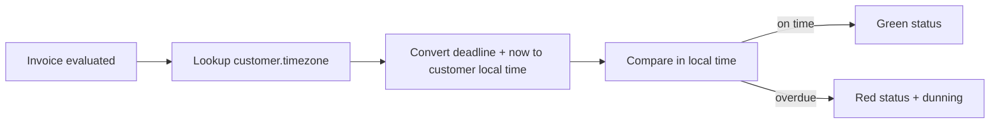

# PRD: Invoice Deadline Timezone Fix

**Squad:** Billing | **DRI (PM):** @pm-lead | **Date:** 2026-05-08
**Stage:** Solution Review
**Bet:** N/A (bug-driven refinement)
**Status:** In Review

## 1) Problem and Hypothesis

**Problem:** Customer success reports that 3% of invoices are flagged as overdue even when the customer is still inside their local payment window. The deadline calculation runs in UTC, but US-EAST customers operate in UTC-5 and EU-WEST customers in UTC+1.

**Hypothesis:** If we apply each customer's registered timezone offset when computing the deadline, then false-overdue invoices will drop to zero within 30 days, because the only cause we have seen across 12 weekly support tickets is the UTC mismatch.

**Strategy fit:** Supports the Billing reliability pillar for Q2 2026. False-overdue flags trigger automated dunning emails and finance write-offs; cleaning this up is table stakes before we offer SLA-backed payment-window guarantees in H2.

**Evidence:**
- 12 weekly support tickets in the last 6 weeks, all from customers in US-EAST and EU-WEST
- Finance: $14k in disputed late fees traced to false-overdue invoices (Q1 2026)
- Customer success confirmed the issue affects only customers in non-UTC timezones. UTC-aligned customers (UK) have zero false-overdue reports.
- Quote, CUST-001 ops manager: "Our payment deadline is 17:00 local. The dunning email arrived at 14:00 saying we missed it. That's just wrong."

## 2) Customers

| Customer | Why it matters |
|----------|----------------|
| Customer ops (US, EU, others in non-UTC) | Daily friction; one weekly escalation each |
| Customer success | Triages the false-overdue tickets, ~3h/week of avoidable work |
| Finance | Reconciles disputed late fees manually |
| End customers | Receive incorrect dunning notifications, hurts trust |

## 3) Scope and Non-Goals

**In scope:**
- Read `customers.timezone` when computing the deadline for any invoice.
- Apply offset in both the daily report and the real-time invoice screen.
- Backfill the last 90 days of flagged invoices to clear false positives.

**Non-goals (max 3):**
- Schema changes to `customers`. The timezone column already exists and is populated.
- Per-segment deadline rules. Separate refinement.
- Surfacing deadline time in customer-facing API responses. Out of scope, request from customers but not blocking.

**Trade-offs accepted:**
- The fix runs in application code, not the database. About +5ms per invoice lookup; acceptable given current latency budget.
- Backfill is a one-off script, not a recurring job. Anything older than 90 days stays as-is.

## 4) Solution Overview

**Summary:** When the billing service evaluates whether an invoice is overdue, it currently compares the invoice's deadline timestamp against a UTC clock. We change the comparison to convert both timestamps into the customer's local timezone before evaluating. The customer timezone is already stored in `customers.timezone` and populated for every active customer.

We add an integration test per timezone tier (UTC, UTC-5, UTC+1) using fixed clock fixtures. A one-time backfill script re-evaluates invoices flagged as overdue in the last 90 days and clears false positives.

**User flow:**

**User stories:**
- As a customer ops lead, I want the invoice report to use my local payment deadline, so that on-time invoices are not flagged as overdue.
- As a customer success analyst, I want false-overdue invoices from the last 90 days cleared, so that I stop triaging the same complaints every week.
- As a finance analyst, I want disputed late fees traceable to the bug to reconcile automatically, so that I do not process them by hand.

**UX reference:** No UI changes. The invoice screen and the daily report read from the corrected backend.

## 5) Success Metrics

| Metric | Baseline | Target | Horizon |
|--------|----------|--------|---------|
| False-overdue rate (non-UTC customers) | 3.1% | 0% | 30 days |
| Weekly support tickets about deadlines | 12 | 0 | 30 days |
| Disputed late fees ($) | 14k/quarter | 0 | 90 days |

**Guardrails:**
- Invoice evaluation latency P95: must stay below 200ms (current 145ms; +5ms acceptable).
- No regression in UTC-aligned customers (UK reference cohort): false-overdue rate must stay 0%.

**Kill criteria:** If P95 latency rises above 220ms or if any UTC-aligned customer starts flagging false-overdue after rollout, disable the feature flag and roll back the backfill.

## 6) Rollout

| Phase | Audience | Duration | Pass criteria |
|-------|----------|----------|---------------|
| 1 | Internal staging + CUST-001 only | 7 days | Zero false-overdue in CUST-001, latency unchanged |
| 2 | All non-UTC customers | 14 days | False-overdue rate drops to 0%, no UTC regressions |
| 3 | Full rollout + 90-day backfill | 1 day cutover, 7-day monitoring | Ticket count drops to 0 within 14 days |

Feature flag: `deadline_local_tz_v1`. Default off, enabled per phase.

## 7) Risks

| Risk | Likelihood | Impact | Mitigation |
|------|-----------|--------|------------|
| Customer timezone misconfigured | Low | High | Pre-rollout audit: query `customers` for nulls or invalid TZ strings, fix before phase 2 |
| Backfill clears legitimately overdue invoices | Low | High | Backfill script writes to an audit table; ops reviews before flipping statuses |
| New customers added without timezone | Medium | Medium | Add NOT NULL constraint after backfill complete |

## 8) Owners and Open Questions

**DRI:** @pm-lead
**Reviewers:** Engineering (Billing tech lead), Customer success lead, Finance ops, Sales ops

**Open questions:**
- [ ] Should we notify customers about the backfill correction, or just clear the records silently? Owner: @customer-success
- [ ] Does finance want a per-customer dispute reconciliation report, or aggregated? Owner: @finance-ops

## 9) Appendix

**Alternatives considered:**
- Store deadlines in UTC and force customers to provide their deadlines in UTC. Rejected because it pushes the conversion burden onto every customer and is error-prone.
- Database-side timezone conversion via view. Rejected because the deadline logic lives in the billing service and splitting it across layers makes future changes harder.

**Research quotes:**
> "Our payment deadline is 17:00 local. The dunning email arrived at 14:00 saying we missed it. That's just wrong." CUST-001 ops manager, ticket #4421

> "Every Monday I open the report and there are five fake overdue ones from US-EAST. I just close them. Waste of time." Customer success analyst, weekly retro 2026-04-29
