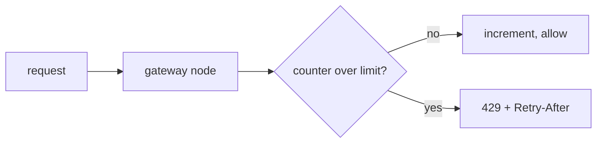
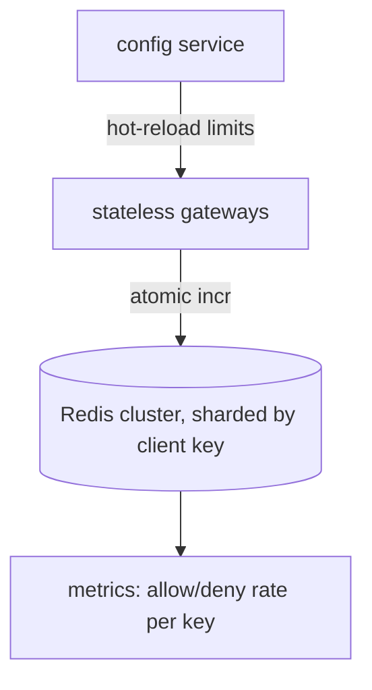

# System Design Doc, Distributed Rate Limiter

<!-- feature_id: 2026-06-14-rate-limiter -->

> One-line frame: a shared rate limiter that caps each API client to N requests per window across a
> fleet of stateless gateway nodes, at 200k QPS, adding under 1 ms to the request path.

## 1. Problem and Context

Our public API is abused by a few clients that burst and degrade latency for everyone. We need
per-client limits enforced consistently across ~40 gateway nodes. Internal infra component, not
user-facing. Triggered by three incidents last quarter where one client drove p99 from 80 ms to 900 ms.

## 2. Requirements

### Functional

- Limit per client key (API key or IP) to a configurable quota per sliding window.
- Return `429` with `Retry-After` when over limit.
- Limits hot-reloadable without redeploy.

### Non-functional

| Dimension | Target |
|---|---|
| Added latency | p99 < 1 ms on the limiter check |
| Throughput | 200k QPS aggregate |
| Availability | fail-open on limiter outage (never block legit traffic on our bug) |
| Consistency | approximate is fine, small over-admit acceptable |
| Cost | fits one small Redis cluster |

**Back-of-envelope.** 200k QPS x 1 counter op = 200k Redis ops/s. A single Redis node handles
~100k-200k ops/s, so we shard across a small cluster or per-key sharding. State per key ~100 bytes;
1M active keys ~100 MB, fits memory easily.
`ASSUMPTION: 200k QPS peak, ~1M distinct active client keys per minute.`

## 3. End-to-End Mental Model

## 4. High-Level Architecture

| Component | Responsibility | Stateful? |
|---|---|---|
| Gateway | run the limit check inline | no |
| Redis cluster | hold per-key counters | yes |
| Config service | serve hot limits | yes |

## 5. Deep Dives

### 5.1 Algorithm: sliding window counter

Token bucket and fixed window both have edge flaws (bucket needs per-key timers, fixed window allows
2x burst at the boundary). We use a sliding-window counter: two fixed buckets (current, previous)
weighted by elapsed fraction. One Lua script does read-weight-increment atomically in Redis, so the
check is a single round trip. Trade-off accepted: approximate at the window edge, which is fine since
small over-admit is allowed.

## 6. Data and Storage

| Store | Holds | Engine | Access pattern |
|---|---|---|---|
| Counters | `{key}:{window}` -> count | Redis (in-memory) | hot atomic incr, TTL = 2 windows |
| Limits | key -> quota | config service + local cache | read-mostly, hot-reload |

## 7. Scale and Partitioning

Redis sharded by client key (consistent hashing), so one key's ops land on one shard, no
cross-shard coordination. Gateways stateless, autoscale freely. Local 1s cache of limits cuts config
load.

## 8. Consistency and Failure Modes

Approximate counting, TTL-bounded. Failures:

| Failure | Blast radius | Mitigation |
|---|---|---|
| Redis shard down | that shard's keys uncounted | fail-open + local fallback counter, alert |
| Config service down | limits stale | serve last-known cached limits |
| Hot key (one client) | shard CPU spike | per-key local pre-check before Redis call |

What breaks first at 10x: a single hot key saturates its shard. Mitigation: local token pre-filter.

## 9. Observability and Operations

Metrics: allow/deny rate per key, Redis op latency p99, fail-open events/min, top-denied keys.
Debug tool: inspect one client key's current counters and effective limit.

## 10. Security and Compliance

Keys hashed before logging. No request bodies stored. Limit config access controlled.

## 11. Incremental Plan

| Phase | Goal | Scope |
|---|---|---|
| 1. Vertical slice | prove inline check | fixed window, single Redis, one gateway |
| 2. Correctness | sliding window + fail-open | Lua script, fallback path |
| 3. Scale | sharded Redis, hot-key pre-filter | 200k QPS, 40 nodes |
| 4. Advanced | tiered + burst limits, per-route quotas | config-driven |

## 12. Trade-offs

| Axis | Choice | Why, given constraint |
|---|---|---|
| accuracy vs latency | approximate sliding window | sub-ms budget beats exact counting |
| fail-open vs fail-closed | fail-open | our outage must not block legit traffic |
| central Redis vs local-only | central + local fallback | consistency across 40 nodes needs shared state |

## 13. Open Questions and Design Review

- Unit of limit: API key, IP, or account? (affects key cardinality and abuse surface)
- Where do limits live and who can change them in an incident?
- Biggest cost-explosion risk: hot-key fan-in on one shard.

---

<!-- canon applied: Nygard (fail-open, bulkhead), Kleppmann (load params before perf), Vogels (design for failure) -->
<!-- approved: 2026-06-14 score=8.6 -->
