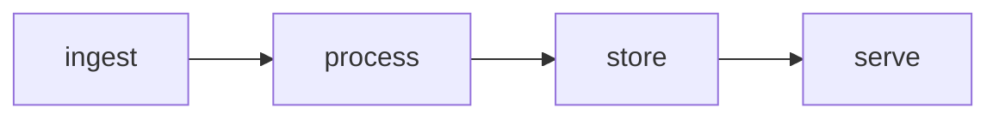

# System Design Doc, {System Name}

<!-- feature_id: {YYYY-MM-DD}-{slug} -->

> One-line frame: {what we are designing, for whom, at what scale}.

## 1. Problem and Context

- What we solve, in 1-2 sentences.
- Who uses it, how often.
- Internal tool or web-scale / multi-tenant. (This changes the whole design.)
- Why now, what triggered it.

## 2. Requirements

### Functional

- {capability 1}
- {capability 2}

### Non-functional (with numbers)

| Dimension | Target |
|---|---|
| Latency (read path) | p99 < {N} ms |
| Throughput | {N} QPS peak |
| Availability | {N} nines on serving path |
| Consistency | {strong / eventual, with convergence bound} |
| Durability / retention | {N} |
| Cost ceiling | {rough $ or resource bound} |

**Back-of-envelope.** {QPS = DAU x actions / 86400; storage = records x bytes x replication x
retention; bandwidth = QPS x payload. Show the math.}
`ASSUMPTION: {state every assumed number}`

## 3. End-to-End Mental Model

The whole path, before any component. Numbered flow or mermaid.



## 4. High-Level Architecture

Components + the two support planes (metadata/policy, observability/control).

```mermaid
flowchart TB
  %% components and data flow
```

| Component | Responsibility | Stateful? |
|---|---|---|
| {name} | {what} | {yes/no} |

## 5. Deep Dives

Pick the 2-3 components that carry the risk. Per component: data structures, algorithm, the hard
trade-off.

### 5.1 {Critical component}

- Data structure / algorithm: {...}
- Why this over the alternative: {...}
- Trade-off accepted: {...}

## 6. Data and Storage

Separate store by function and access pattern.

| Store | Holds | Engine | Access pattern |
|---|---|---|---|
| {raw} | {...} | object storage | sequential, cheap |
| {operational} | {...} | KV / wide-column | random updates |
| {query} | {...} | index / relational | read-optimized |

## 7. Scale and Partitioning

- Partition key: {...}. Why it avoids hot spots.
- Replication: {N replicas, leader/follower}.
- Rebalancing: {how}.
- Stateless vs stateful components: {which autoscale, which need leadership}.

## 8. Consistency and Failure Modes

- Consistency model and convergence bound.
- Failure table:

| Failure | Blast radius | Mitigation |
|---|---|---|
| {component dies} | {what stops} | {bulkhead / retry / failover} |

What breaks first under 10x load: {...}.

## 9. Observability and Operations

- Metrics per stage: {ingest rate, error rate, lag, p50/p95/p99, backlog}.
- Debugging tools that must exist: {inspect one record's lifecycle; explain one request's result}.

## 10. Security and Compliance

- Least data stored. Sandbox untrusted input. Sanitize parsing. Respect external policy.

## 11. Incremental Plan

| Phase | Goal | Scope |
|---|---|---|
| 1. Vertical slice | prove end-to-end | small scope, reuse proven engines |
| 2. Efficiency / quality | {...} | {...} |
| 3. Real scale | {...} | {...} |
| 4. Advanced | {...} | {...} |

## 12. Trade-offs

| Axis | Choice | Why, given constraint |
|---|---|---|
| coverage vs quality | {...} | {...} |
| freshness vs cost | {...} | {...} |
| recall vs latency | {...} | {...} |
| build vs buy | {...} | {...} |

## 13. Open Questions and Design Review

The questions a reviewer should interrogate. (Feed these to /system-design:review.)

- {the unit of quality?}
- {where does {policy/budget} live and how is it updated?}
- {biggest cost-explosion risk in current design?}

---

<!-- canon applied: {names from design-method.md whose lens shaped this} -->
