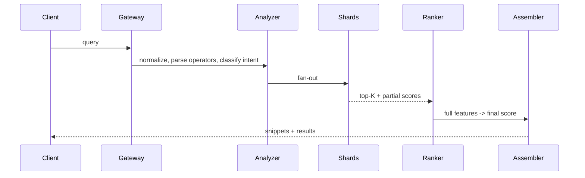

Design a search engine. Topic playbook. The agent loads this canned reference architecture and
adapts it to the user's actual scale and constraints, then emits the SDD via the generic template.

Use when the problem is: web search, site/doc search at scale, a crawler, or a large retrieval
system. For internal doc search at small scale, say so and simplify (often a managed engine is the
whole answer).

Ask once if missing: corpus scope (internal docs vs open web), target QPS, freshness SLO, build vs
buy appetite.

Read:
- guides/design-method.md
- guides/writing-style.md
- guides/templates/system-design.md
- guides/pipeline.md

Generate the SDD using the template, filled with the reference below, adapted to user scale.

Save to .claude/runtime/outputs/architect/design/{feature_id}.md.
Sensors: sensors/design-structure.md, sensors/design-rigor.md. Evals: evals/design-quality.md.

---

## Reference architecture (adapt, do not copy blindly)

One line: a search engine is a distributed factory that turns URLs into rankable documents. It is a
chain of decisions: what to discover, fetch, store, index, retrieve, promote. Each stage kills bad
cost and keeps useful signal.

### Four subsystems + two support planes

- **Crawler**: discover and fetch pages.
- **Processing pipeline**: parse, clean, extract, enrich.
- **Indexing pipeline**: build the indexes.
- **Query serving**: analyze query, retrieve candidates, rank, assemble result.
- Support: **metadata/policy** (robots.txt, politeness, canonical, scheduling, dedup) and
  **observability/control** (metrics, debugging, reprocess, backfill, allow/blocklists).

### Crawler (the heart)

- **URL frontier** is not one queue. Split into: URL-seen store (Bloom filter + persistent),
  crawl-state store (status, hash, next-recrawl), scheduler priority queues.
- **Multi-queue per host**: one pending queue per host + a `next_eligible_timestamp`; a global heap
  orders hosts by lowest eligible time and highest priority. Gives fairness + politeness together. A
  single global queue creates hot domains and looks like a DDoS.
- **URL canonicalization** before enqueue (lowercase host, drop fragments, default ports, clean
  tracking params, resolve relative, drop session ids). Skipping this explodes duplicates.
- **robots.txt** cached per host with TTL; respect allow/disallow and crawl-delay. Timeouts, redirect
  limits, max download size.
- **Politeness** is not a fixed sleep. Next request after `max(min_delay, k * observed_latency,
  robots_delay)`; max concurrency per host; exponential backoff on errors.
- **Fetcher** stateless: async I/O, connection pool, gzip/brotli, conditional GET (ETag /
  If-Modified-Since) for cheap recrawl, content-type sniffing, body checksum.
- **Crawler traps**: infinite calendars, e-commerce facets, param explosions, pagination loops.
  Guardrails: crawl budget per host, fan-out limit per page, param regex blocklists, template-repeat
  score, depth limit. Without these, 80% of cost goes to the worst 5% of the web.

### Crawl scheduling (money becomes strategy)

Finite budget. `crawl_score ~ quality * freshness_need * business_priority / fetch_cost` (intuition,
not a literal formula). Adaptive recrawl: changed twice fast -> shrink window; stable -> grow window;
errors -> backoff. Beats fixed cron. Freshness tiers A/B/C/D (minutes -> rarely) by domain or score.

### Dedup and document canonicalization

Three levels: URL dup, exact content dup (hash of clean text), near-dup (shingles + MinHash/SimHash).
Store a document fingerprint and a canonical doc id; many URLs map to one canonical doc. Dedup early,
in layers, or you pay to process expensive duplicates. Consolidate ranking signals onto the canonical.

### Storage by function

- Raw content store: object storage, compressed, for reprocess/audit.
- Parsed document store: doc_id, canonical_url, clean_text, language, outlinks, anchors_in,
  fingerprint, quality signals.
- Crawl metadata store: KV/wide-column (random updates): status, next_fetch_at, retry_count,
  robots_version, blocked_reason.

### Indexing

- **Inverted index**: term -> postings list `[(doc_id, tf, positions, field)]`.
- Build pipeline: tokenize, normalize (lowercase, stem), drop stopwords, emit term->posting,
  sort-merge, compress, persist immutable **segments**, publish version. MapReduce-shaped.
- **Document sharding** (not term sharding) simplifies serving/replication: query fans out to all
  doc shards, each returns local top-K, aggregator merges.
- Immutable segments + background merge (Lucene model): cheap sequential writes, easy snapshot/
  rollback, serve during reindex; cost is merge + tombstones.
- Compression: delta encoding, varbyte, frame-of-reference, skip lists.

### Query serving (online path)

- **Analyzer**: normalize, tokenize, optional spell-correct, synonyms, operators (quotes, `site:`,
  `filetype:`), intent class (navigational / informational / transactional / fresh).
- **Candidate retrieval**: BM25 lexical, title/anchor boost, optional ANN over embeddings, hybrid
  union. Top-N per shard (~500-1000), then merge.
- **Ranking**: weighted features to start, e.g. `0.45*bm25 + 0.20*title + 0.15*authority +
  0.10*freshness + 0.10*anchor`. Evolve to learning-to-rank only with good features and click data.
- **Result assembly**: highlighted snippet, canonical URL, clean title, dedup near-identical results.

### Link graph and global signals

Offline batch (daily/hourly), never on the query path. Authority/hub/centrality/domain reputation;
PageRank is the famous approximation. Combine with anti-spam or link farms manipulate it.

### Spam and quality

Adversaries always come. Keyword stuffing, hidden text, doorway pages, link farms, cloaking, mass
low-value content. Defenses: spam classifier on content + link features, domain reputation,
per-template/cluster limits, click/bounce feedback loop. Best index serving garbage fast is still
garbage.

### Index publishing

Snapshot model: workers build segments, a manifest describes the full version, publisher commits it
atomically, query servers warm up then swap. Rollback simple, no downtime. Base snapshot + small
delta indexes for frequent updates.

### Scale and partitioning

Frontier partitioned by host hash (one owner per host for politeness coordination). Fetchers
stateless, autoscale. Index: e.g. 64 logical shards x 2-3 replicas, leader publishes, followers
serve. Link graph as distributed batch.

### Failure modes (the review answers)

- Central scheduler bottleneck -> partition frontier, distribute ownership.
- Late dedup -> layered dedup (URL, exact, near).
- Fan-out blows p99 -> balanced sharding, caches, candidate pruning.
- Relevance stagnates -> instrument clicks, abandonment, zero-results; offline analysis loop.
- Crawler stuck in traps -> per-host budget, dynamic blocks, param filters.
- Index publish breaks serving -> atomic snapshot + warmup before swap.

### Incremental plan

1. Vertical slice: small seed set, HTML only, per-host frontier with basic politeness, simple parser,
   inverted index (Lucene/OpenSearch is fine), BM25 query, URL-inspection tool.
2. Efficiency/quality: exact + near dedup, better canonicalization, adaptive recrawl, quality
   scoring, better snippets, more observability.
3. Real scale: partitioned frontier, distributed fetchers, sharded versioned index, link-graph jobs,
   multi-factor ranking, DR + replay.
4. Advanced: learning-to-rank, behavioral signals, hybrid embeddings, anti-spam, personalization.

Advanced relevance on bad ingestion is expensive makeup. Order matters.

### Trade-offs to state explicitly

coverage vs quality; freshness vs cost; recall vs latency; complexity vs delivery speed; centralize
vs partition. For most teams: use a proven index engine (Lucene), spend the quarters on pipeline and
ranking, not on reinventing the inverted index.

<!-- canon: Kleppmann (3 pillars), Jeff Dean (numbers/MapReduce), Vogels (design for failure), Helland (immutable segments), Nygard (backoff/circuit breaker) -->
