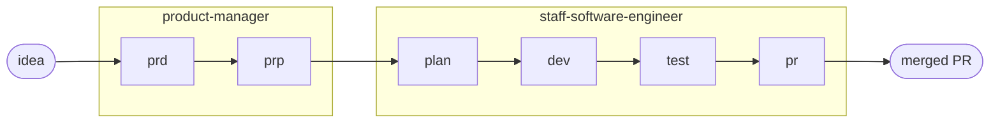
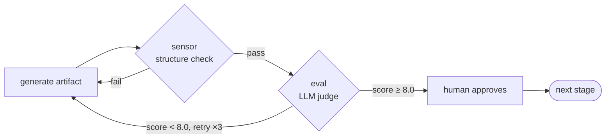

<div align="center">

# harness-kit

**Idea to merged PR, through one gated pipeline.**


Claude Code agents, a product manager, a staff engineer, and a system architect, that carry a raw
idea through `prd → prp → plan → dev → test → pr`, with a pass/fail check and a scored review at every stage.

[](VERSION)
[](https://claude.ai/code)
[](https://github.com/Pierry/harness-kit/stargazers)
[](LICENSE)

<br/>


<sub>~90s walkthrough, what it is, install, the three agents, the golden path, how each stage is gated, idea to merged PR.</sub>

</div>

---

## Why

Shipping a feature on vibes skips the parts that make it correct: framing the problem, writing
acceptance criteria, holding the conventions, gating the review. harness-kit puts those back,
without you hand-writing a single doc.



Every stage produces a markdown artifact, gated by a deterministic **sensor** (pass/fail) and a
scored **eval** (≥ 8.0). Nothing advances on vibes. After the PR opens, an in-session monitor
watches for merge and clears state on its own.

### How one stage is gated

The same loop runs at every stage. The agent generates the artifact, a **sensor** checks its
structure deterministically, an **eval** scores its quality with an LLM judge, and only then does a
human approve. Failures self-correct before they reach you.



This is the harness-engineering split: **guides** steer before (feedforward), **sensors** give
deterministic feedback, **evals** give inferential feedback, and humans stay *on* the loop, improving
the guides and gates rather than hand-fixing each output. See [Foundations](#foundations).

---

## Install

Two layers: the **plugin** (fetched once from the marketplace) and the **harness** (laid into each
repo you want it in).

```
/plugin marketplace add Pierry/harness-kit
/plugin install harness-kit@harness-kit
```

Restart Claude Code, then inside the repo you want to use it in:

```
/harness-kit:install
```

`/harness-kit:install` lays the full harness into that repo, agents, commands, skills, hooks, and the
status bar, under `.claude/` plus `AGENTS.md`/`CLAUDE.md` at the root. Run it once per repo.

Requires Claude Code, `python3`, `git`, and the [gh CLI](https://cli.github.com/) (for PRs).
[Full tooling →](docs/ARCHITECTURE.md#tooling)

---

## Update

The plugin version is pinned in the marketplace, so a new release does **not** reach you until you
pull it. **Three** steps are required, in order, the middle one matters:

```
/plugin update harness-kit     # step 1: fetch the newer plugin into the cache
                               # step 2: RESTART Claude Code  (plugins load at startup)
/harness-kit:update            # step 3: re-lay it into THIS repo
```

Step 1 fetches the new version into the plugin cache but does **not** change anything in your repo,
and the running session still points at the old version. Step 2 (restart) makes Claude Code load the
new version, without it, step 3 would re-lay the *old* version it still has loaded (the updater now
detects this and stops with a restart reminder rather than silently downgrading). Step 3 lays the new
version into the repo you run it from, run it once **per repo** you installed into.

If step 1 reports you are already up to date but you know a newer release exists, refresh the
marketplace first: `/plugin marketplace update harness-kit`, then retry step 1.

**You don't have to remember to check.** On session start the harness compares your installed version
against the latest release on GitHub (best-effort, cached ~24h, never blocks) and prints a one-line
notice when you're behind, with the steps to run. Disable it with
`HK_UPDATE_CHECK=0` in your environment.

`/harness-kit:update` backs up your existing `.claude/settings.json` and reports the version delta
via `.claude/.hk-version`. It also pre-authorizes the harness's own scripts (`marker.sh`,
`preflight.sh`, `run-sensors.sh`) in `permissions.allow`, so a pipeline run never stops for an
internal prompt, while destructive ops stay blocked. If you customized permissions, merge them back
from the `.bak` file. See [Architecture › Permissions](docs/ARCHITECTURE.md#permissions).

- **New users** who install after a release get the latest version automatically, nothing extra.
- **Existing users** stay on their pinned version until they run the steps above.

Current version: see the badge up top and [`CHANGELOG.md`](CHANGELOG.md).

---

## Quickstart, the golden path

One command, idea to merged PR.

**1. Write the brief.** Open the **[idea-brief builder](https://pierry.github.io/harness-kit/brief/)**
and fill the fields, squad, problem, hypothesis, customers, metric. Inline validation holds you to
the PRD conventions as you type.

**2. Paste it.** Hit **Copy brief** and paste the ready-made `/golden-path` kick into Claude Code:

```
/golden-path

Squad: checkout
Problem: Returning guests abandon checkout when a card is declined once …
Hypothesis: If we add one-tap retry, then completion rises 5 points, because …
Success metric: checkout completion, from 71% to 76% within 30 days
```

**3. Approve and ship.** All six gated stages run, PM (`prd → prp`) then Eng (`plan → dev → test → pr`).
Approve each artifact when prompted; the status bar tracks where you are. SSE flags pass straight
through: `/golden-path --local`, `--sdd`, `--no-monitor`.

Already know the idea cold? Skip the builder and type `/golden-path` with the brief yourself.
[Golden path reference →](docs/GOLDEN-PATH.md)

---

## Other ways to run

Every flow shares the same pipeline state, so you can switch between them mid-feature.

| You want | Run | Stages |
|---|---|---|
| Spec only, align before any code | `/product-manager:run` | `prd → prp` |
| Small change, plan in your head | `/sse:run` | `plan → dev → test → pr` |
| Local only, no PR | `/sse:run --local` | `plan → dev → test` |
| Loop until the spec passes | `/sse:sdd` | `plan → [dev↔test↔eval] ×3` |
| Resume after a break | `/pipeline:continue` | next pending stage |

`/sse:sdd` treats the PRP as the spec: an independent supervisor session re-checks the repo against
the PRP's `Success criteria` + `Validation gates` after every dev↔test iteration, and never opens a
PR on its own. Each stage is also its own command, `/sse:plan`, `/sse:dev`, `/sse:test`, `/sse:pr`.
`/sse:dev` asks once whether to apply the designer skill when the work has UI. To ship a finished
static site, `/sse:firebase-publish` creates or reuses a Firebase project and deploys Hosting.

**[Every command and every gate →](docs/COMMANDS.md)**

---

## Context optimization

Optional, all local-first. As a target repo and the harness grow, the tokens spent
*loading context* and *reading command output* start to dominate. Four tools cut that, and they
stack with the per-stage model tiers (which pick *which* model runs each step):

| Tool | Cuts | How | Setup |
|---|---|---|---|
| [`/context:pack`](docs/COMMANDS.md) | input | `repomix` snapshot of the target repo for a deterministic stage handoff, cached per feature | `npm i -g repomix` |
| [`/context:graph`](docs/COMMANDS.md) | input | `graphify` knowledge graph of a long-lived repo, query "what calls X" instead of grepping (~71× fewer tokens) | `pipx install graphifyy` |
| **qmd** | input | local semantic search over the harness's own guides/skills, returns the relevant excerpt instead of the whole file | `setup/setup-qmd.sh` |
| **rtk** | output | shell proxy that compresses `git`/`test`/`lint`/`grep` output 60-90% before it reaches the model | `brew install rtk && rtk init -g` |

**`/context:pack` and `/context:graph`** ship with the harness. `pack` is a per-feature snapshot
consumed by `/sse:plan` and the SDD supervisor eval; `graph` is a long-lived, queryable map of a big
repo. The plan and eval stages read the cache when present and fall back to grep otherwise. Tier
order and the decision tree live in [`context-strategy.md`](.claude/shared/context-strategy.md).

**qmd** ([tobi/qmd](https://github.com/tobi/qmd)) and **rtk** ([rtk-ai/rtk](https://github.com/rtk-ai/rtk))
attack the two remaining halves of token cost, input loading and output reading:

```
# rtk, output filter, one-liner, auto-intercepts git/test/lint/grep
brew install rtk
rtk init -g            # select Claude Code; rtk gain shows savings

# qmd, semantic doc search over the harness guide tree
npm install -g @tobilu/qmd
setup/setup-qmd.sh     # indexes .claude/agents · commands · shared + skills, then embeds
```

`setup-qmd.sh` indexes the guide tree and prints the MCP-server snippet to add to
`.claude/settings.json`. First embed downloads ~2GB of local models, once. After that an agent runs
`qmd:query "..."` and gets back only the relevant guide section.

> Heads up: qmd and rtk are third-party tools, not bundled. Each `Setup` cell above installs them
> yourself. See [issue #2](https://github.com/Pierry/harness-kit/issues/2) for the rationale and
> measured wins.

---

## The agents

All registered in [`AGENTS.md`](./AGENTS.md). Each ships its own sensors, evals, guides, and skills.

- **`product-manager`**: turns a problem into an engineering-ready spec.
  Skills `prd`, `prp`. [Docs →](.claude/agents/product-manager/README.md)
- **`staff-software-engineer`**: turns an approved PRP into a merged PR (or a satisfied spec).
  Skills `backend`, `web`, `mobile`, `devops`, auto-detected from the repo, plus `designer`
  (Material Design 3, dark/light theme, modern type, i18n, favicon) for new UIs.
  [Docs →](.claude/agents/staff-software-engineer/README.md)
- **`system-architect`**: turns a problem into a rigorous System Design Doc, then an adversarial
  review. Topic playbooks per classic design (url-shortener, rate-limiter, search-engine). Optional
  front stage before the pipeline. [Docs →](.claude/agents/system-architect/README.md) ·
  [Wiki →](https://github.com/Pierry/harness-kit/wiki)

---

## Docs

| | |
|---|---|
| [Golden path](docs/GOLDEN-PATH.md) | the full front-door walkthrough |
| [Commands & gates](docs/COMMANDS.md) | every command, every sensor and eval |
| [Architecture](docs/ARCHITECTURE.md) | stage anatomy, status bar, repo layout, tooling |
| [Conventions](.claude/agents/staff-software-engineer/guides/conventions-override.md) | per-repo overrides for the SSE agent |
| [AGENTS.md](./AGENTS.md) | agent registry and path-by-path map |

---

## Foundations

This is not invented method. harness-kit is a concrete implementation of **harness engineering**, and
the system-architect agent reasons from the established engineering canon.

**The harness model** comes from Birgitta Böckeler (Thoughtworks / martinfowler.com):

- [Harness engineering for coding agent users](https://martinfowler.com/articles/harness-engineering.html): guides (feedforward), sensors (deterministic feedback), evals (inferential feedback), humans on the loop. Every stage gate here is exactly this.
- [Maintainability sensors for coding agents](https://martinfowler.com/articles/sensors-for-coding-agents.html): the sensor idea our structure checks implement.

**The system-design canon** behind the `system-architect` agent (full mapping in
[`design-method.md`](.claude/agents/system-architect/guides/design-method.md)):

- [*Designing Data-Intensive Applications*](https://dataintensive.net/), Martin Kleppmann: reliability / scalability / maintainability as the spine.
- *A Philosophy of Software Design*, John Ousterhout: deep modules, simple interfaces, complexity is the enemy.
- *Release It!*, Michael Nygard: stability patterns: circuit breaker, bulkhead, timeout, backoff.
- Jeff Dean (numbers every engineer should know), Werner Vogels (design for failure), Pat Helland (immutability, events over mutable state), Leslie Lamport, Sam Newman, Gregor Hohpe.

**The system-design topic playbooks** adapt the [System Design series](https://github.com/Pierry/harness-kit/wiki), one wiki page per classic problem (url-shortener, rate-limiter, search-engine), with the theory, diagrams, and references for each.

---

## Contributing

Issues and PRs welcome. The harness is plain markdown, Python, and shell, agents under
`.claude/agents/`, commands under `.claude/commands/`, hooks wired in `.claude/settings.json`.
See [`AGENTS.md`](./AGENTS.md) for where everything lives.

---

MIT. Built on [Claude Code](https://claude.ai/code). Works in any repo Claude Code touches.
