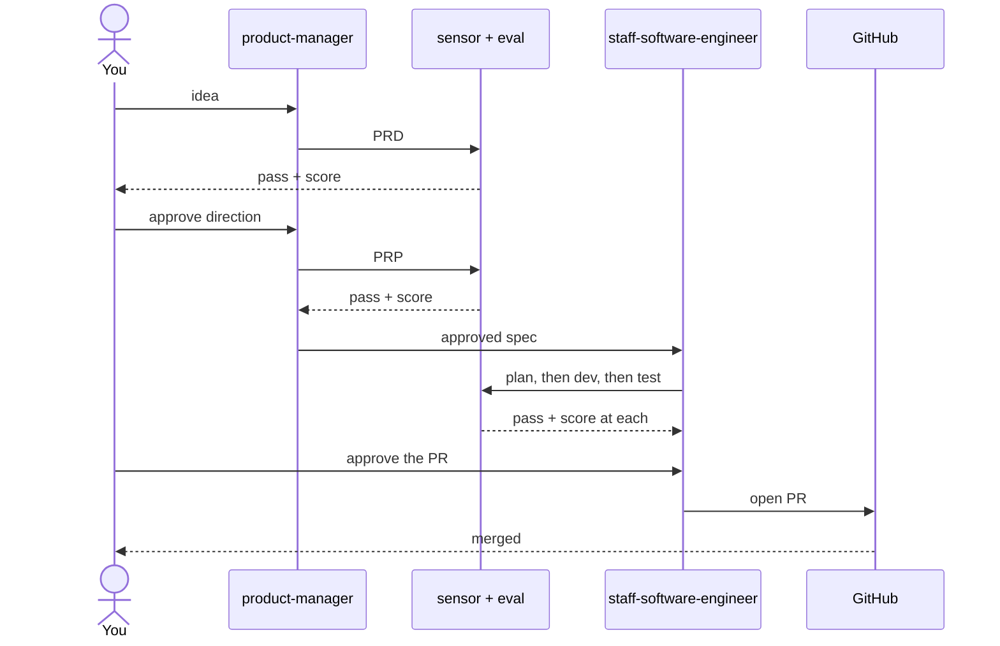
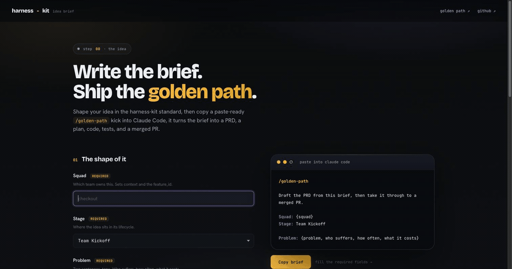
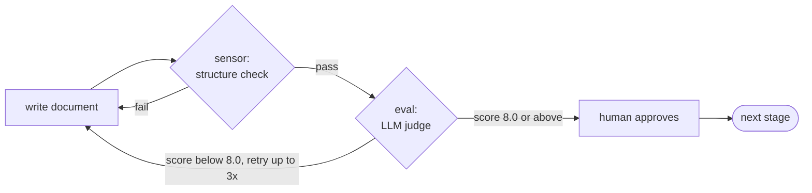
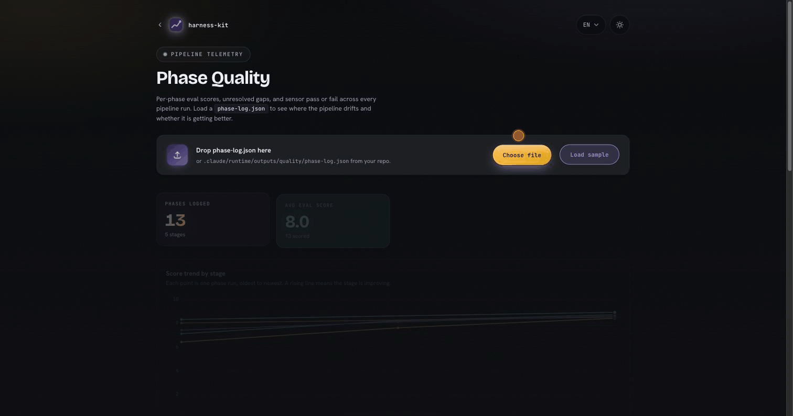

<div align="center">

# harness-kit

**One idea in, one merged PR out, through the same gated pipeline every time.**

harness-kit is a set of Claude Code agents (a product manager, a staff engineer, and a system architect) that take a rough idea and carry it through `prd → prp → plan → dev → test → pr`. Every stage produces a real document, passes a structural check, and clears a scored review before it moves on.

[](VERSION)
[](https://claude.ai/code)
[](https://github.com/Pierry/harness-kit/stargazers)
[](LICENSE)

<br/>


<sub>About 90 seconds: what it is, how to install it, the agents, the golden path, and how each stage is gated, from idea to merged PR.</sub>

</div>

---

## Contents

- [Why this exists](#why-this-exists)
- [The problem it solves](#the-problem-it-solves)
- [Why it matters](#why-it-matters)
- [What you get](#what-you-get)
- [Install](#install)
- [How to use it](#how-to-use-it)
- [Features](#features)
  - [1. Brief builder](#1-brief-builder)
  - [2. The pipeline](#2-the-pipeline)
  - [3. Quality dashboard](#3-quality-dashboard)
  - [4. The cockpit](#4-the-cockpit)
- [The agents](#the-agents)
- [Context optimization](#context-optimization)
- [More docs](#more-docs)
- [Contributing](#contributing)
- [Foundations](#foundations)
- [License](#license)

---

## Why this exists

Most features get built twice. Once in a hurry to see the thing work, and again later when you realize nobody wrote down the problem it solved, the acceptance criteria drifted, and the review was a rubber stamp.

The parts that make a feature correct are the framing, the definition of done, the conventions, and an honest review. Those are exactly the parts that get skipped when you are moving fast with an AI agent. harness-kit puts them back, and it does the writing for you.

## The problem it solves

Shipping on vibes quietly skips four things:

1. A clear problem statement, so you are building the right thing.
2. Acceptance criteria, so "done" means something.
3. Your conventions, so the code fits the repo.
4. A gated review, so quality is not optional.

Doing all four by hand for every feature is tedious, so over time they rot. harness-kit generates each one as a normal markdown document, checks its structure, scores its quality, and only then advances. No blank page, no hand-written specs, no silent drop in quality.

## Why it matters

- **Same pipeline every time.** Quality stops depending on who is at the keyboard or how tired they are.
- **Every stage is gated twice.** A deterministic sensor checks the structure, an LLM eval scores the quality. Weak output corrects itself before it reaches you.
- **You stay on the loop, not in it.** You approve the direction and the PR. The agents do the typing. When something is off, you improve a guide or a gate, not the individual output.
- **It is measurable.** Every approved stage records a score, so you can see whether your PRDs, or your tests, are getting better or worse across runs.

## What you get

One command takes a raw idea to a merged pull request. Six documents, a structural check and a scored review at each stage, and two moments where a human decides: is this the right direction, and is this PR good to open. Everything in between runs on rails you can watch.

You spend your attention on those two decisions instead of on formatting a spec or trying to remember your own conventions.



---

## Install

There are two layers: the **plugin**, fetched once from the marketplace, and the **harness**, laid into each repo you want to use it in.

```
/plugin marketplace add Pierry/harness-kit
/plugin install harness-kit@harness-kit
```

Restart Claude Code, then, inside the repo you want to use it in:

```
/harness-kit:install
```

That lays the full harness into the repo (agents, commands, skills, hooks, and the status bar) under `.claude/`, plus `AGENTS.md` and `CLAUDE.md` at the root. Run it once per repo.

You need Claude Code, `python3`, `git`, and the [gh CLI](https://cli.github.com/) for opening PRs. [Full tooling list](docs/ARCHITECTURE.md#tooling).

**Updating.** A new release does not reach you until you pull it, and the order matters:

```
/plugin update harness-kit     # 1. fetch the newer plugin into the cache
                               # 2. RESTART Claude Code (plugins load at startup)
/harness-kit:update            # 3. re-lay it into this repo, once per repo
```

Skip the restart and step 3 would re-install the old version that is still loaded (the updater notices and stops you). On session start the harness checks whether you are behind and prints a one-line notice. Turn that off with `HK_UPDATE_CHECK=0`.

---

## How to use it

The front door is one command. Paste a brief (or write it yourself) and approve each document when prompted. The status bar tracks where you are.

```
/golden-path

Squad: checkout
Problem: Returning guests abandon checkout when a card is declined once.
Hypothesis: If we add one-tap retry, completion rises 5 points.
Success metric: checkout completion, from 71% to 76% within 30 days
```

That is the whole thing: idea in, merged PR out. If you would rather run less than the full flow, every path shares the same pipeline state, so you can switch between them mid-feature.

| You want | Run | Stages |
|---|---|---|
| Hands-off, idea to PR, two gates | `/pipeline:run "<idea>"` | `intake → prd → ... → pr` |
| Idea to merged PR, approve each step | `/golden-path` | `prd → prp → plan → dev → test → pr` |
| Spec only, align before any code | `/product-manager:run` | `prd → prp` |
| Small change, plan in your head | `/sse:run` | `plan → dev → test → pr` |
| Local only, no PR | `/sse:run --local` | `plan → dev → test` |
| Loop until the spec passes | `/sse:sdd` | `plan → [dev, test, eval] up to 3x` |
| Pick up where you left off | `/pipeline:continue` | next pending stage |

Each stage is also its own command: `/sse:plan`, `/sse:dev`, `/sse:test`, `/sse:pr`. To publish a finished static site, `/sse:firebase-publish` creates or reuses a Firebase project and deploys it.

[Every command and every gate](docs/COMMANDS.md) · [Golden path reference](docs/GOLDEN-PATH.md)

---

## Features

harness-kit is one product with four surfaces. Each does one job, and they connect: shape the idea, run the pipeline, watch its quality, drive it from a terminal. You can start with any of them.

| | Feature | What it does | Where |
|---|---|---|---|
| **1** | [Brief builder](#1-brief-builder) | A web page that turns your idea into a paste-ready `/golden-path` prompt, validating as you type. | [Open it](https://pierry.github.io/harness-kit/brief/) |
| **2** | [The pipeline](#2-the-pipeline) | The agents and the gated flow. Carries the idea from `prd` to a merged `pr`. | Claude Code |
| **3** | [Quality dashboard](#3-quality-dashboard) | Tracks each stage's score, gaps, and sensor failures across every run over time. | [Open it](https://pierry.github.io/harness-kit/quality/phase-report.html) |
| **4** | [The cockpit](#4-the-cockpit) | A terminal UI over the pipeline. Every stage live, run a stage on a keypress, gates as prompts. | `hk-tui` |

The pipeline is the engine. The brief builder feeds it, the dashboard measures it, the cockpit drives it.

### 1. Brief builder

The on-ramp. A single web page that turns a rough idea into a well-formed `/golden-path` prompt. You fill in squad, problem, hypothesis, and metric, it checks each field against the PRD conventions as you type, and it assembles the exact prompt to paste into Claude Code. No blank page to stare at.



**[Open the brief builder](https://pierry.github.io/harness-kit/brief/)**

Fill the fields, watch the preview build the prompt on the right, hit **Copy brief**, and paste it into Claude Code. If you already know the idea cold, skip the builder and type `/golden-path` with the brief yourself.

### 2. The pipeline

The engine. Two agents carry a feature through six gated stages, and every stage produces a markdown document that has to pass a check before it advances.


After the PR opens, a monitor in the session watches for the merge and clears the state on its own.

**How one stage is gated.** The same loop runs at every stage. The agent writes the document, a **sensor** checks its structure deterministically, an **eval** scores its quality with an LLM judge, and only then does a human approve. Failures correct themselves before they reach you.



This is the harness-engineering split: **guides** steer before the work, **sensors** give deterministic feedback, **evals** give judgment-based feedback, and humans stay on the loop, improving the guides and gates rather than fixing each output by hand. See [Foundations](#foundations).

### 3. Quality dashboard

The feedback surface. Scores used to disappear into the chat once a stage was approved. The dashboard keeps that signal across every run and answers one question: is each stage getting better or worse over time?



**[Open the dashboard](https://pierry.github.io/harness-kit/quality/phase-report.html)** (click **Load sample** to explore with example data).

Every time a stage is approved, a hook appends one entry (deterministic, no token cost) to `.claude/runtime/outputs/quality/phase-log.json`:

| Field | Where it comes from |
|---|---|
| `score` | the eval score parsed from the approval marker |
| `gaps` | how many `NOT FOUND - NEEDS REVIEW` markers are left in the document |
| `sensors` | the stage sensors re-run against the document, pass or fail |
| `status` | `failed` if a sensor blocked, `degraded` if the score is low or there are gaps, otherwise `ok` |

Drop that JSON on the page, which is a single static file with no build and no network, and it renders the trend by stage, the failure rate, the score against the threshold, the sensors that block most often, and the full run table. [More](docs/quality/README.md).

### 4. The cockpit

The control surface. A terminal UI over the pipeline. It shows every stage live, renders each document, runs a stage on a keypress, and turns the two human gates into prompts. It reads pipeline state and documents straight off disk, so it stays in sync with any Claude Code session working on the same feature.


```
npm i -g @pieerry/harness-kit   # once; puts hk, harness-kit, and hk-tui on your PATH

hk-tui                     # open the cockpit in the current repo
hk-tui path/to/repo        # or point it at one
hk-tui -- "add one-tap retry to checkout"   # seed the idea for intake
```

| Key | Action |
|---|---|
| `up down` or `j k` | move between stages |
| `enter` | run the selected stage, output tails in the pane |
| `tab` | focus the reader, scroll with `j k` or space |
| `a` | at a gate, approve and continue. `x` to hold |
| `r` | refresh. `q` to quit |

The cockpit ships bundled with harness-kit as a single file, so `hk-tui` works the moment the package is installed. It needs a terminal and Node 18 or newer.

---

## The agents

All three are registered in [`AGENTS.md`](./AGENTS.md). Each one ships its own sensors, evals, guides, and skills.

- **`product-manager`** turns a problem into an engineering-ready spec. Skills: `prd`, `prp`. [Docs](.claude/agents/product-manager/README.md)
- **`staff-software-engineer`** turns an approved spec into a merged PR. Skills: `backend`, `web`, `mobile`, `devops` (auto-detected from the repo), plus `designer` for new UIs (Material Design 3, dark and light, modern type, i18n, favicon). [Docs](.claude/agents/staff-software-engineer/README.md)
- **`system-architect`** turns a problem into a rigorous system design document, then runs an adversarial review of it. Topic playbooks for classic designs (url-shortener, rate-limiter, search-engine). An optional stage before the pipeline. [Docs](.claude/agents/system-architect/README.md) · [Wiki](https://github.com/Pierry/harness-kit/wiki)

---

## Context optimization

Optional and local-first. As a repo and the harness grow, the tokens spent loading context and reading command output start to add up. Four tools cut that, and they stack with the per-stage model tiers.

| Tool | Cuts | How | Setup |
|---|---|---|---|
| [`/context:pack`](docs/COMMANDS.md) | input | a `repomix` snapshot of the repo, cached per feature | ships with the harness |
| [`/context:graph`](docs/COMMANDS.md) | input | a `graphify` knowledge graph, ask "what calls X" for far fewer tokens | ships with the harness |
| **qmd** | input | local semantic search over the guides, returns just the relevant excerpt | `setup/setup-qmd.sh` |
| **rtk** | output | a shell proxy that compresses `git`, `test`, `lint`, and `grep` output | `brew install rtk && rtk init -g` |

`pack` and `graph` ship with the harness and feed the plan and SDD stages, falling back to grep otherwise. qmd and rtk are third-party, so you install them yourself. See [issue #2](https://github.com/Pierry/harness-kit/issues/2) for the reasoning and the measured wins.

---

## More docs

| | |
|---|---|
| [Golden path](docs/GOLDEN-PATH.md) | the full front-door walkthrough |
| [Commands and gates](docs/COMMANDS.md) | every command, every sensor and eval |
| [Architecture](docs/ARCHITECTURE.md) | stage anatomy, status bar, repo layout, tooling |
| [Quality tracking](docs/quality/README.md) | how the dashboard is fed |
| [Conventions](.claude/agents/staff-software-engineer/guides/conventions-override.md) | per-repo overrides for the engineer agent |
| [AGENTS.md](./AGENTS.md) | the agent registry and a path-by-path map |

---

## Foundations

This is not an invented method. harness-kit is a concrete implementation of **harness engineering**, and the system-architect agent reasons from the established engineering canon.

**The harness model** comes from Birgitta Böckeler (Thoughtworks / martinfowler.com):

- [Harness engineering for coding agent users](https://martinfowler.com/articles/harness-engineering.html): guides (feedforward), sensors (deterministic feedback), evals (judgment-based feedback), humans on the loop. Every stage gate here is exactly this.
- [Maintainability sensors for coding agents](https://martinfowler.com/articles/sensors-for-coding-agents.html): the sensor idea our structure checks implement.

**The system-design canon** behind the `system-architect` agent (full mapping in [`design-method.md`](.claude/agents/system-architect/guides/design-method.md)):

- [*Designing Data-Intensive Applications*](https://dataintensive.net/), Martin Kleppmann: reliability, scalability, and maintainability as the spine.
- *A Philosophy of Software Design*, John Ousterhout: deep modules, simple interfaces, complexity as the enemy.
- *Release It!*, Michael Nygard: stability patterns such as circuit breaker, bulkhead, timeout, and backoff.
- Jeff Dean (numbers every engineer should know), Werner Vogels (design for failure), Pat Helland (immutability, events over mutable state), Leslie Lamport, Sam Newman, Gregor Hohpe.

**The topic playbooks** adapt the [System Design series](https://github.com/Pierry/harness-kit/wiki), one wiki page per classic problem (url-shortener, rate-limiter, search-engine), with the theory, diagrams, and references for each.

---

## Contributing

Issues and PRs are welcome. The harness is plain markdown, Python, and shell: agents under `.claude/agents/`, commands under `.claude/commands/`, hooks wired in `.claude/settings.json`. See [`AGENTS.md`](./AGENTS.md) for where everything lives.

## License

MIT. Built on [Claude Code](https://claude.ai/code). Works in any repo Claude Code touches.
