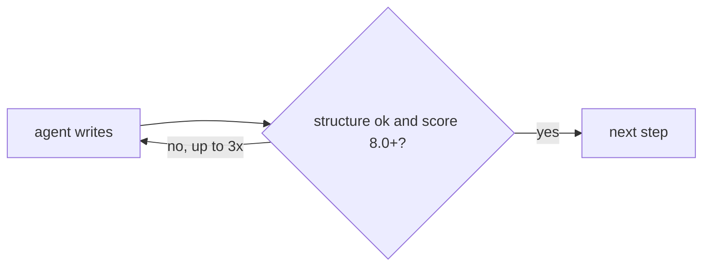

<div align="center">

# harness-kit

You describe a feature. Claude Code writes the spec, the plan, the code, and the tests, and opens the PR. Nothing moves forward until it passes a check.


</div>

# Start

*1 min read*

harness-kit is a set of Claude Code agents that carry one idea through three phases: Spec, Build, and Ship. Every step writes a markdown file, a script checks its structure, a judge scores it, and only a passing step unlocks the next. You decide twice: the direction, and the PR.

| Without it | With it |
|---|---|
| The problem lives in a chat thread | A written problem with a numeric success metric |
| "Done" is whatever the agent decided | Acceptance criteria you can check one by one |
| Review is reading a diff and hoping | Every document scored and retried until it passes |

Use it for features worth doing right. Skip it for one-line fixes and throwaway spikes.

```
/plugin marketplace add Pierry/harness-kit
/plugin install harness-kit@harness-kit
```

Restart Claude Code, open your repo, run `/harness-kit:install`, and restart again. It asks which eval judge to use and whether to turn on graph engineering; the defaults are fine. You need `python3`, `git`, and the [gh CLI](https://cli.github.com/). To update: `/plugin update harness-kit`, restart, `/harness-kit:update`.

# Phase 1: Spec

*1 min read*

You type a four-line brief, or build one in the [brief builder](https://pierry.github.io/harness-kit/brief/).

```
/golden-path

Squad: checkout
Problem: Returning guests abandon checkout when a card is declined once.
Hypothesis: If we add one-tap retry, completion rises 5 points.
Success metric: checkout completion, from 71% to 76% within 30 days
```

It writes the PRD (problem, customers, metrics, rollout, risks) and you approve the direction: a wrong problem caught here costs one rewrite, not a feature. Then it writes the PRP, the engineering spec, with the files to change and acceptance criteria.

With Jev, Jev scores both documents instead of Claude. With graph engineering, each criterion gets a stable id like `REQ-001` and `trace/{feature}.yml` is created.

# Phase 2: Build

*1 min read*

It writes the plan (files, order, risks, tests), implements it in small commits that follow your conventions and linters, and runs your tests. Each step loops until it passes:


```mermaid
flowchart LR
    write[agent writes] --> check{structure ok and score 8.0+?}
    check -->|no, up to 3x| write
    check -->|yes| next[next step]
```

The score comes from small yes/no checks, such as "every metric has a baseline", so a failure names exactly what to fix. With graph engineering, the plan records each file it expects to touch, and dev fails if it touches any other file without a written reason.

# Phase 3: Ship

*1 min read*

It writes the PR (summary, test plan, links) and you approve it; it opens as a draft. A monitor clears the pipeline when it merges.

With graph engineering, the PR carries a table linking each requirement to its code and the test that proves it, and the next feature marks those links VALIDATED or STALE. Every approved step logs its score to the [quality dashboard](https://pierry.github.io/harness-kit/quality/phase-report.html), so you can see quality move over time. The cockpit shows it all live in a terminal: `npm i -g @pieerry/harness-kit`, then `hk-tui`.

# Options

*1 min read*

| Setup | Best for | Adds | Cost |
|---|---|---|---|
| Plain (default) | most features | the gated pipeline | nothing extra |
| Jev judge | a judge that is not Claude grading Claude | [Jev](https://typesafe.ai) scores, Claude takes over when unsure | about $0.04 per million tokens |
| Graph engineering | shared or audited code | requirement ids, trace file, scope gate | free |
| Graph and Jev | both | both | about $0.04 per million tokens |

Switch any time: `/hk:eval jev` or `local`, and `/hk:graph manifest`, `full`, or `off`. `full` adds a local graph of your decisions and call graph (FalkorDB with Graphiti on free NVIDIA models, and Joern), with no Docker. Install with `HK_STATUSLINE=1` if you want the pipeline in your status line. When installed, [semble](https://github.com/MinishLab/semble), [repowise](https://github.com/repowise-dev/repowise), and [context7](https://github.com/upstash/context7) sharpen code search; otherwise it uses grep.

| You want | Run |
|---|---|
| Idea to merged PR, approving each step | `/golden-path` |
| Stop only at the two decisions | `/pipeline:run "<idea>"` |
| Spec only | `/product-manager:run` |
| Build from a spec you have | `/sse:run` (`--local` to skip the PR) |
| Design a hard system first | `/system-design:run` |
| Resume | `/pipeline:continue` |

# Learn more

*1 min read*

The [wiki](https://github.com/Pierry/harness-kit/wiki), also in [Portuguese and Spanish](https://pierry.github.io/harness-kit/wiki/), has [Getting Started](https://github.com/Pierry/harness-kit/wiki/Getting-Started) with every step in detail, how scoring works in [Evals](https://github.com/Pierry/harness-kit/wiki/Evals) and [Jev and System One](https://github.com/Pierry/harness-kit/wiki/Jev-and-System-One), traceability in [Graph Engineering](https://github.com/Pierry/harness-kit/wiki/Graph-Engineering) and [Graph Theory](https://github.com/Pierry/harness-kit/wiki/Graph-Theory), and the sources in [References](https://github.com/Pierry/harness-kit/wiki/References). The method is harness engineering from [Birgitta Böckeler](https://martinfowler.com/articles/harness-engineering.html). The three agents (`product-manager`, `staff-software-engineer`, `system-architect`) are mapped in [AGENTS.md](./AGENTS.md).

One honest limit: neither judge is checked against human ratings yet, so treat 8.0 as a signal, not a measurement. Issues and PRs welcome. MIT license.
