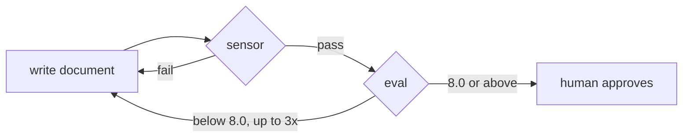
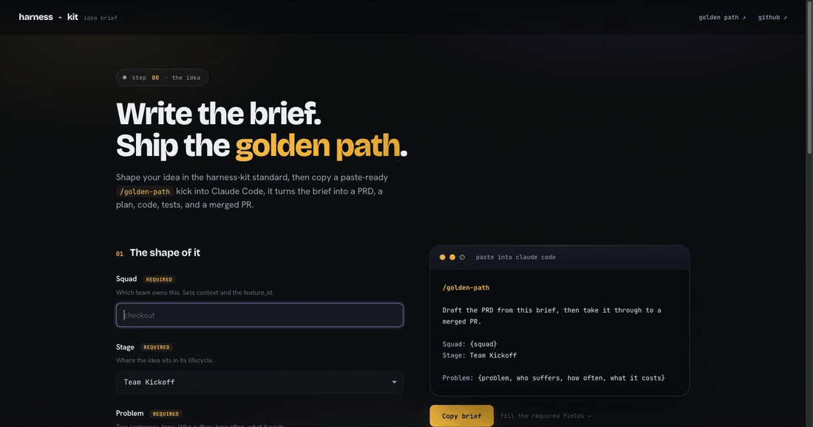
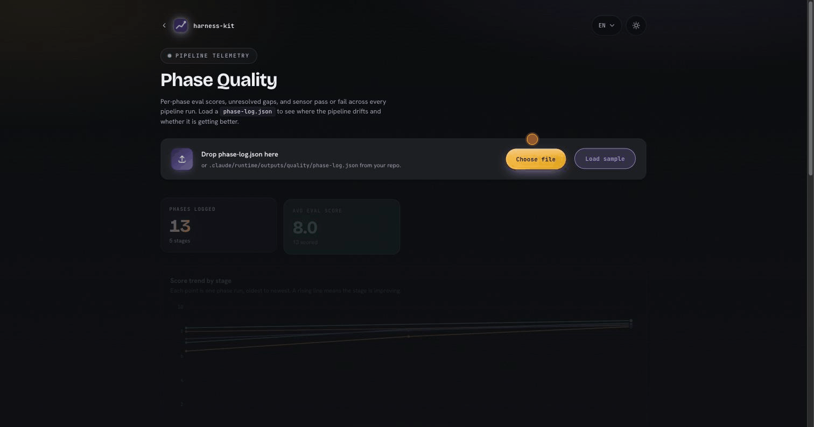

<div align="center">

# harness-kit

One idea in, one merged PR out, through the same gated pipeline every time.


</div>

# What it is

harness-kit is a set of Claude Code agents that carry a rough idea through `prd → prp → plan → dev → test → pr`. A product manager agent writes the spec, a staff engineer agent builds and ships it, and a system architect agent designs the hard parts when you need one. Every stage writes a markdown document, passes a structural check, and clears a scored review before the next stage starts.

You make two decisions: whether the direction is right after the PRD, and whether the PR is good to open. The agents do the rest.

# Why

Fast AI-assisted work skips the parts that make a feature correct: a clear problem statement, acceptance criteria, your repo conventions, and an honest review. harness-kit writes each of those for you and refuses to advance until they pass, so quality stops depending on who is at the keyboard. Every approved stage records a score, so you can see whether your PRDs and tests get better or worse over time.

# Install

The plugin is fetched once. The harness is laid into each repo you use it in.

```
/plugin marketplace add Pierry/harness-kit
/plugin install harness-kit@harness-kit
```

Restart Claude Code, then run this inside your repo:

```
/harness-kit:install
```

It writes agents, commands, and hooks under `.claude/`, plus `AGENTS.md` and `CLAUDE.md` at the root, and asks which eval judge to use (see Evals below). You need Claude Code, `python3`, `git`, and the [gh CLI](https://cli.github.com/). Full list in [Architecture](docs/ARCHITECTURE.md#tooling).

# Update

The order matters, because plugins load at startup.

```
/plugin update harness-kit
# restart Claude Code
/harness-kit:update
```

Skip the restart and the updater stops you, since it would reinstall the old version still in memory. A one-line notice at session start tells you when you are behind. `HK_UPDATE_CHECK=0` turns it off.

# Use

Run the golden path with a short brief and approve each document when asked. `hk status` shows where you are. Your own status line stays untouched; install with `HK_STATUSLINE=1` if you want the pipeline bar instead.

```
/golden-path

Squad: checkout
Problem: Returning guests abandon checkout when a card is declined once.
Hypothesis: If we add one-tap retry, completion rises 5 points.
Success metric: checkout completion, from 71% to 76% within 30 days
```

Every entry point shares the same pipeline state, so you can switch mid-feature.

| You want | Run |
|---|---|
| Idea to PR, only two human gates | `/pipeline:run "<idea>"` |
| Idea to merged PR, approve each step | `/golden-path` |
| Spec only, no code | `/product-manager:run` |
| Plan, build, test, open PR | `/sse:run` |
| Same, no PR | `/sse:run --local` |
| Loop until the spec passes, up to 3 rounds | `/sse:sdd` |
| Resume the next pending stage | `/pipeline:continue` |
| Pick the eval judge | `/hk:eval jev` or `/hk:eval local` |
| Turn graph engineering on or off | `/hk:graph manifest`, `full`, or `off` |

Each stage also runs alone: `/sse:plan`, `/sse:dev`, `/sse:test`, `/sse:pr`. `/sse:firebase-publish` deploys a finished static site to Firebase Hosting. [Every command and gate](docs/COMMANDS.md).

# How a stage is gated

The agent writes the document. A sensor checks its structure in code. An eval scores its quality against a weighted rubric. Below 8.0 the agent rewrites only what failed, up to three times, and only then does a human approve.


```mermaid
flowchart LR
    gen[write document] --> sensor{sensor}
    sensor -->|fail| gen
    sensor -->|pass| eval{eval}
    eval -->|below 8.0, up to 3x| gen
    eval -->|8.0 or above| approve[human approves]
```

This is the harness engineering split from Birgitta Böckeler: guides steer before the work, sensors and evals check after it, and you improve the guides and gates instead of fixing each output by hand.

# Sensors

Each sensor declares whether code enforces it (`computational`) or a model applies it (`inferential`). Only a computational sensor can record a pass. An inferential one is logged as `inferential`, never as green, and a sensor that claims to be computational without a real check fails CI. This rule exists because sensors once declared themselves hard gates while their checks were prose the runner could not parse, and every run logged a pass that nothing had verified. `python3 .claude/scripts/check-sensors.py` prints the ledger.

# Evals

Every rubric dimension is broken into atomic yes/no checks, such as "every metric in Success Metrics has a baseline value". A dimension scores the share of its checks met. Checks that code can answer, like banned words or em dashes, run as regexes instead of going to a model. `eval-score.py` recomputes the weighted total from the rubric and rejects a judge whose numbers do not add up. When a stage fails, the feedback is the list of failed checks, which is what the retry fixes.

You pick the judge per project with `/hk:eval`. The default, `local`, dispatches a fresh Claude evaluator that sees only the document and the rubric. `jev` sends the checks to [Jev](https://typesafe.ai), a TypeSafe AI model that returns calibrated probabilities instead of text, in one call per document, with each check reading only the section it names. When Jev is unsure on checks that would flip pass to fail, when the key is missing, or when the call fails, the stage falls back to the Claude evaluator. Jev is a paid API (about $0.042 per million input tokens) and runs only locally, never in CI. Its key lives in an environment variable or in `.claude/settings.local.json`, never in a committed file.

The reason for a second judge: a Claude judge grading Claude output inflates scores ([Wataoka et al.](https://arxiv.org/abs/2410.21819)), and a different model family reduces that without removing it. Atomic checklists make judges agree more often ([CheckEval](https://arxiv.org/abs/2403.18771), [TICK](https://arxiv.org/abs/2410.03608)). Neither judge is validated against human labels yet, and 8.0 is a convention, not a calibrated boundary. Every Jev run is logged to `.claude/runtime/outputs/evals/jev-judge.jsonl` to start building that labeled set.

# Graph engineering

Optional, off by default. `/hk:graph manifest` gives every PRP criterion a stable id (`REQ-001`), records each code symbol the plan expects to touch as a link with its evidence in `trace/{feature}.yml`, and makes that list the only scope dev may change: a file outside it fails the stage unless scope is widened with a written reason. Every commit hash in a link is checked against git before it is written. After a merge, links proven by a test become VALIDATED and links whose symbol moved become STALE, so the next feature starts from what the last one left. `/hk:graph full` adds a graph embedded in the project with no Docker: FalkorDB holding Graphiti facts from your decision docs (on free NVIDIA build models) and the Joern call graph of your code, behind the same four queries the agent already uses. `/hk:graph off` brings back the plain pipeline. [How it works](https://github.com/Pierry/harness-kit/wiki/Graph-Engineering).

# Brief builder

A web page that turns an idea into a `/golden-path` prompt, checking each field against the PRD conventions as you type. [Open it](https://pierry.github.io/harness-kit/brief/).



# Quality dashboard

Each approved stage appends its score, open gaps, sensor results, and status to `.claude/runtime/outputs/quality/phase-log.json`, with no token cost. Drop that file on the dashboard to see the trend per stage, the failure rate, and the sensors that block most. [Open it](https://pierry.github.io/harness-kit/quality/phase-report.html) and click Load sample to explore. [How it is fed](docs/quality/README.md).



# Cockpit

A terminal UI over the pipeline. It shows every stage live, renders each document, runs a stage on a keypress, and turns the two human gates into prompts. It reads state from disk, so it stays in sync with any Claude Code session on the same feature. It needs Node 18 or newer.

```
npm i -g @pieerry/harness-kit
hk-tui
hk-tui path/to/repo
hk-tui -- "add one-tap retry to checkout"
```

| Key | Action |
|---|---|
| `up` `down` or `j` `k` | move between stages |
| `enter` | run the selected stage |
| `tab` | focus the reader |
| `a` / `x` | approve or hold at a gate |
| `r` / `q` | refresh or quit |


# Agents

`product-manager` turns a problem into an engineering-ready spec with the `prd` and `prp` skills. [Docs](.claude/agents/product-manager/README.md).

`staff-software-engineer` turns an approved spec into a merged PR. It picks the `backend`, `web`, `mobile`, or `devops` skill from the repo, and applies `designer` when it builds a new UI. [Docs](.claude/agents/staff-software-engineer/README.md).

`system-architect` writes a system design document and then runs an adversarial review of it, with playbooks for the URL shortener, rate limiter, and search engine. It is an optional stage before the pipeline. [Docs](.claude/agents/system-architect/README.md).

All three are registered in [AGENTS.md](./AGENTS.md).

# Context tools

Stages that read your repo run `.claude/scripts/context-tools.sh` once and use whatever is installed, falling back to grep when nothing is. [semble](https://github.com/MinishLab/semble) finds code by intent and returns file and line, which feeds the file references a PRP needs. [repowise](https://github.com/repowise-dev/repowise) explains why a module is shaped the way it is, scores the risk of touching it for the plan, and lists the tests that cover a change for the test report. [context7](https://github.com/upstash/context7) fetches current library docs instead of relying on memory. joern and graphify answer who calls what, and `/context:pack` caches a `repomix` snapshot of the feature. Installed skills for requirement atomization and decision memory are picked up the same way. [context-strategy.md](.claude/shared/context-strategy.md) maps each question to a tool. None of them needs a paid key in default mode.

# Docs

The [wiki](https://github.com/Pierry/harness-kit/wiki) covers the method and the theory, also in Portuguese and Spanish on the [site](https://pierry.github.io/harness-kit/wiki/). In the repo: [Golden path](docs/GOLDEN-PATH.md), [Commands and gates](docs/COMMANDS.md), [Architecture](docs/ARCHITECTURE.md), [Quality tracking](docs/quality/README.md), [Convention overrides](.claude/agents/staff-software-engineer/guides/conventions-override.md), and [AGENTS.md](./AGENTS.md).

# Foundations

The harness model comes from Birgitta Böckeler: [Harness engineering for coding agent users](https://martinfowler.com/articles/harness-engineering.html) and [Maintainability sensors for coding agents](https://martinfowler.com/articles/sensors-for-coding-agents.html). The second one changed the code most. Her finding that agents ignore sensor checks unless they are hardwired is why `code-maintainability` runs the repo's linter itself, and her warning about an illusion of quality is why an unverified sensor never shows green. Fowler's [Agentic Programming](https://martinfowler.com/bliki/AgenticProgramming.html) explains why the two human gates sit where they do.

The eval design draws on Hamel Husain's [LLM-as-a-Judge guide](https://hamel.dev/blog/posts/llm-judge/), [Trust or Escalate](https://arxiv.org/abs/2407.18370) for falling back when the judge is unsure, and TypeSafe's [Jev guidance](https://docs.typesafe.ai/model-jaggedness/jev-1.13) on one judgment per question.

The system architect reasons from Kleppmann's [Designing Data-Intensive Applications](https://dataintensive.net/), Ousterhout's A Philosophy of Software Design, Nygard's Release It!, and Jeff Dean, Werner Vogels, and Pat Helland. [design-method.md](.claude/agents/system-architect/guides/design-method.md) maps each source to what it changed, and the [References](https://github.com/Pierry/harness-kit/wiki/References) wiki page does the same for the whole harness.

# Contributing

Issues and PRs are welcome. Everything is markdown, Python, and shell: agents in `.claude/agents/`, commands in `.claude/commands/`, hooks in `.claude/settings.json`. [AGENTS.md](./AGENTS.md) maps where each piece lives.

# License

MIT. Built on [Claude Code](https://claude.ai/code).
