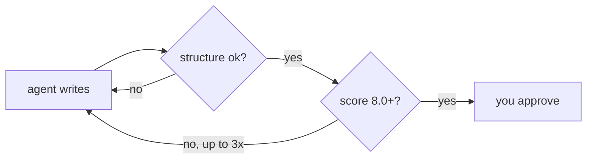

<div align="center">

# harness-kit

You describe a feature. Claude Code writes the spec, the plan, the code, the tests, and opens the PR, and nothing moves forward until it passes a check.


</div>

# What it is

A set of Claude Code agents that take one idea through six steps: `prd → prp → plan → dev → test → pr`. Each step writes a normal markdown file, a script checks its structure, a judge scores its quality, and only a passing step unlocks the next one. You approve twice: the direction after the PRD, and the PR before it opens.

# When to use it

Use it when a feature is worth doing right: it touches real users, other people will review it, or you will have to explain later why it was built that way. You get a written problem, acceptance criteria, a plan tied to real files, code that follows your repo conventions, and a scored review, without writing any of it by hand.

Skip it for a one-line fix, a spike you will throw away, or a question you can answer by reading the code. For those, plain Claude Code is faster.

# Why it is worth it

| Without it | With it |
|---|---|
| The ticket lives in your head or a chat thread | A PRD with the problem, the customers, and a numeric success metric |
| "Done" is whatever the agent decided | Acceptance criteria you can check one by one |
| The agent edits whatever it finds | A plan that names the files, and optionally a gate that fails on any other file |
| Review is reading a diff and hoping | Every document scored against a rubric and retried until it passes |
| Nobody remembers why the code is like this | Each requirement linked to the code and the test that prove it, if you turn graph engineering on |

You spend your attention on two decisions, the direction and the PR, instead of on typing specs and chasing conventions.

# Pick a setup

Start with the default; one command switches later.

| Setup | Best for | Adds | Cost |
|---|---|---|---|
| Plain (default) | most features, trying it out | the gated pipeline | nothing extra |
| Jev judge | a judge that is not Claude grading Claude | scoring by Jev, Claude when unsure | about $0.04 per million tokens |
| Graph engineering | shared or audited codebases | requirement ids, trace file in the PR, scope gate | free |
| Graph and Jev | both | both | about $0.04 per million tokens |

# Install

```
/plugin marketplace add Pierry/harness-kit
/plugin install harness-kit@harness-kit
```

Restart Claude Code, open the repo you want to use it in, and run `/harness-kit:install`. It asks two questions; answer for your setup and restart once more. You need `python3`, `git`, and the [gh CLI](https://cli.github.com/).

| Question | Plain | Jev judge | Graph engineering | Graph and Jev |
|---|---|---|---|---|
| Eval judge | `local` | `jev` | `local` | `jev` |
| Graph engineering | `off` | `off` | `manifest` or `full` | `manifest` or `full` |

For Jev, create a key at [console.typesafe.ai/keys](https://console.typesafe.ai/keys) and run `/hk:eval jev`. For the graph database (`full`), run `/hk:graph full` with a free key from [build.nvidia.com](https://build.nvidia.com), then `python3 .claude/scripts/graph.py setup` and `python3 .claude/scripts/graph.py index-code`. `manifest` needs nothing else.

To update: `/plugin update harness-kit`, restart Claude Code, then `/harness-kit:update`.

# What you can do

| You want | Run |
|---|---|
| Idea to merged PR, approving each step | `/golden-path` |
| Idea to PR, stopping only at the two approvals | `/pipeline:run "<idea>"` |
| Only the spec, no code yet | `/product-manager:run` |
| Code from a spec you already have | `/sse:run` |
| Same, without opening a PR | `/sse:run --local` |
| Keep fixing until every acceptance criterion passes | `/sse:sdd` |
| Design a hard system before building it | `/system-design:run` |
| Continue where you stopped | `/pipeline:continue` |
| See where the current feature is | `hk status` |

A brief is four lines:

```
/golden-path

Squad: checkout
Problem: Returning guests abandon checkout when a card is declined once.
Hypothesis: If we add one-tap retry, completion rises 5 points.
Success metric: checkout completion, from 71% to 76% within 30 days
```

Every step also runs alone (`/sse:plan`, `/sse:dev`, `/sse:test`, `/sse:pr`). [All commands](docs/COMMANDS.md).

# From task to merged PR

| Step | What happens | With Jev | With graph engineering |
|---|---|---|---|
| Brief | you type four lines after `/golden-path` | | |
| PRD | problem, customers, metrics; you approve the direction | Jev scores it | |
| PRP | files, patterns, acceptance criteria | Jev scores it | each criterion gets an id like `REQ-001`, `trace/{feature}.yml` is created |
| Plan | files to change, order, risks, tests | Jev scores it | each likely symbol becomes a link with evidence; those files become the only allowed scope |
| Dev | small commits, your linters, your conventions | Jev scores it | out-of-scope files fail the step; each commit is linked and checked in git |
| Test | suite runs, failures by name | Jev scores it | each test that proves a requirement is linked |
| PR | summary and test plan; you approve, a draft PR opens | Jev scores it | a traceability table goes in the PR; the next plan marks links VALIDATED or STALE |

The full walkthrough, with what you see at each step, is in [Getting Started](https://github.com/Pierry/harness-kit/wiki/Getting-Started).

# How it works

Each step runs the same loop. The agent writes the document. A sensor, which is a script, checks its structure. An eval scores it against a rubric of small yes/no checks such as "every success metric has a baseline". Below 8.0 the agent rewrites only the checks that failed, up to three times. You see the step only once it passes.


```mermaid
flowchart LR
    write[agent writes] --> sensor{structure ok?}
    sensor -->|no| write
    sensor -->|yes| eval{score 8.0+?}
    eval -->|no, up to 3x| write
    eval -->|yes| you[you approve]
```

When something keeps failing, you fix the guide or the rubric once, not every output. That idea, called harness engineering, comes from [Birgitta Böckeler](https://martinfowler.com/articles/harness-engineering.html).

# Options

All are off or on their simplest setting until you change them.

| Option | Default | What changes when you turn it on | Command |
|---|---|---|---|
| Eval judge | `local`: a fresh Claude scores | [Jev](https://typesafe.ai) by TypeSafe AI scores instead, a different model so Claude does not grade its own work; falls back to Claude when unsure. Paid, about $0.04 per million tokens | `/hk:eval jev` |
| Graph engineering | `off` | Every requirement gets an id, every file the plan expects to touch is recorded with its evidence, and dev fails if it touches anything else | `/hk:graph manifest` |
| Graph database | `off` | Adds a local graph of your decisions and your code's call graph, no Docker, on free NVIDIA models | `/hk:graph full` |
| Pipeline status bar | off, your own status line stays | Replaces it with the pipeline's current step | install with `HK_STATUSLINE=1` |

The harness also uses code tools when you have them installed: [semble](https://github.com/MinishLab/semble) to find code by meaning, [repowise](https://github.com/repowise-dev/repowise) for risk and affected tests, [context7](https://github.com/upstash/context7) for current library docs, Joern for call graphs. Without them it uses grep. Nothing here needs a paid key by default.

# Extras

| | What it does | Where |
|---|---|---|
| Brief builder | Turns an idea into a ready `/golden-path` prompt, checking each field as you type | [Open](https://pierry.github.io/harness-kit/brief/) |
| Quality dashboard | Shows each step's score and failures across every run, so you see if quality goes up or down | [Open](https://pierry.github.io/harness-kit/quality/phase-report.html) |
| Cockpit | A terminal view of the pipeline: watch steps live, run one with a key, approve at the gates | `npm i -g @pieerry/harness-kit`, then `hk-tui` |

# Agents

| Agent | Turns | Into |
|---|---|---|
| `product-manager` | a problem | a PRD and an engineering-ready PRP |
| `staff-software-engineer` | an approved PRP | a plan, code, tests, and a PR, using backend, web, mobile, or devops skills picked from your repo |
| `system-architect` | a hard problem | a system design document plus an adversarial review |

Registered in [AGENTS.md](./AGENTS.md).

# Learn more

The [wiki](https://github.com/Pierry/harness-kit/wiki) explains each part and the theory behind it, also in [Portuguese and Spanish](https://pierry.github.io/harness-kit/wiki/). Good starting pages: [Getting Started](https://github.com/Pierry/harness-kit/wiki/Getting-Started), [Golden Path](https://github.com/Pierry/harness-kit/wiki/Golden-Path), [Evals](https://github.com/Pierry/harness-kit/wiki/Evals), [Graph Engineering](https://github.com/Pierry/harness-kit/wiki/Graph-Engineering), [Graph Theory](https://github.com/Pierry/harness-kit/wiki/Graph-Theory), [Jev and System One](https://github.com/Pierry/harness-kit/wiki/Jev-and-System-One), and [References](https://github.com/Pierry/harness-kit/wiki/References) for every source the design draws on.

One honest limit: neither judge is checked against human ratings yet, so treat 8.0 as a useful signal, not a measurement.

# Contributing

Issues and PRs are welcome. Everything is markdown, Python, and shell: agents in `.claude/agents/`, commands in `.claude/commands/`. [AGENTS.md](./AGENTS.md) maps where each piece lives.

# License

MIT. Built on [Claude Code](https://claude.ai/code).
