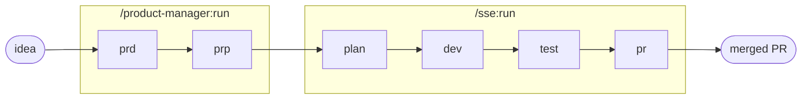

# Golden Path

Caveman-full. Internal doc.

## What golden path is

Golden path = opinionated, supported, paved way from idea to production. Term from Spotify
(Netflix calls it "paved road"). Not the *only* way — the *recommended* way. Five properties:

- **Opinionated** — one pipeline, repo conventions. No bikeshedding the flow.
- **Supported** — sensors + evals gate every stage. Harness catches drift, not you.
- **Optional** — step off any time, run stages solo. No enforcement, no punishment.
- **Self-serviceable** — one command. No tickets, no waiting on a platform team.
- **Transparent / extensible** — every stage names what ran (sensors, guides, evals).
  Override per repo via `conventions/`. Abstraction you can see through and bend.

## harness-kit golden path

One command. Idea → merged PR. Six gated stages:

```
/golden-path
```

Runs `/product-manager:run` (prd → prp) then `/sse:run` (plan → dev → test → pr → monitor).
Same six-stage `full-run` pipeline the status bar already tracks.

**Start from a brief.** The idea-brief builder collects the inputs the PRD needs (squad,
problem, hypothesis, customers, metric) in-standard and emits a paste-ready `/golden-path`
kick: [`docs/brief/`](./brief/) (GitHub Pages: `https://pierry.github.io/harness-kit/brief/`).



Each stage: writes artifact → deterministic sensors fire → LLM-judge eval (retry up to 3) →
approval marker → token accounting. See `AGENTS.md` § Pipeline stages.

Flag passthrough to the SSE half:

- `--local` — stop after test, no PR. Dev + test locally.
- `--sdd` — spec-driven loop variant (plan once, dev↔test↔eval until PRP spec met). Local only.
- `--no-monitor` — PR opens, skip auto merge-watch.

## Stepping off the path

Optional property in practice. Golden path is the paved lane, not a fence. Run any stage solo:

| Detour | Command |
|---|---|
| Just the PRD | `/product-manager:prd` |
| Just the PRP | `/product-manager:prp` |
| Just the plan | `/sse:plan` |
| Implement only | `/sse:dev` |
| Tests only | `/sse:test` |
| Open PR only | `/sse:pr` |
| Dev + test, no PR | `/sse:run --local` |
| Spec-driven loop | `/sse:sdd` |
| Resume where left off | `/pipeline:continue` |
| Abandon active run | `/pipeline:reset` |

Same sensors, same evals, same artifacts. You lose the one-command convenience, not the support.

## Per-discipline paving

Golden path canon: one path per engineering discipline. harness-kit does this in the dev stage —
auto-selects the repo's discipline conventions:

- `.claude/conventions/backend.md`
- `.claude/conventions/web.md`
- `.claude/conventions/mobile.md`
- `.claude/conventions/devops.md`

When a file exists, project wins over SSE defaults. These overrides *are* the per-discipline
paving. See `.claude/agents/staff-software-engineer/guides/conventions-override.md`.

## What runs behind the curtain

Transparency property. Golden path abstracts, never hides. Every stage summary names the
sensors, evals, guides, and refs that ran — not generic "done", actual names. Example from a
plan stage:

```
sensors: plan-structure ok, plan-feasibility ok
eval:    plan-quality 8/10 (attempts: 1)
guides:  pipeline.md, coding-style.md, skills/{area}/SKILL.md
refs:    prp/{feature_id}.md, conventions/{area}.md
```

Want to see deeper? Read the `sensors/`, `evals/`, `guides/` under
`.claude/agents/<agent>/`. Plain markdown. Nothing sealed.

## See also

- `AGENTS.md` — registry, routing, pipeline-stages spec
- `.claude/commands/golden-path.md` — the command
- `.claude/agents/staff-software-engineer/guides/sdd-loop.md` — spec-driven variant
