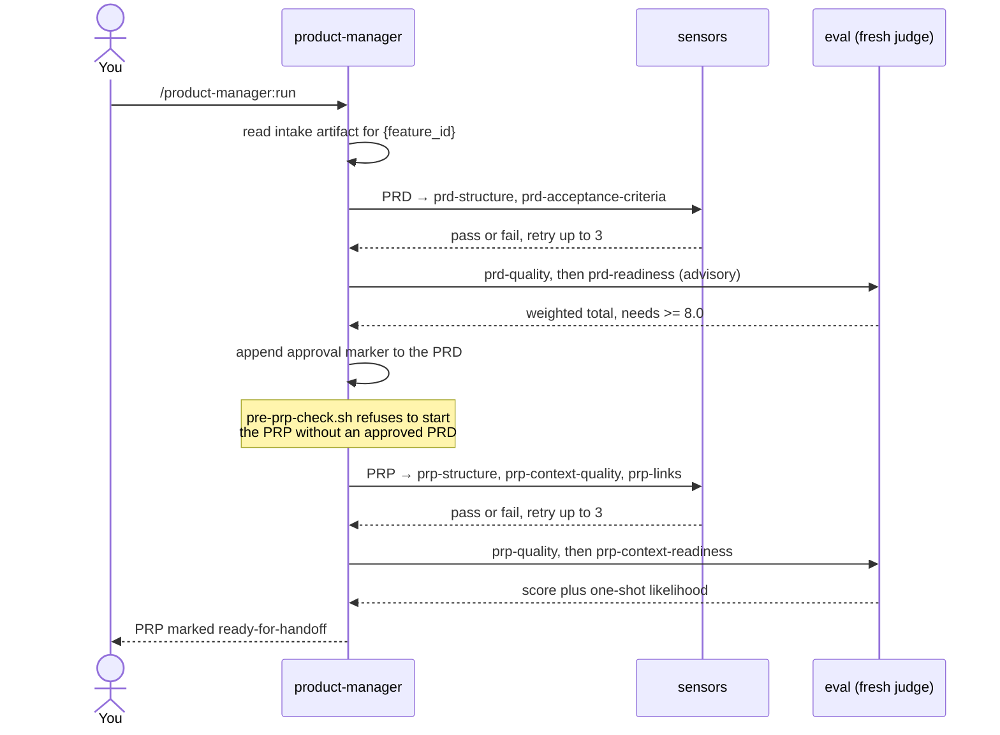
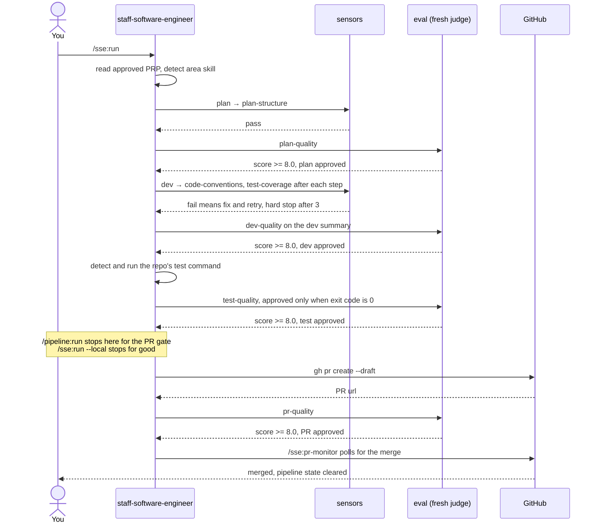
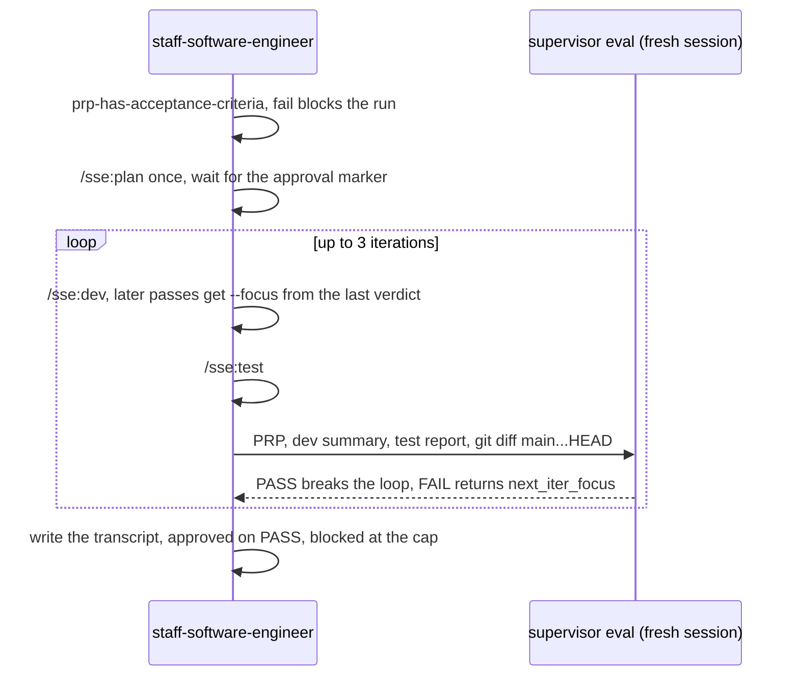
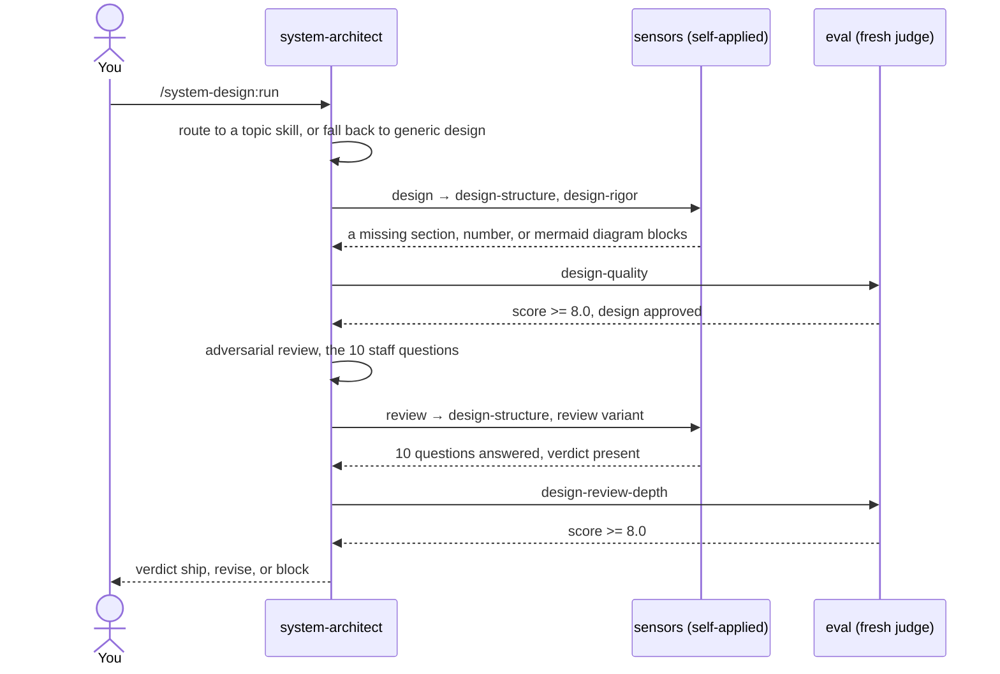

# Pipelines de los agents

Un diagrama de secuencia por agent, que muestra lo que realmente pasa entre el comando que escribes y
el artefacto que recibes de vuelta: qué sensors corren, qué eval califica el resultado, y dónde queda
la gate.

[Pipeline y stages](Pipeline-and-Stages) describe los stages en sí. [Sensors](Sensors) y
[Evals](Evals) describen los dos tipos de feedback. Esta página es el cableado.

## Lo que comparte cada stage

El mismo loop corre en cada stage de cada agent, así que léelo una vez y los tres diagramas de abajo
se vuelven mucho más cortos:

1. El agent genera el artefacto en `.claude/runtime/outputs/`.
2. Los **sensors** lo revisan de forma determinista. Pasa o falla, sin nota, sin juicio.
3. Un **eval** lo califica. El evaluador es un sub-agent nuevo (herramienta Task, `general-purpose`)
   que recibe solo la ruta del artefacto y la ruta de la rubric. El autor nunca califica su propio
   trabajo.
4. Por debajo del threshold, el agent regenera solo las secciones que fallaron o sacaron poco y lo
   intenta de nuevo. **Máximo tres intentos**, y después devuelve un blocker en vez de seguir.
5. Al pasar, agrega un marker de aprobación: `<!-- approved: {YYYY-MM-DD} score={weighted-total} -->`.
   Ese marker es la gate que revisa el stage siguiente.

El threshold es **total ponderado >= 8.0** para todo eval calificado: `prd-quality`, `prp-quality`,
`plan-quality`, `dev-quality`, `test-quality`, `pr-quality`, `design-quality` y
`design-review-depth`.

Las gates humanas son del orquestador, no de los agents. `/pipeline:run` se detiene en exactamente
dos: aprobar la dirección después del PRD, y aprobar el PR antes de que se abra. Los stages
individuales nunca agregan gates propias.

## product-manager

`prd → prp`. Punto de entrada `/product-manager:run`. Las entradas vienen del artefacto de intake y no
de ti, así que el agent no se detiene a preguntar.

Los artefactos quedan en `.claude/runtime/outputs/pm/prd/{feature_id}.md` y
`.claude/runtime/outputs/pm/prp/{feature_id}.md`.

Dos detalles que el diagrama comprime. `prd-readiness` es consultivo y no tiene threshold numérico,
así que reporta sin bloquear. `prp-context-readiness` es la gate de handoff de verdad: solo pasa
cuando cada sensor estructural pasó, `shippable` es yes o partial, hay como máximo dos preguntas
bloqueantes, y `one_shot_likelihood >= 0.7`.

## staff-software-engineer

`plan → dev → test → pr`. Punto de entrada `/sse:run`. Lee el PRP aprobado más reciente y detecta solo
el area skill (`backend`, `web`, `mobile`, `devops`) a partir de los archivos del repo, y monta encima
el skill `designer` cuando el trabajo es claramente una UI nueva.

Los artefactos quedan en `.claude/runtime/outputs/sse/{plan,dev,test,pr}/{feature_id}.md`.

El stage `dev` es el único que pasa por gate dos veces: `code-conventions` y `test-coverage` corren
contra el código después de cada paso de implementación, y `dev-structure` más `dev-quality` corren
después contra el resumen escrito. Los tests que fallan nunca se reintentan automáticamente; el agent
devuelve un blocker y te deja la decisión.

### La variante SDD

`/sse:sdd` reemplaza los stages lineales de dev y test por un loop guiado por objetivo. Planea una vez
y después itera hasta satisfacer el spec del propio PRP. Es solo local y nunca abre un PR.

El predicado se construye a partir del PRP mismo: cada bullet bajo `Success criteria (verifiable)`
tiene que estar cubierto por código y por un test, y cada comando del bloque `Validation gates` tiene
que salir con 0. El supervisor corre en una sesión nueva, así el contexto del worker no se filtra a su
propia calificación. Llegar al tope de tres iteraciones es señal real de que el spec y el código no
coinciden.

## system-architect

`design → review`. Punto de entrada `/system-design:run`. Este agent es un stage opcional previo al
PRP, no forma parte del golden path. Elige un **topic skill** igual que el staff engineer elige un area
skill: `url-shortener`, `rate-limiter` o `search-engine` cuando el problema encaja con alguno, y el
skill genérico `design` en los demás casos.

Los artefactos quedan en `.claude/runtime/outputs/architect/design/{feature_id}.md` y
`.claude/runtime/outputs/architect/review/{feature_id}.md`.

Este agent es deliberadamente libre de hooks: sus sensors son reglas en markdown autoaplicadas, no
scripts que corren desde los hooks de `settings.json`, lo que lo mantiene portable a cualquier
herramienta que lea `AGENTS.md`. El review es escéptico por defecto e interroga en lugar de resumir. Un
verdict `block` es terminal, el diseño no se marca como listo y el run muestra los blockers en su
lugar.

## Relacionados

- [Pipeline y stages](Pipeline-and-Stages), los stages y sus artefactos
- [Sensors](Sensors) y [Evals](Evals), los dos mecanismos de feedback
- [Agents](Agents), para qué sirve cada agent
- [Golden path](Golden-Path), la puerta de entrada de punta a punta
- [Método de system design](System-Design-Method), el método detrás del architect
