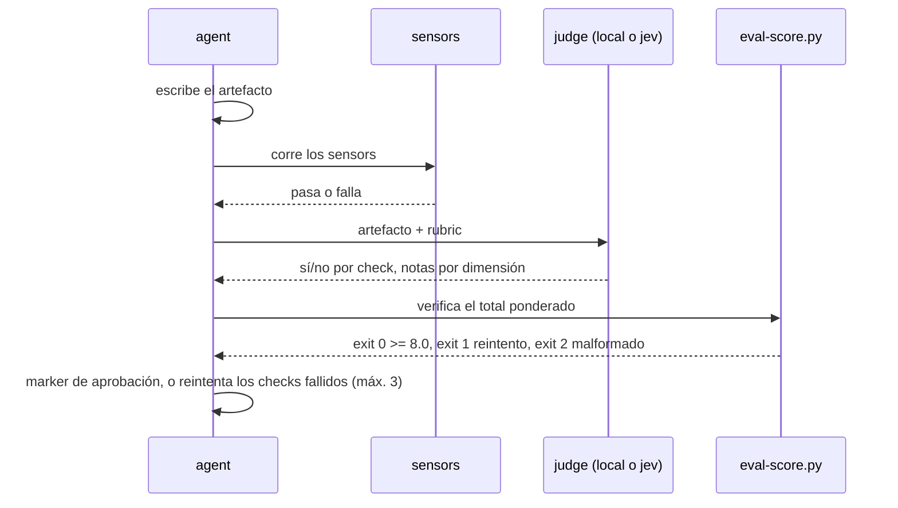

# Pipelines de los agents

Qué sensors corren, qué eval califica el resultado y dónde queda la gate, desde el comando hasta el artefacto. [Pipeline y stages](Pipeline-and-Stages) describe los stages, y [Sensors](Sensors) y [Evals](Evals) describen los dos tipos de feedback.

# El loop que corre cada stage

El agent escribe el artefacto en `.claude/runtime/outputs/`. Los sensors lo revisan de forma determinista con el runner versionado: pasa o falla, sin nota. Después un judge que no escribió el artefacto responde los checks de sí o no de la rubric en `.claude/agents/{agent}/evals/*.md`.

El judge es el que se eligió con `/hk:eval jev | local`: un evaluador Claude nuevo que recibe solo las rutas del artefacto y de la rubric, o Jev, que escala a Claude cuando tiene dudas en un check decisivo. `eval-score.py` recalcula el total ponderado y rechaza un judge cuya aritmética o claves no coinciden. Por debajo de 8.0 el agent regenera solo los checks que fallaron, hasta 3 intentos, y después devuelve un blocker. Al pasar agrega `<!-- approved: {YYYY-MM-DD} score={weighted-total} -->`, el marker que revisa el stage siguiente. Los detalles están en [Evals](Evals).

```mermaid
sequenceDiagram
    participant A as agent
    participant S as sensors
    participant J as judge (local o jev)
    participant V as eval-score.py
    A->>A: escribe el artefacto
    A->>S: corre los sensors
    S-->>A: pasa o falla
    A->>J: artefacto + rubric
    J-->>A: sí/no por check, notas por dimensión
    A->>V: verifica el total ponderado
    V-->>A: exit 0 >= 8.0, exit 1 reintento, exit 2 malformado
    A->>A: marker de aprobación, o reintenta los checks fallidos (máx. 3)
```

Las gates humanas son del orquestador. `/pipeline:run` se detiene en dos: aprobar la dirección después del PRD y aprobar el PR antes de que se abra. Los stages nunca agregan gates propias.

# Consulta por stage

| Stage | Sensors | Eval |
|---|---|---|
| prd | prd-structure, prd-acceptance-criteria | prd-quality, prd-readiness (consultivo) |
| prp | prp-structure, prp-context-quality, prp-links | prp-quality, prp-context-readiness |
| plan | plan-structure | plan-quality |
| dev | code-conventions, test-coverage, dev-structure | dev-quality |
| test | test-structure | test-quality, aprobado solo con exit code 0 |
| pr | pr-structure | pr-quality |
| design | design-structure, design-rigor | design-quality |
| review | design-structure (variante de review) | design-review-depth |

Los artefactos quedan en `.claude/runtime/outputs/pm/{prd,prp}/{feature_id}.md`, `.claude/runtime/outputs/sse/{plan,dev,test,pr}/{feature_id}.md` y `.claude/runtime/outputs/architect/{design,review}/{feature_id}.md`.

# product-manager

`/product-manager:run` corre `prd` y después `prp`. Las entradas vienen del artefacto de intake, así que el agent no se detiene a preguntar. `pre-prp-check.sh` se niega a empezar el PRP sin un PRD aprobado.

`prd-readiness` es consultivo y nunca bloquea. `prp-context-readiness` es la gate de entrega: pasa solo cuando todos los sensors estructurales pasaron, `shippable` es yes o partial, hay como máximo 2 preguntas bloqueantes y `one_shot_likelihood >= 0.7`. Un PRP que pasa queda marcado como `ready-for-handoff`.

# staff-software-engineer

`/sse:run` corre `plan`, `dev`, `test` y `pr`. Lee el último PRP aprobado, detecta el área skill (`backend`, `web`, `mobile`, `devops`) a partir de los archivos del repo, y suma el [designer skill](Designer-Skill) cuando el trabajo es una UI nueva.

`dev` pasa por dos gates: `code-conventions` y `test-coverage` corren sobre el código después de cada paso de implementación, y luego `dev-structure` y `dev-quality` corren sobre el resumen escrito. Los tests que fallan nunca se reintentan de forma automática; el agent devuelve un blocker con los nombres de los tests que fallaron. `/sse:run --local` se detiene después de test. Si no, `pr` corre `gh pr create --draft`, califica `pr-quality`, y `/sse:pr-monitor` consulta hasta que el merge limpia el estado del pipeline.

# La variante SDD

`/sse:sdd` planifica una vez y después repite dev, test y un eval supervisor hasta 3 iteraciones. Es solo local y nunca abre un PR. El sensor `prp-has-acceptance-criteria` corre primero y bloquea la corrida si falla.

El eval supervisor, `spec-satisfied`, siempre corre en Claude en una sesión nueva que recibe el PRP, el resumen de dev, el reporte de test y `git diff main...HEAD`. Cada viñeta bajo `Success criteria (verifiable)` tiene que cumplirse con código y un test, y cada comando en `Validation gates` tiene que salir con 0. Un FAIL devuelve `next_iter_focus`, que se pasa al siguiente `/sse:dev --focus`. Llegar al tope significa que la spec y el código no coinciden.

# system-architect

`/system-design:run` corre `design` y después `review`. Es un stage previo opcional antes del PRP, fuera del golden path. Redirige a un skill de tema (`url-shortener`, `rate-limiter`, `search-engine`) cuando el problema coincide con uno, y al skill genérico `design` en los demás casos.

El agent no tiene hooks ni runner de sensors; aplica él mismo sus reglas de sensor, así que funciona en cualquier herramienta que lea `AGENTS.md`. La review responde las 10 preguntas de staff con escepticismo y devuelve ship, revise o block. Un veredicto `block` es terminal: el design no queda marcado como listo y la corrida muestra los blockers.

# Relacionado

[Pipeline y stages](Pipeline-and-Stages), [Sensors](Sensors), [Evals](Evals), [Agents](Agents), [Golden Path](Golden-Path), [Método de System Design](System-Design-Method).
