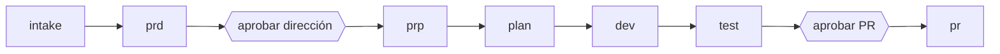

# Autonomía

Un solo comando lleva una idea hasta un PR y se detiene solo donde una persona aporta criterio. El stage `intake` y la regla de resolver, marcar, continuar corren en todos los stages (prd, prp, plan, dev, test, pr, system-design). La forma canónica es [`.claude/shared/pipeline-pattern.md`](https://github.com/Pierry/harness-kit/blob/main/.claude/shared/pipeline-pattern.md). Todavía en plan: escalonar modelos a Haiku para checks baratos, y que cada organización complete su propio `context-library/repos.md`.

# Las preguntas son contexto que falta

La primera versión se detenía antes de cada artefacto para preguntar el squad, el problema, los clientes, la hipótesis, el link de la apuesta y las rutas del repo. Borrar esas preguntas y dejar que el agent adivine produce un squad alucinado o una métrica inventada. En cambio, harness-kit hace que el agent lea el repo, su historial y la context library antes que nada, y pregunta solo lo que es externo.

En términos de [Harness Engineering](Harness-Engineering), esto pasa de feedback a feedforward. Preguntar a mitad de la corrida es feedback: el agent produce un hueco y espera. Juntar el contexto de entrada es feedforward: el hueco nunca se forma.

# El stage de intake

`intake` corre antes de `prd` como [subagent](Orchestration-and-Subagents) (`/intake:run`). Lee el repo objetivo (código, README, commits recientes, PRs e issues abiertos), `context-library/` (business-info, squads, metrics, decisions) y los remotes de git. Escribe `.claude/runtime/outputs/intake/{feature_id}.md` con `squad`, `problem`, `customers`, `hypothesis`, `repos`, `metrics` y `unknowns`.

Como corre en un contexto aislado, su exploración nunca llega a los stages siguientes. Ellos leen el artefacto destilado. El agent del PRD lo lee en lugar de preguntarte.

# Resolver, marcar, continuar

Cada entrada recibe una de tres disposiciones, que reemplazan el preguntar o bloquear.

| Disposición | Cuándo | Qué pasa |
|---|---|---|
| Resolver | La respuesta está en el repo o en la context library | El valor entra al artefacto, sin contacto humano |
| Marcar | La respuesta no se encuentra (un link de apuesta, una meta ejecutiva) | `NOT FOUND - NEEDS REVIEW: {detail}` va en línea y en `unknowns`, la corrida sigue |
| Continuar | Siempre | La corrida nunca se bloquea por una entrada faltante; lo desconocido aparece en la siguiente gate |

Los evals toleran una cantidad acotada de markers: `prp-context-quality` bloquea solo por encima de 5. Un artefacto previo faltante es el único corte duro, y el stage se aborta indicando el comando que hay que correr primero.

# Dos gates

La persona pasa de estar en el loop, respondiendo antes de cada artefacto, a estar sobre el loop, aprobando en los puntos donde revisar es barato y un error es caro. La distinción viene de lo que escribe Böckeler sobre harness engineering.

La gate del PRD lleva unos 30 segundos y evita una corrida completa de dev apuntada en la dirección equivocada. La gate del PR protege la única acción hacia afuera que es difícil de deshacer. `/pipeline:run --yolo` quita las dos para flujos confiables y de bajo riesgo.

# Lo que sigue siendo determinista

Las búsquedas son código. `context-library/repos.md` asocia cada squad con las rutas de sus repos; viene como `context-library/repos-template.md` para que cada organización lo complete. Sin una entrada, intake detecta los repos desde el directorio de trabajo y los remotes de git. `feature_id` se calcula como `{YYYY-MM-DD}-{squad}-{slug}`.

# Lo que no cambia

Los sensors y evals se disparan en cada stage, así que un PRD autónomo enfrenta las mismas barras de `prd-structure` y `prd-quality` que uno guiado. Los markers, la contabilidad de tokens y `.pipeline-state.json` funcionan igual que antes, e intake cambia el estado con los mismos hooks. `/pipeline:continue` retoma en el siguiente stage pendiente después de una falla.

# Ver también

[Orquestación y subagents](Orchestration-and-Subagents), [Pipeline y stages](Pipeline-and-Stages), [Harness Engineering](Harness-Engineering).
