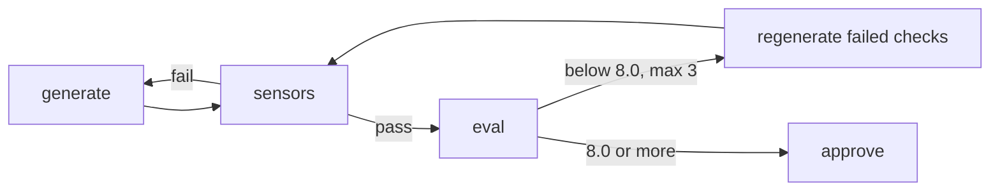

# Evals (feedback inferencial)

Un [sensor](Sensors) revisa la estructura con regex. Un eval juzga el significado, por ejemplo si el plan se desprende del PRP. Cada eval es una rubric ponderada que puntúa de 0 a 10; se aprueba con 8.0, con hasta 3 retries.

# Anatomía de una rubric

Las rubrics viven en `.claude/agents/{agent}/evals/*.md`. Cada dimensión `### Name (weight N%)` lleva checks atómicos de sí o no: las líneas `- check:` son preguntas para el judge, y las líneas `- absent:` son regex que corren en código (palabras prohibidas, raya larga, diagramas de cajas en ASCII).

```markdown
### Metric completeness (weight 20%)
- check: Every metric in `sections.success_metrics` has a baseline value.
- check: Every metric in `sections.success_metrics` has a target value.
- check: `sections.success_metrics` states a kill criterion with a numeric threshold.

### Voice (weight 5%)
- absent: (?i)\b(delve|leverage|utilize|unlock|streamline|robust|cutting-edge|seamless|best-in-class)\b
- absent: (?m)^\s*\+[-=]{3,}\+
```

Una dimensión puntúa 10 veces la proporción de sus checks cumplidos; las anclas 0/5/10 solo desempatan.

# Aritmética verificada

`eval-score.py` recalcula el total ponderado a partir de los pesos de la rubric y rechaza un judge cuya aritmética o claves no coinciden.

```
python3 .claude/scripts/eval-score.py --rubric evals/prd-quality.md --scores judge.json
```

| Salida | Significado |
|---|---|
| `0` | consistente y en 8.0 o más; imprime el puntaje para el marker de aprobación |
| `1` | por debajo del threshold, reintentar |
| `2` | salida malformada, total incorrecto o dimensiones faltantes o sobrantes |

# El loop de retry

Los sensors corren primero, así ninguna llamada al judge va a un artefacto malformado. Un eval fallido regenera solo los checks que fallaron, que son el feedback textual. Después de 3 intentos fallidos el stage devuelve un blocker.



# Dos judges

`/hk:eval jev | local` elige el judge por proyecto. La elección vive en `.claude/hk-config.json`, se pregunta una vez en la instalación, y el default es `local`.

`local` es un evaluador nuevo de Claude que solo ve el artefacto y la rubric. `jev` es Jev de [TypeSafe AI](https://typesafe.ai), un modelo System One que devuelve probabilidades calibradas en vez de texto, llamado desde `.claude/scripts/jev-judge.py`. Cada check es una pregunta Noul (sí o no). El artefacto se envía dividido por sección `## ` (`sections.success_metrics`), así un check lee solo la parte que nombra; un check sobre una sección ausente falla sin llamada. Cada corrida agrega una línea a `.claude/runtime/outputs/evals/jev-judge.jsonl`.

# Escalamiento a Claude

La corrida escala al evaluador de Claude cuando Jev duda en checks que deciden el resultado: el total recalculado con las respuestas dudosas forzadas a no y a sí cae a ambos lados de 8.0. También escala cuando no hay key, cuando el artefacto supera los 32k tokens o ante un error de la API.

La key vive en una variable de entorno (por default `TYPESAFE_API_KEY`) o en el bloque `env` de `.claude/settings.local.json`, nunca en un archivo commiteado. Jev es una API paga, unos $0.042 por millón de tokens de entrada, así que corre en local y nunca en CI. `spec-satisfied` y los gates de readiness siempre usan Claude.

# Evals por stage

| Stage | Evals |
|---|---|
| `prd` | `prd-quality`, `prd-readiness` |
| `prp` | `prp-quality`, `prp-context-readiness` |
| `plan` | `plan-quality` |
| `dev` | `dev-quality` |
| `test` | `test-quality` |
| `pr` | `pr-quality` |
| loop `sdd` | `spec-satisfied` |
| system design | `design-quality`, `design-review-depth` |

Los pesos dicen qué le importa a cada gate; la calidad del PRD pone 20% en claridad y 20% en completitud de métricas. Ajustas un peso una vez y se aplica a todo artefacto futuro. `design-review-depth` hace fallar una revisión que aprueba por inercia: sin brechas nombradas, severidad plana, consejos genéricos.

# spec-satisfied

`/sse:sdd` usa `spec-satisfied`, que devuelve PASS o FAIL contra `Success criteria (verifiable)` y `Validation gates` del PRP. Un FAIL vuelve a entrar al loop de dev y test con una pista `next_iter_focus`, hasta 3 iteraciones. Corre en una sesión nueva, sin contexto del worker.

# Por qué esta forma

Un judge Claude que califica salida de Claude infla los puntajes ([Wataoka et al.](https://arxiv.org/abs/2410.21819); [Panickssery et al.](https://arxiv.org/abs/2404.13076)); una familia distinta lo reduce, no lo elimina. Los checklists atómicos aumentan el acuerdo entre judges ([CheckEval](https://arxiv.org/abs/2403.18771), [TICK](https://arxiv.org/abs/2410.03608)). El escalamiento sigue [Trust or Escalate](https://arxiv.org/abs/2407.18370). Los checks de Jev siguen su [guía](https://docs.typesafe.ai/model-jaggedness/jev-1.13): un juicio por pregunta, sin conteos, estado de filtro.

# Lo que el puntaje no es

Ningún judge está validado todavía contra etiquetas humanas, y 8.0 es una convención, no un límite calibrado. [Hamel Husain](https://hamel.dev/blog/posts/llm-judge/) recomienda unos 100 ejemplos etiquetados por modo de falla; el log jsonl es el comienzo de ese conjunto. Lee los checks que fallaron, no solo el número.

# Ver también

[Sensores](Sensors), [Guides](Guides), [Pipeline y stages](Pipeline-and-Stages), [Referencias](References).
