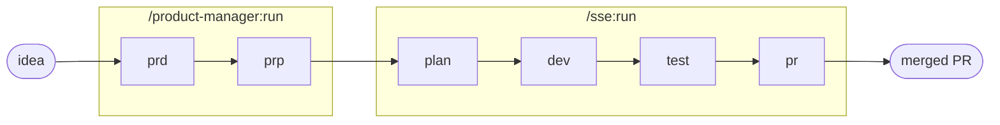

# Golden Path

El golden path es el **camino pavimentado, opinado y con soporte, de la idea a producción**. El término
viene de Spotify; Netflix lo llama "paved road". No es la *única* manera de atravesar el harness, es la
*recomendada*.

```
/golden-path
```

Un solo comando corre los seis stages con gate: `/product-manager:run` (prd → prp) y después `/sse:run`
(plan → dev → test → pr → monitor). Entra una idea, sale un PR mergeado.

## Las cinco propiedades

Un golden path de verdad se define por cinco propiedades, y harness-kit busca cumplir todas:

- **Opinado**: un pipeline, las convenciones del repo, sin bikeshedding del flujo.
- **Con soporte**: sensors + evals dan gate en cada stage. El drift lo atrapa el harness, no la persona.
- **Opcional**: salirse en cualquier momento, correr stages sueltos. Sin imposición, sin castigo.
- **Autoservicio**: un comando. Sin tickets, sin esperar a un equipo de plataforma.
- **Transparente / extensible**: cada stage nombra lo que corrió (sensors, guides, evals); se puede
  sobrescribir por repo via `conventions/`. Una abstracción que se puede ver por dentro y doblar.

La combinación es el punto: opinado *y* opcional, con soporte *y* transparente. Pavimenta un carril sin
levantar una cerca.



## Empezar por un brief

El constructor de idea-brief junta los inputs que el PRD necesita (squad, problema, hipótesis, clientes,
métrica) y emite un kick de `/golden-path` listo para pegar, con validación inline que mantiene el texto
dentro de las convenciones del PRD mientras se escribe. Alojado en `pierry.github.io/harness-kit/brief/`.
¿La idea ya está clarísima? Saltarse el constructor y escribir `/golden-path` con el brief a mano.

## Flags (se pasan a la mitad SSE)

- `--local`, para después del test, sin PR. Dev + test en local.
- `--sdd`, variante del loop guiado por spec (plan una vez, dev↔test↔eval hasta cumplir la spec del PRP).
  Solo local.
- `--no-monitor`, el PR se abre, se salta el merge-watch automático.

## Salirse del camino

La propiedad "opcional" en la práctica. Cualquier stage se puede correr suelto:

| Desvío | Comando |
|---|---|
| Solo el PRD / PRP | `/product-manager:prd` · `:prp` |
| Solo plan / dev / test / pr | `/sse:plan` · `:dev` · `:test` · `:pr` |
| Dev + test, sin PR | `/sse:run --local` |
| Loop guiado por spec | `/sse:sdd` |
| Retomar donde se quedó | `/pipeline:continue` |
| Abandonar la run activa | `/pipeline:reset` |

Los mismos sensors, los mismos evals, los mismos artefactos. Se pierde la comodidad de un solo comando, no
el soporte.

## Pavimentación por disciplina

Un principio del golden path: un carril pavimentado por disciplina de ingeniería. harness-kit lo hace en
el stage de dev, seleccionando automáticamente las convenciones de la disciplina del repo:

```
.claude/conventions/{backend,web,mobile,devops}.md
```

Cuando el archivo existe, el proyecto le gana a los defaults del SSE. Esos overrides *son* la
pavimentación por disciplina, feedforward bajo control del equipo. Vea [Guides](Guides).

## Transparencia: lo que corre detrás de la cortina

El golden path abstrae, nunca esconde. El resumen de cada stage nombra los sensors, evals, guides y refs
que corrieron, nombres reales, no un "done" genérico:

```
sensors: plan-structure ok, plan-feasibility ok
eval:    plan-quality 8/10 (attempts: 1)
guides:  pipeline.md, coding-style.md, skills/{area}/SKILL.md
refs:    prp/{feature_id}.md, conventions/{area}.md
```

¿Ver más a fondo? Ahí están los `sensors/`, `evals/`, `guides/` dentro de `.claude/agents/<agent>/`.
Markdown puro. Nada sellado.

## Vea también

- [Pipeline y stages](Pipeline-and-Stages): los seis stages en detalle
- [Ingeniería de harness](Harness-Engineering): por qué el camino tiene gate como lo tiene
- [Agents](Agents): los agents que el camino orquesta
