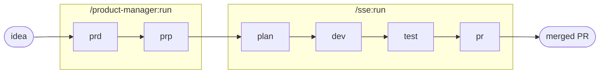

# Golden Path

El golden path es el camino recomendado de la idea a producción, un término de Spotify que Netflix llama paved road. También puedes correr cualquier stage por separado.

```
/golden-path
```

Un comando corre `/product-manager:run` (prd, prp) y después `/sse:run` (plan, dev, test, pr, monitor). Entra una idea, sale un merged PR. Para la versión sin intervención, con dos gates de aprobación y un stage `intake`, usa `/pipeline:run`; mira [Autonomía](Autonomy).


```mermaid
flowchart LR
    idea([idea]) --> prd --> prp --> plan --> dev --> test --> pr --> merged([merged PR])
    subgraph PM["/product-manager:run"]
        prd
        prp
    end
    subgraph SSE["/sse:run"]
        plan
        dev
        test
        pr
    end
```

# Las cinco propiedades

Es opinado: un solo pipeline y las convenciones del repo. Tiene soporte: sensors y evals controlan cada stage, así el harness detecta la deriva. Es opcional: te sales cuando quieras y corres stages por separado. Es autoservicio: un comando, sin ticket a un equipo de plataforma. Es transparente y extensible: cada stage dice qué corrió, y sobrescribes por repo con `.claude/conventions/`.

# Empezar por un brief

El constructor de briefs en `pierry.github.io/harness-kit/brief/` recolecta squad, problema, hipótesis, clientes y métrica, los valida contra las convenciones del PRD mientras escribes y genera una llamada a `/golden-path` lista para pegar. Si ya conoces la idea, escribe `/golden-path` con el brief tú mismo.

# Flags

Los flags pasan a la mitad SSE.

| Flag | Efecto |
|---|---|
| `--local` | para después de test, sin PR |
| `--sdd` | loop guiado por spec: planifica una vez, luego dev, test y eval hasta cumplir el PRP; solo local |
| `--no-monitor` | abre el PR y omite la vigilancia del merge |

# Salirse del camino

| Desvío | Comando |
|---|---|
| solo PRD o PRP | `/product-manager:prd`, `/product-manager:prp` |
| un stage de SSE | `/sse:plan`, `/sse:dev`, `/sse:test`, `/sse:pr` |
| dev y test, sin PR | `/sse:run --local` |
| loop guiado por spec | `/sse:sdd` |
| retomar | `/pipeline:continue` |
| abandonar la corrida | `/pipeline:reset` |

Los desvíos corren los mismos sensors, evals y artefactos. Solo se pierde la comodidad de un único comando.

# Pavimentación por disciplina

El stage dev lee las convenciones de disciplina del repo encima de los defaults de SSE, y el proyecto gana:

```
.claude/conventions/{backend,web,mobile,devops}.md
```

Estos archivos son feedforward que controla el equipo; mira [Guides](Guides).

# Lo que corre detrás de la cortina

Cada resumen de stage nombra los sensors, evals, guides y refs que corrieron:

```
sensors: plan-structure ok
eval:    plan-quality 8.4/10 (attempts: 1)
guides:  pipeline.md, coding-style.md, skills/{area}/SKILL.md
refs:    prp/{feature_id}.md, conventions/{area}.md
```

Los archivos detrás son markdown plano en `.claude/agents/<agent>/sensors/`, `evals/` y `guides/`. Qué judge calificó el eval depende de `/hk:eval`; mira [Evals](Evals).

Mira también [Pipeline y stages](Pipeline-and-Stages), [Harness Engineering](Harness-Engineering), [Agents](Agents).
