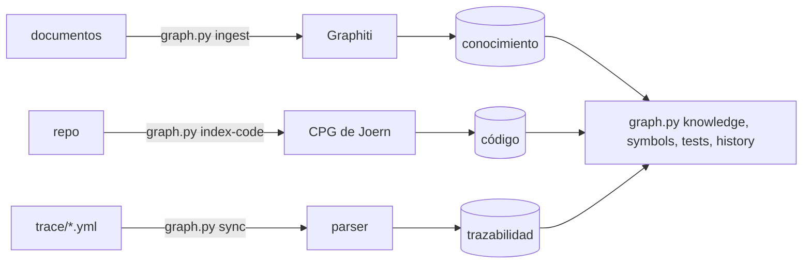

# Teoría de grafos

Un agent de código que recibe un ticket lee prosa, elige las partes que parecen instrucciones, busca el código por nombre y edita lo que encuentra. Nada le dice a qué requisito sirve un método, qué callers se rompen cuando ese método cambia, ni qué decidió el equipo el trimestre pasado sobre el mismo campo. Llena esos huecos con texto plausible. Una respuesta incorrecta que parece correcta es la más cara, porque pasa la revisión.

Graph engineering reemplaza las conjeturas con consultas. Los requisitos se vuelven átomos con ids estables, el código se vuelve un grafo de símbolos y llamadas, y los vínculos entre ellos llevan evidencia y un estado. La configuración, los comandos y los modos están en [Graph Engineering](Graph-Engineering). Las ideas de abajo son la base de cada parte, con las fuentes que les dieron forma.

# Requisitos como átomos

ISO/IEC/IEEE 29148:2018 enumera las características de un requisito bien formado, y una de ellas es singular: un requisito declara una capacidad, una característica o una restricción. Un requisito que junta dos comportamientos puede quedar implementado a medias y aun así parecer terminado, y un solo test no puede comprobar ambas mitades. El requisito singular es el átomo al que todo lo demás se vincula.

EARS, el Easy Approach to Requirements Syntax (Mavin et al., RE 2009), le da una gramática al átomo. Surgió del trabajo de control de motores en Rolls-Royce y fija un conjunto pequeño de patrones, cada uno abierto por una palabra clave: `When` para un evento, `While` para un estado, `If ... then` para comportamiento no deseado, `Where` para una función opcional, y un `shall` solo para comportamiento que siempre se cumple. Un disparador, una respuesta, un requisito.

```
REQ-001: When a shipment is created with a weight above the carrier limit,
         the API shall reject it with HTTP 422 and the code WEIGHT_OVER_LIMIT.
```

El id importa más que la redacción. El texto se edita durante la revisión; el id no cambia. Una vez que el ticket se vuelve REQ-001 a REQ-00n, cada paso posterior se basa en el id y el texto original del ticket no se vuelve a leer, así un criterio reescrito conserva sus vínculos, tests y commits. En harness-kit el PRP escribe cada criterio de éxito como `- [ ] REQ-001: ...`, y `trace.py init` lee esas líneas, o conserva los ids que el skill atomize ya asignó.

# La trazabilidad y por qué se pudren los vínculos

Gotel y Finkelstein le pusieron nombre al problema en An Analysis of the Requirements Traceability Problem (RE 1994). Lo dividieron en dos: la trazabilidad post requisitos sigue un requisito hacia adelante, hacia el diseño, el código y los tests, y la trazabilidad pre requisitos lo sigue hacia atrás, hacia quién lo pidió y por qué. Su estudio encontró la mayor parte de los problemas sin resolver del lado pre, donde el origen de un requisito vive en reuniones y documentos que ninguna herramienta vincula.

Gotel et al. volvieron al tema en The Grand Challenge of Traceability (2012) con una meta que llamaron trazabilidad ubicua: vínculos creados como efecto secundario del trabajo normal de ingeniería, confiables y tan baratos que nadie tenga que decidir si mantenerlos. El obstáculo que describen es el deterioro. Un vínculo escrito a mano el primer día sigue igual mientras el código debajo cambia cada semana, y nadie es responsable de actualizarlo.

Un vínculo obsoleto hace más daño que uno ausente, porque parece procedencia. El artículo Graph Engineering #1 de Pierry Borges registra un mapa de ownership donde un agent escribió 16 hashes de commit, y ninguno coincidía con algún objeto de git. Nada los verificó al momento de escribirlos, y quedaron en el archivo durante meses, tipográficamente idénticos a los reales, hasta que una auditoría los detectó.

La solución es que un vínculo lleve cómo se hizo y cuánto confiar en él: estado, confianza, los métodos detrás de él, evidencia, commit y fecha. PROPOSED significa que un análisis cree que el requisito toca el símbolo. VALIDATED significa que el cambio se mergeó y un test lo comprueba. STALE significa que el símbolo se movió o desapareció. Dos verificaciones mantienen honesto el estado: al escribir, el commit se resuelve contra git y un hash que git no encuentra se rechaza, y al asentar, cada símbolo se vuelve a buscar en el árbol actual. En palabras del artículo, la documentación envejece en silencio, la evidencia vence ruidosamente.

# Grafos de propiedades de código

Un compilador construye varias vistas del mismo código, y cada una responde una pregunta distinta. El árbol de sintaxis abstracta (AST) es la estructura parseada del código fuente: este método, esta llamada, estos argumentos. Dice qué es el código y nada sobre el orden en que se ejecuta.

El grafo de flujo de control (CFG) tiene un nodo por sentencia y una arista hacia cada sentencia que puede ejecutarse a continuación, así las ramas y los bucles se vuelven bifurcaciones y ciclos. Responde qué puede ejecutarse después de qué. El grafo de dependencias del programa (PDG) agrega dos tipos de aristas: dependencia de datos, donde la sentencia B lee un valor que la sentencia A escribió, y dependencia de control, donde B se ejecuta solo si la condición de A se cumple. Responde qué sentencias influyen en cuáles.

Yamaguchi et al. unieron los tres en Modeling and Discovering Vulnerabilities with Code Property Graphs (IEEE S&P 2014). El grafo de propiedades de código conserva los nodos del AST y pone encima las aristas del CFG y del PDG, todo en un solo grafo de propiedades, así un único recorrido puede hacer una pregunta que abarca sintaxis, orden y flujo de datos, como un argumento que viene de la entrada del usuario y llega a una llamada de copia sin verificación de límites en el camino. Lo usaron para encontrar 18 vulnerabilidades desconocidas hasta entonces en el kernel de Linux.

[Joern](https://github.com/joernio/joern) es la implementación de código abierto, con el esquema publicado en [cpg.joern.io](https://cpg.joern.io). Incluye frontends para C y C++, Java, JavaScript, Python, Kotlin y otros lenguajes, agrega un grafo de llamadas e información de tipos sobre las tres capas base, y se consulta en un lenguaje basado en Scala.

Para un agent la parte útil es el grafo de llamadas. Un cambio en el método M solo puede romper código que llega a M, es decir, sus callers, los callers de esos, y así hasta los entrypoints. Ese conjunto transitivo es el límite superior de lo que hay que revisar y volver a probar, y acota el radio de impacto antes de que alguien edite. Grep encuentra un nombre; el grafo de llamadas resuelve cada llamada a una sola declaración, así dos métodos llamados `validate` en clases distintas quedan separados.

harness-kit guarda solo esa parte. `graph.py index-code` corre un frontend de Joern, exporta métodos y sitios de llamada a través de `.claude/graph/export_callgraph.sc`, y los carga como nodos `Fn` unidos por aristas `CALLS`. Luego `graph.py symbols` imprime hasta 10 callers por cada símbolo candidato. El artículo agrega una nota de campo: en un proyecto Java con Lombok, Joern sin `--fetch-dependencies --delombok-mode no-delombok` omitió 4,351 de 4,890 archivos y produjo un grafo plausible de 188 KB, contra 16 MB con los flags. Cuenta lo que contiene el grafo en lugar de confiar en que existe.

# Grafos de conocimiento temporales y Graphiti

El conocimiento cambia de una forma en que el código no cambia. Un carrier sube su límite de peso, una decisión se revierte, una política vence. Un grafo que guarda ambos hechos da dos respuestas contradictorias, y un grafo que sobrescribe el anterior pierde el registro de lo que era cierto cuando se escribió el código anterior.

Rasmussen et al. describen la respuesta en Zep: A Temporal Knowledge Graph Architecture for Agent Memory ([arXiv:2501.13956](https://arxiv.org/abs/2501.13956), 2025), el paper detrás de [Graphiti](https://github.com/getzep/graphiti). Graphiti mantiene tres subgrafos. Los episodios guardan la entrada cruda, un documento o un mensaje, con su timestamp, así cada hecho puede apuntar a su origen. Las entidades y los hechos entre ellas se extraen de los episodios. Las comunidades agrupan entidades relacionadas con un resumen.

Cada arista de hecho es bitemporal. El tiempo válido registra cuándo el hecho se cumplía en el mundo, y el tiempo de transacción registra cuándo el sistema lo supo y cuándo lo marcó como vencido. Cuando un episodio nuevo contradice un hecho anterior, Graphiti cierra la validez de la arista anterior en lugar de borrarla, así puedes preguntar qué era cierto el 1 de marzo y también qué creía el sistema el 1 de marzo. El paper reporta 94.8% en el benchmark Deep Memory Retrieval contra 93.4% de MemGPT, y en LongMemEval mejoras de precisión de hasta 18.5% con la latencia de respuesta reducida en cerca de 90%.

El artículo trae la advertencia que acompaña esto. Requisitos tipados que atomize ya había producido se mandaron por el modelo de todos modos: 25 a 30 segundos por requisito, hechos inventados, un carrier guardado bajo dos nombres de nodo, y 35 de 42 aristas sin fecha de validez, lo que hizo imposible la revocación. Un parser que leyó el mismo archivo cargó 26 requisitos en 0.86 segundos como 107 nodos y 248 aristas, nada inventado, cada arista con fecha. El modelo se gana su lugar donde hay juicio, nunca donde un parser ya conoce la respuesta.

En harness-kit Graphiti solo corre en `graph.py ingest`, para documentos no estructurados como decisiones y notas de reuniones, sobre modelos de NVIDIA build en lugar de un Ollama local. `graph.py ingest` pasa el momento de la ingesta como tiempo de referencia de cada episodio. Los manifests y el CPG se cargan con parsers.

# La ontología como contrato

Una ontología aquí es la lista de tipos de nodo que pueden existir y las aristas válidas entre ellos, con los campos que cada arista requiere. Es el contrato entre cada proceso que escribe el grafo y cada proceso que lo lee.

El artículo empieza con lo que pasa sin una. Un grafo de conocimiento tenía 19,262 nodos, incluidos 1,100 requisitos tipados, y respondía nada a cada pregunta. El writer usaba un conjunto de etiquetas de nodo, el reader consultaba otro, y el cliente buscaba en una partición llamada "main" a la que no pertenecía ningún nodo. Siguió así durante semanas, porque un grafo que no devuelve nada se ve igual que un grafo que no tiene nada. En un mes los autores catalogaron ocho defectos en dos proyectos, entre ellos los hashes inventados, una fecha fija estampada en archivos generados, y una política de recuperación escrita como instrucciones para el LLM que se desvió del código de puntuación, que nunca la leyó. Cada uno fue un writer y un reader sin un contrato verificado.

La ontología queda como un archivo versionado para que un cambio llegue como un pull request que alguien pueda discutir. Crece solo cuando un documento real o código real pide un tipo. La primera ontología del artículo sobrevivió dos documentos; el tercero necesitó una arista para una política que restringe una feature, y entró marcada como local en lugar de canónica. Una arista que contaba los niveles de abstracción salteados, en lugar de inventar los que faltaban, convirtió "dónde se saltea niveles nuestra documentación" en una consulta que respondió 23 lugares.

harness-kit incluye `.claude/graph/ontology.yml` en la versión 1 con cuatro tipos de nodo (Requirement, Decision, Method, Test) y tres aristas (AFFECTS, IMPLEMENTS, VERIFIED_BY). `trace.py` la lee en cada escritura y `trace.py validate` rechaza un tipo de arista que no está en la lista, un campo obligatorio ausente, un estado desconocido, un requisito no declarado o un commit que git no encuentra.

# Un writer por capa

El grafo tiene tres capas separadas por etiquetas de nodo. El conocimiento son requisitos, decisiones y hechos. El código son archivos, métodos y llamadas. La trazabilidad son los vínculos entre los dos. Cada capa tiene exactamente un writer y la base de datos solo guarda.



La regla existe por la falta de coincidencia de etiquetas. Cuando dos procesos escriben las mismas etiquetas, cada uno tiene su propia idea del esquema y nada falla hasta que un reader vuelve vacío. Con un writer por capa, un solo lugar codifica cada parte del esquema, y el reader se puede probar contra ese lugar. El agent no ve nada de esto: hace cuatro preguntas a través de `graph.py` y las respuestas vienen de los backends que el modo active.

# El archivo es la verdad, el grafo es una proyección

El artículo reporta una prueba que nadie planea hacer: el equipo borró su base de datos Neo4j, sin backup para restaurar. Cada archivo de requisitos sobrevivió en git, el grafo se reconstruyó desde esos archivos en una tarde, y el grafo reconstruido era mejor que el perdido porque la ontología había mejorado entretanto. Si el grafo hubiera sido el único hogar de esos datos, un mes de trabajo se habría ido con un comando.

La lección que saca el artículo es simplificar la infraestructura y nunca los datos. La infraestructura se puede cambiar después; los datos que nunca se registraron se pierden. harness-kit guarda `trace/{feature_id}.yml` en git y lo envía con el PR. El grafo es FalkorDB embebido a través de falkordblite, guardado en `.claude/runtime/graph/kg.db` e ignorado por git, sin Docker y sin servidor. `graph.py sync` y `graph.py index-code` lo reconstruyen desde archivos. La capa de conocimiento se reconstruye ingiriendo de nuevo los documentos fuente, lo que cuesta llamadas al modelo, así que esos documentos también van en el repo.

# Recuperación antes de generación

Lewis et al. presentaron la generación aumentada por recuperación en Retrieval-Augmented Generation for Knowledge-Intensive NLP Tasks ([arXiv:2005.11401](https://arxiv.org/abs/2005.11401), NeurIPS 2020). Un recuperador trae pasajes de un índice y el generador se condiciona en ellos, así los hechos vienen de texto que puedes inspeccionar y actualizar cambiando el índice en lugar de volver a entrenar el modelo. Edge et al. lo extendieron en From Local to Global: A Graph RAG Approach to Query-Focused Summarization ([arXiv:2404.16130](https://arxiv.org/abs/2404.16130), 2024): un LLM construye un grafo de entidades a partir del corpus, el grafo se divide en comunidades, y cada comunidad se resume de antemano, lo que responde preguntas sobre todo el corpus que recuperar los pocos fragmentos más parecidos no alcanza.

Graph engineering toma el orden del primer paper y la estructura del segundo. La recuperación corre primero y sigue aristas, de requisito a símbolo a caller a test, en lugar de ordenar texto solo por similitud. Todas las consultas se disparan en paralelo: símbolos, historial de git, documentos, tests, memoria y el CPG. En el monolito del artículo, de 4,900 archivos Java, el CPG tarda 15 minutos en construirse y encuentra 1,062 entrypoints, 990 de ellos HTTP, agrupados en 77 features con 2,124 cláusulas de contrato. Se construye una vez y se reindexa con commits nuevos, nunca por ticket; un servicio más chico se indexó en menos de un minuto.

# Acotar el contexto

Liu et al. midieron por qué más contexto no es mejor en Lost in the Middle: How Language Models Use Long Contexts ([arXiv:2307.03172](https://arxiv.org/abs/2307.03172), TACL 2024). La precisión al responder preguntas sobre varios documentos es más alta cuando el pasaje relevante está al inicio o al final de la entrada y cae cuando está en el medio. En algunas configuraciones el modelo rindió peor con la respuesta enterrada en medio del contexto que sin ningún documento.

Por eso el grafo acota el contexto y nunca lo llena. harness-kit devuelve como máximo 5 hechos de Graphiti y 5 resúmenes de entidades por consulta de conocimiento y 10 callers por símbolo, y la lista de alcance del plan es el único conjunto de archivos que dev puede tocar, impuesto por `trace.py gate`. La misma regla aplica al eval judge, que recibe una sección por verificación; ver [Jev and System One](Jev-and-System-One).

# Cómo harness-kit aplica cada idea

| Idea | Dónde vive |
|---|---|
| Requisito singular, id estable | líneas `- [ ] REQ-001:` del PRP, leídas por `trace.py init` |
| Vínculo con evidencia y estado | `trace/{feature_id}.yml`, escrito solo por `.claude/scripts/trace.py` |
| Commit verificado al escribir | `resolve_commit` en `trace.py` |
| Los vínculos se asientan después del merge | `trace.py settle --all`, al inicio de cada plan |
| Ontología como contrato | `.claude/graph/ontology.yml`, impuesta por `trace.py validate` |
| El grafo de llamadas acota el radio de impacto | `graph.py index-code`, `graph.py symbols` |
| Conocimiento temporal | `graph.py ingest` hacia Graphiti sobre modelos de NVIDIA build |
| Un writer por capa | Graphiti, Joern, `trace.py`; FalkorDB solo guarda |
| El archivo es la verdad | `graph.py sync` e `index-code` reconstruyen `kg.db` |
| Alcance como lista | `trace.py scope`, `trace.py gate` |

# Referencias

Pierry Borges, Graph Engineering #1: Introduction, artículo inédito, fuente de las notas de campo y los números de uso en producción.

ISO/IEC/IEEE 29148:2018, Systems and software engineering, Life cycle processes, Requirements engineering, para el requisito singular. Mavin et al., Easy Approach to Requirements Syntax (EARS), RE 2009.

Gotel y Finkelstein, An Analysis of the Requirements Traceability Problem, RE 1994. Gotel et al., The Grand Challenge of Traceability (v1.0), en Software and Systems Traceability, Springer, 2012.

Yamaguchi et al., Modeling and Discovering Vulnerabilities with Code Property Graphs, IEEE S&P 2014. [Joern](https://github.com/joernio/joern) y la [especificación del CPG](https://cpg.joern.io).

Rasmussen et al., [Zep: A Temporal Knowledge Graph Architecture for Agent Memory](https://arxiv.org/abs/2501.13956), 2025. [Graphiti](https://github.com/getzep/graphiti). [FalkorDB](https://github.com/FalkorDB/FalkorDB).

Lewis et al., [Retrieval-Augmented Generation for Knowledge-Intensive NLP Tasks](https://arxiv.org/abs/2005.11401), NeurIPS 2020. Edge et al., [From Local to Global: A Graph RAG Approach to Query-Focused Summarization](https://arxiv.org/abs/2404.16130), 2024. Liu et al., [Lost in the Middle: How Language Models Use Long Contexts](https://arxiv.org/abs/2307.03172), TACL 2024.

# Ver también

[Graph Engineering](Graph-Engineering), [Jev and System One](Jev-and-System-One), [Evals](Evals), [References](References).
