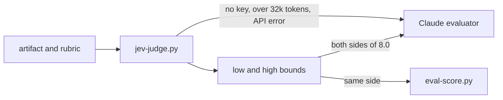

# Jev y System One

Cada stage de harness-kit termina en un eval: un judge lee el artefacto contra una rubric ponderada y el stage aprueba con 8.0. Cuando el judge es un modelo de la misma familia que escribió el artefacto, el gate mide familiaridad además de calidad. Jev, un modelo System One de [TypeSafe AI](https://typesafe.ai), es el segundo judge que ofrece harness-kit por esa razón. Cómo cambiar de judge y leer la salida está en [Evals](Evals). La investigación y el diseño del modelo detrás de esa elección están abajo.

# El problema de un judge LLM

Zheng et al. fijaron la línea base en Judging LLM-as-a-Judge with MT-Bench and Chatbot Arena ([arXiv:2306.05685](https://arxiv.org/abs/2306.05685), 2023). GPT-4 como judge coincidió con las preferencias humanas más del 80% de las veces, el mismo nivel en que los humanos coinciden entre sí. El mismo paper midió tres sesgos. Posición: con las dos respuestas intercambiadas, GPT-4 dio un veredicto consistente en el 65.0% de los casos, que subió a 77.5% con ejemplos few-shot. Verbosidad: una respuesta inflada con una copia reformulada de su propia lista le ganó a la original para Claude-v1 y GPT-3.5 en el 91.3% de 23 casos, y para GPT-4 en el 8.7%. Autopreferencia: GPT-4 favoreció sus propias respuestas con una tasa de victoria 10% mayor y Claude-v1 con 25%, aunque los autores dicen que sus datos eran demasiado limitados para confirmar el efecto.

Trabajos posteriores lo confirmaron. Panickssery et al., en LLM Evaluators Recognize and Favor Their Own Generations ([arXiv:2404.13076](https://arxiv.org/abs/2404.13076), 2024), encontraron que los modelos distinguen su propia salida de la de otros, y que la fuerza de la autopreferencia crece de forma lineal con ese autorreconocimiento; hacer fine-tuning a un modelo para que se reconozca mejor hizo que se prefiriera más. Wataoka et al., en Self-Preference Bias in LLM-as-a-Judge ([arXiv:2410.21819](https://arxiv.org/abs/2410.21819), 2024), rastrearon un mecanismo: los judges dan puntajes más altos a texto con menor perplejidad, texto que les resulta más familiar, lo hayan escrito o no.

Para un pipeline de Claude calificado por Claude este es el peor caso. El PRD en revisión es texto que el judge encuentra familiar al máximo. Un evaluador nuevo con un contexto limpio quita el razonamiento del escritor, y los pesos que encuentran familiar la prosa siguen siendo los mismos.

Verga et al. probaron la respuesta obvia en Replacing Judges with Juries ([arXiv:2404.18796](https://arxiv.org/abs/2404.18796), 2024). Un panel de tres judges más pequeños de familias de modelos distintas coincidió con los humanos mejor que un solo judge GPT-4 en sus datasets, mostró menos sesgo intramodelo y costó más de siete veces menos. harness-kit da un paso en esa dirección: un judge de otra familia, con Claude como respaldo. Todavía no es un panel.

# Modelos System One y System Two

Los nombres retoman los dos modos de pensamiento de Kahneman: System 1 es rápido e intuitivo, System 2 es lento y deliberado. Un LLM trabaja en el segundo modo. Genera razonamiento token por token y responde en prosa que tu código después parsea, y el parseo puede fallar.

Los modelos [System One](https://typesafe.ai/blog/introducing-system-one-models-and-jev) de TypeSafe hacen el primer tipo de trabajo: el juicio que una persona con conocimiento hace en un segundo si tiene el contexto correcto. Envías un estado (el contenido a juzgar) y un conjunto de preguntas tipadas, y Jev devuelve una distribución de probabilidad sobre las opciones que diste. Nunca produce un valor fuera de ellas, así que la respuesta no puede venir malformada. TypeSafe lo entrena con un método que llama RLCD para devolver probabilidades calibradas, y los mismos pesos sirven a todas las cuentas.

Jev no escribe texto, no llama herramientas ni mantiene una conversación, y la [página de coding agents](https://docs.typesafe.ai/introduction/coding-agents) dice sin rodeos que no puede reemplazar al modelo detrás de Claude Code. La división en harness-kit sigue esa línea. Claude escribe el PRD, que es trabajo System Two. Si `sections.success_metrics` nombra una línea base es una pregunta System One.

# Qué devuelve Jev

Cada pregunta tiene un id, un tipo e instrucciones. El id queda en tu código y nunca llega al modelo.

| Tipo | Respuesta | Cómo leerla |
|---|---|---|
| Noul | `noul` | probabilidad de que la respuesta sea sí |
| Score | `score`, `probabilities`, `confidence` | posición en niveles ordenados que tú describes |
| Choice | `choice`, `probabilities`, `confidence` | una opción de un conjunto sin orden |

Un valor Noul es la respuesta y la certeza en un solo número. La documentación muestra respuestas registradas a "Is the customer asking for a human agent?": 0.02 para "Thanks, that fixed it!", 0.40 para "Are you a bot?", 0.84 para "Is there any way to speak to someone about my invoice?". Un valor cerca de 0.5 es el modelo diciendo que no sabe.

Un Score es la media de los números de nivel ponderada por probabilidad. Para un reporte de bug dividido entre "workaround exists" y "no workaround", las probabilidades son 0.0, 0.57 y 0.43, así que el puntaje es 0 x 0.0 + 1 x 0.57 + 2 x 0.43 = 1.43. Los niveles tienen que describir situaciones: el mismo reporte puntuó 0.55 con niveles pelados "0", "1", "2" y 0.0 con confianza total con niveles descriptivos.

Un Noul es una probabilidad y no una escala. Ante "Is the candidate strong in Python?", un candidato con dos años de uso diario obtuvo 0.81 y uno con ocho años obtuvo 0.92. La diferencia mide qué tan seguro está el modelo de que "strong" aplica, y no dice nada sobre cuánta más experiencia tiene el segundo. Cuando quieres grado, usa un Score.

Calibrado significa que las probabilidades coinciden con las frecuencias: entre muchas respuestas de 0.8, cerca del 80% debería resultar en sí. Esa propiedad es lo que permite que el código ponga thresholds sobre los números.

# La confianza en tres fórmulas

Las respuestas Choice y Score traen una `confidence` de 0 a 1, calculada a partir de la distribución devuelta. Un Noul no la tiene, porque su única probabilidad ya describe una distribución de dos resultados.

```
Noul    confidence = |2p - 1|
Choice  confidence = (p_max - 1/n) / (1 - 1/n)
Score   confidence = max(0, 1 - sum_i p_i |i - m| / MAD_unif)
        MAD_unif   = (1/n) sum_i |i - (n - 1)/2|
```

La forma Noul es la distancia a tirar una moneda: 0 en p = 0.5, 1 en p = 0 o 1. La forma Choice mide qué tan arriba está la opción principal respecto de un reparto parejo de 1/n, así que 0 es una adivinanza uniforme y 1 es certeza; solo lee la probabilidad más alta, por eso (0.6, 0.3, 0.1) y (0.6, 0.2, 0.2) obtienen ambos 0.4.

La forma Score cuenta qué tan lejos está la probabilidad del nivel más probable m, medido en niveles, y lo compara con la misma dispersión para una distribución pareja. La probabilidad en un nivel vecino cuesta menos que la probabilidad en el extremo opuesto: con tres niveles, (0, 0.5, 0.5) obtiene 0.25 y (0.5, 0, 0.5) obtiene 0. El reporte de bug de arriba obtiene 1 - 0.43 / (2/3), cerca de 0.35. La [página de confianza](https://docs.typesafe.ai/confidence) de TypeSafe presenta estas fórmulas como defaults razonables y devuelve las probabilidades completas para que puedas calcular otra medida si tu caso lo necesita.

# Un juicio por pregunta

La documentación de Jev pide un juicio inmediato por pregunta. Un Noul que pregunta dos cosas a la vez, como "Is the customer angry and asking for a refund?", obliga al modelo a juzgar ambas juntas, y el valor significa menos. Divídelo en dos Nouls y combínalos en código con pesos que tú controlas.

La investigación sobre evals llegó a la misma conclusión desde el otro lado. CheckEval ([arXiv:2403.18771](https://arxiv.org/abs/2403.18771)) descompone cada criterio en preguntas binarias de checklist y subió el acuerdo promedio entre modelos evaluadores en 0.45. TICK ([arXiv:2410.03608](https://arxiv.org/abs/2410.03608)) hace que un LLM escriba un checklist por instrucción, y juzgar contra él subió el acuerdo exacto entre los juicios del LLM y las preferencias humanas de 46.4% a 52.2%.

harness-kit aplica ambos. Una dimensión de rubric como la completitud de métricas antes preguntaba "every metric has baseline, target, horizon? guardrails listed? kill criteria numeric?" de un tirón. Ahora lleva una línea `- check:` por condición, y `jev-judge.py` envía cada línea como un Noul:

```markdown
### Metric completeness (weight 20%)
- check: Every metric in `sections.success_metrics` has a baseline value.
- check: Every metric in `sections.success_metrics` has a target value.
- check: `sections.success_metrics` states a kill criterion with a numeric threshold.
```

Todos los checks de una rubric van en una sola request. Jev los evalúa en paralelo, así que más preguntas casi no cambian el tiempo de respuesta; el cookbook de preguntas en paralelo de TypeSafe midió 13 preguntas en una llamada a un costo 11.5 veces menor y 9.6 veces más rápido que 13 llamadas separadas, con las mismas respuestas.

# El valor esperado por encima de la respuesta más probable

Un judge de texto emite un token de puntaje, el más probable, y descarta el resto de su distribución. G-Eval ([arXiv:2303.16634](https://arxiv.org/abs/2303.16634)) la conservó: pondera cada puntaje posible por la probabilidad de su token y los suma. En el benchmark SummEval, G-Eval con GPT-4 alcanzó una correlación de Spearman de 0.514 con las calificaciones humanas usando probabilidades, contra 0.502 sin ellas, y la versión ponderada también rompió los empates que producen los puntajes enteros.

Wang, Zhang y Choi plantearon el caso general en Improving LLM-as-a-Judge Inference with the Judgment Distribution ([arXiv:2503.03064](https://arxiv.org/abs/2503.03064), 2025). En sus configuraciones, la media de la distribución del juicio le ganó a la moda, que es lo que devuelve la decodificación greedy. También encontraron que el prompting con chain-of-thought puede colapsar la distribución hacia una sola respuesta, lo que elimina la información de la que depende la media.

Jev devuelve la distribución directamente, y su campo Score ya es el valor esperado. `jev-judge.py` usa la misma idea para los checks: una dimensión puntúa 10 veces la media de p(sí) entre sus checks, la proporción esperada de checks cumplidos. Un check en 0.6 aporta 0.6, no un 1 redondeado. Una dimensión sin checks recurre a un único Score sobre las anclas 0/5/10 de la propia rubric, un modo más débil que ya no usa ninguna rubric ponderada del repo.

# En qué falla Jev

TypeSafe publica los [bordes irregulares de jev-1.13](https://docs.typesafe.ai/model-jaggedness/jev-1.13): lee las instrucciones de forma literal, no cuenta de forma confiable, trata números y fechas como texto, pierde precisión con la indirección y con un estado grande lleno de detalle irrelevante, puede ser movido por contenido adversarial, puede inclinarse hacia la primera opción en un Choice, y no genera texto. harness-kit esquiva cada uno de los que encuentra.

| Debilidad | Qué hace harness-kit |
|---|---|
| Conteo, aritmética | las regex `- absent:` corren en código; `eval-score.py` calcula el total ponderado y aplica 8.0 |
| Números y fechas | los checks preguntan si un valor está presente, nunca comparan ni calculan valores |
| Estado grande y con distracciones | el artefacto se envía como `sections`; cada check nombra `sections.x`; una sección ausente falla en código sin llamada |
| Límite de contexto | un artefacto de más de unos 30k tokens (120,000 caracteres) escala a Claude |
| Lectura literal | cada check plantea una condición exacta, redactada para que sí signifique bien |
| Orden de opciones en Choice | no se usan preguntas Choice |
| Generación | el feedback es el texto del check fallido, escrito por código |

Quedan dos bordes. Un check como "Every metric in `sections.success_metrics` has a baseline value" le pide a Jev aplicar una condición sobre una lista, lo que queda cerca de la debilidad de conteo cuando la lista es larga; dividirlo por métrica en código sería más estricto. El contenido adversarial también sigue abierto: el artefacto es texto escrito por un modelo, y una oración que argumenta a favor de su propia calidad puede mover una respuesta. El escalamiento atrapa los casos dudosos, y nada atrapa uno equivocado con confianza.

# Escalamiento

Jung et al., en Trust or Escalate: LLM Judges with Provable Guarantees for Human Agreement ([arXiv:2407.18370](https://arxiv.org/abs/2407.18370), 2024), dejan que un judge decida solo cuando su confianza supera un threshold, y pasan el resto a un judge más fuerte. Con el threshold calibrado sobre etiquetas humanas, el método garantiza un nivel elegido de acuerdo con los humanos en los casos que el judge se queda.

harness-kit aplica la forma sin la calibración. Una respuesta con 0.3 < p < 0.7 cuenta como dudosa. `jev-judge.py` recalcula el total ponderado dos veces: el límite bajo cuenta como cumplidas solo las respuestas de 0.7 o más, lo que fuerza toda respuesta dudosa a no, y el límite alto cuenta toda respuesta por encima de 0.3, lo que las fuerza a sí. Cuando un límite llega a 8.0 y el otro no, las respuestas dudosas deciden el veredicto, y el script sale con 3 para que el evaluador de Claude juzgue el artefacto. Las respuestas dudosas que no pueden cambiar el resultado no escalan.



La misma salida manda la corrida a Claude cuando el judge está en `local`, falta la key, el artefacto es demasiado grande o la API falla. Las corridas escaladas se registran con el veredicto `escalated`. Los límites 0.3 y 0.7 son una convención elegida; Jung et al. fijaron los suyos con datos humanos, y harness-kit todavía no tiene ninguno.

# Costo y latencia

jev-1.13 cuesta $0.042 por millón de tokens de entrada, y los tokens de salida son gratis. Una request de 10,000 tokens de entrada cuesta $0.00042. El contexto admite 64k tokens por request, de los cuales el estado más la pregunta individual más larga pueden usar 32k, y los límites de tasa son 100K tokens por segundo y 80 requests por segundo. La documentación de TypeSafe dice que la mayoría de las consultas terminan en unos 100 ms, y el post de lanzamiento da de 70 a 500 ms.

Barato sigue siendo pago. Jev corre en la máquina del desarrollador con una key de una variable de entorno o del bloque `env` de `.claude/settings.local.json`, y nunca en CI. El alias `jev-latest` cambia cuando sale una nueva versión, así que las respuestas detrás de él pueden cambiar; cada corrida registrada guarda el id versionado del modelo que respondió, y puedes fijar uno con `TYPESAFE_MODEL` una vez que los thresholds estén ajustados contra él.

# Lo que falta probar

Ningún judge se midió contra etiquetas humanas en artefactos de harness-kit. La calibración de Jev es una afirmación de TypeSafe sobre datos de TypeSafe, la banda de 0.3 a 0.7 es una convención, y 8.0 es una convención. La investigación de arriba dice que los checks atómicos, los valores esperados y un judge de otra familia mueven cada uno el acuerdo en la dirección correcta. Nada de eso dice cuánto en un PRD.

Hamel Husain, en [Using LLM-as-a-Judge for evaluation](https://hamel.dev/blog/posts/llm-judge/), describe la salida: un experto del dominio etiqueta ejemplos como aprobados o fallidos con una crítica escrita, unos 100 por modo de falla, y mides con qué frecuencia el judge coincide. El acuerdo bruto favorece a un judge cuando la mayoría de las respuestas son sí. Dos evaluadores que dicen sí el 90% de las veces coinciden el 82% de las veces solo por azar (0.9 x 0.9 + 0.1 x 0.1), por eso lo usual es reportar medidas corregidas por azar como el kappa de Cohen.

Cada corrida de Jev agrega sus probabilidades por check, los límites, el veredicto y el id del modelo a `.claude/runtime/outputs/evals/jev-judge.jsonl`. Etiquetar esos registros convierte el log en ese conjunto, y hasta entonces los checks que fallaron valen más que el número.

# Referencias

Zheng et al., [Judging LLM-as-a-Judge with MT-Bench and Chatbot Arena](https://arxiv.org/abs/2306.05685), NeurIPS 2023. Panickssery et al., [LLM Evaluators Recognize and Favor Their Own Generations](https://arxiv.org/abs/2404.13076), 2024. Wataoka et al., [Self-Preference Bias in LLM-as-a-Judge](https://arxiv.org/abs/2410.21819), 2024. Verga et al., [Replacing Judges with Juries: Evaluating LLM Generations with a Panel of Diverse Models](https://arxiv.org/abs/2404.18796), 2024.

Liu et al., [G-Eval: NLG Evaluation using GPT-4 with Better Human Alignment](https://arxiv.org/abs/2303.16634), 2023. Wang, Zhang y Choi, [Improving LLM-as-a-Judge Inference with the Judgment Distribution](https://arxiv.org/abs/2503.03064), 2025. Lee et al., [CheckEval](https://arxiv.org/abs/2403.18771), 2024. Cook et al., [TICK: Generated Checklists Improve LLM Evaluation and Generation](https://arxiv.org/abs/2410.03608), 2024. Jung et al., [Trust or Escalate](https://arxiv.org/abs/2407.18370), 2024. Liu et al., [Lost in the Middle](https://arxiv.org/abs/2307.03172), TACL 2024, sobre por qué un estado largo y con distracciones cuesta precisión.

TypeSafe AI, [Introducing System One models and Jev](https://typesafe.ai/blog/introducing-system-one-models-and-jev), y la [documentación de TypeSafe](https://docs.typesafe.ai): primitivas, Noul, Score, confianza, puntuación compuesta, estado, modelos y jaggedness de jev-1.13. Hamel Husain, [Using LLM-as-a-Judge for evaluation](https://hamel.dev/blog/posts/llm-judge/).

# Ver también

[Evals](Evals), [Teoría de grafos](Graph-Theory), [Graph Engineering](Graph-Engineering), [Referencias](References).
