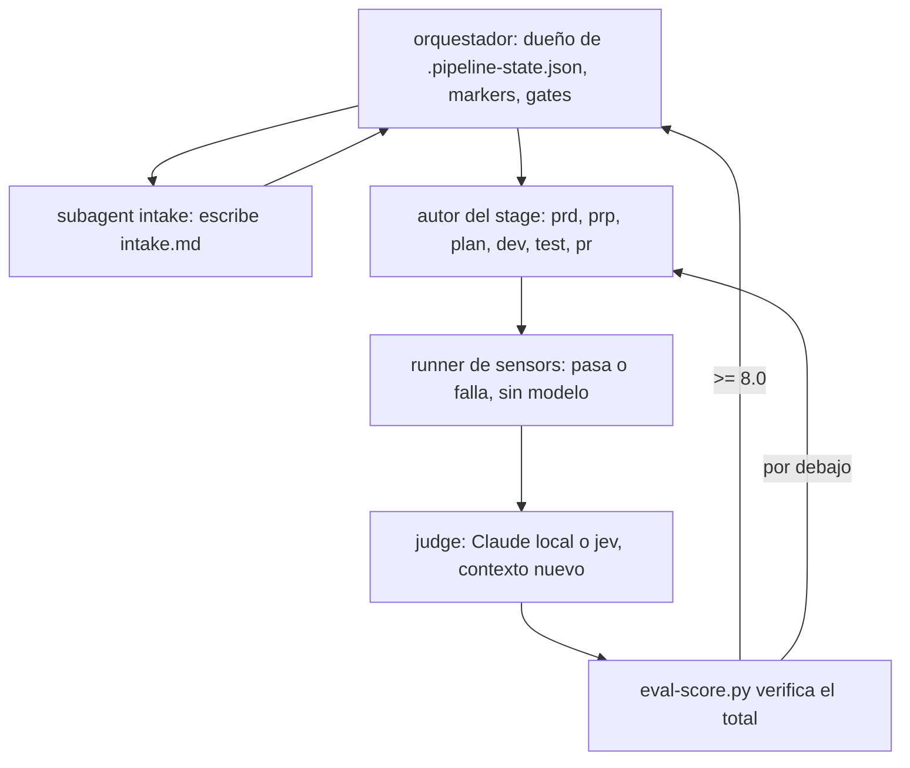

# Orquestación y subagents

El pipeline corre como un orquestador más subagents chicos. `intake` es un subagent de solo lectura, el eval de cada stage va a un judge que no escribió el artefacto, y las entradas siguen resolver, marcar, continuar. La forma canónica es [`.claude/shared/pipeline-pattern.md`](https://github.com/Pierry/harness-kit/blob/main/.claude/shared/pipeline-pattern.md). Escalonar modelos a Haiku está en plan; hoy todos los agents corren en Opus.

# Por qué subagents

Un subagent es un contexto nuevo y aislado que se inicia con la herramienta Task. Dividir vale la pena en tres casos. El aislamiento de contexto evita que un stage que lee cientos de archivos, como `intake`, arrastre ese volumen hacia adelante. El paralelismo corre trabajo independiente al mismo tiempo. La separación adversarial evita que el autor califique su propio trabajo.

El tercero es el que más pesa. Un autor que califica su propio PRD infla la nota. Un evaluador nuevo que recibe solo el artefacto y la rubric no tiene nada que defender. El eval `spec-satisfied` del loop SDD ya corría en una sesión nueva; v5 lo convirtió en la regla para cada gate.

# La trampa de la sobredescomposición

Cada salto cuesta un arranque de contexto, volver a leer archivos (los subagents no comparten memoria), latencia y tokens. Divide solo cuando un salto compra uno de los tres beneficios. Una regla estructural ("el PRD tiene las secciones obligatorias") es un script de sensor sin modelo. Un juicio ("esta hipótesis se puede probar") es un eval.

# Tres responsabilidades

| Responsabilidad | Dueño | Regla |
|---|---|---|
| Coordinación: secuencia, estado, markers, reintentos, gates | el orquestador (sesión principal) | Nunca escribe un artefacto |
| Generación: PRD, PRP, plan, código | el autor del stage | Entradas explícitas, salida estructurada |
| Verificación: sensors y eval | el runner de sensors y un judge aparte | Quien califica nunca escribió lo que califica |

# La topología

Las hojas nunca hablan entre sí. La información fluye por el orquestador y por los artefactos en disco.

# El judge

El evaluador empieza sin memoria de cómo se escribió el artefacto y recibe solo el artefacto y la rubric. El proyecto lo elige con `/hk:eval jev | local`, guardado en `.claude/hk-config.json`. `local` es un evaluador Claude nuevo. `jev` es Jev de TypeSafe AI, otra familia de modelos, que reduce el sesgo de autopreferencia sin eliminarlo; escala a Claude cuando tiene dudas en un check decisivo. `spec-satisfied` y las gates de readiness siempre usan Claude. Ver [Evals](Evals).

El patrón admite un panel de tres evaluadores con lentes distintos para las gates de mayor riesgo. Ningún comando de stage lo usa hoy, y `dev` corre con un solo autor sin reparto por módulo.

# Restricciones de Claude Code

Los subagents son hojas sin estado: no pueden modificar el estado compartido, no heredan memoria y no pueden lanzar sus propios subagents libremente. Por eso el orquestador es dueño de todo el estado y escribe `.claude/.pipeline-state.json` y los markers con `pipeline.py` y `marker.sh`. Una hoja completa un artefacto y devuelve un resultado; el orquestador hace la transición de estado. La maquinaria de hooks, markers y tokens queda como estaba.

# Contratos

Cada subagent recibe rutas de archivo como entradas y devuelve una forma que el orquestador puede parsear. `intake` devuelve `squad`, `problem`, `repos`, `customers` y `unknowns`, y el orquestador lee `unknowns` para decidir qué te muestra la gate del PRD. Con contratos, el flujo de control es determinista aunque las hojas sean inferenciales.

# Despliegue

v5 probó primero un corte vertical: intake, autor del prd, script de sensor del prd, eval del prd en un contexto nuevo. Cuando funcionó contra un repo real se convirtió en `pipeline-pattern.md`, y `prp`, `plan`, `dev`, `test`, `pr` y los stages de system-design lo copiaron. Los stages nuevos siguen el mismo archivo.

# Ver también

[Autonomía](Autonomy), [Pipeline y stages](Pipeline-and-Stages), [Agents](Agents), [Harness Engineering](Harness-Engineering).
