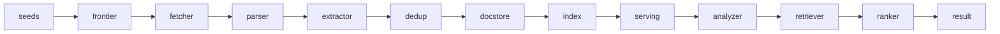
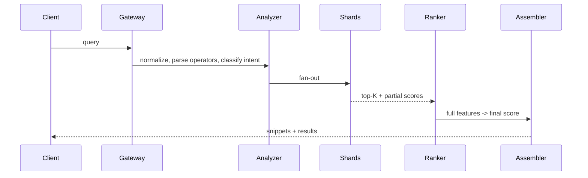

# Search Engine

> Serie System Design #3 (EP24). Topic skill: `skills/search-engine/`.
> Diseñar un search engine web con crawler, indexing, ranking y serving a escala.

## 1. El problema y por qué engaña

La mayoría imagina una cajita simple: el usuario escribe la query, recibe diez links, listo. Debajo hay
un pipeline enorme. Hay que descubrir páginas, decidir qué vale la pena traer, descargar contenido sin
dañar sitios de terceros, parsear y extraer texto/links/metadatos, normalizar, deduplicar, construir un
inverted index, calcular features offline, opcionalmente generar embeddings y, al final, responder
queries en pocos milisegundos con un ranking relevante.

La arquitectura cambia enormemente según el objetivo. Buscar en documentación interna es un problema.
Buscar en la web pública a escala es otro mundo. Una frase resume el sistema:

> Un search engine es una **fábrica distribuida que convierte URLs en documentos rankeables.**

Es una **cadena de decisiones**: qué descubrir, traer, almacenar, indexar, recuperar y promover. Cada
stage mata costo malo y conserva señal útil.

## 2. Cuatro subsistemas + dos planos de apoyo

- **Crawler**: descubre y trae páginas.
- **Pipeline de procesamiento**: parseo, limpieza, extracción, enriquecimiento.
- **Pipeline de indexing**: construye los indexes.
- **Query serving**: analiza la query, recupera candidatos, hace ranking, arma el resultado.
- Apoyo: **metadatos / política** (robots.txt, politeness, reglas de canonical, agendamiento, dedup) y
  **observabilidad / control** (métricas, debugging, reprocesamiento, backfill, allow/blocklists).

## 3. Requisitos

**Funcionales:** aceptar seeds; descubrir links recursivamente; respetar la política de crawl (robots.txt,
delays, límites por host); traer HTML (opcionalmente PDFs, feeds, imágenes); parsear y extraer texto,
links, título, headings, anchor text, canonical, idioma, timestamp, metadatos estructurados; detectar
duplicados y casi-duplicados; construir un inverted index para búsqueda léxica; opcionalmente un index
vectorial para recall semántico; responder queries con paginación, snippets, filtros y ranking de
relevancia; recrawlear periódicamente para mantener freshness.

**No funcionales:** escalabilidad horizontal en cada stage; alto throughput offline; **baja latency de
serving** (típicamente < 200 ms de punta a punta, idealmente bastante menos); alta disponibilidad en el
camino de la query; la consistencia eventual entre crawl y búsqueda es aceptable si converge; costo
predecible; comportamiento seguro y no abusivo hacia sitios de terceros; observabilidad suficiente para
explicar por qué una página no está indexada o por qué una query devolvió lo que devolvió.

## 4. Modelo mental de punta a punta



Seeds → el frontier elige una URL elegible → el fetcher descarga → el parser convierte bytes en un
documento estructurado → el extractor produce texto limpio, outlinks y metadatos → el deduplicador decide
nuevo/duplicado exacto/casi-duplicado → el document store persiste la versión canonical → el indexing
tokeniza y construye las postings lists → jobs offline calculan señales globales (por ejemplo,
popularidad en el link graph) → al momento de la query el analyzer normaliza, el retriever encuentra
candidatos, el ranker puntúa y el result builder arma los snippets.

## 5. El crawler (el corazón)

### URL frontier
La estructura central. **No es una sola cola**. Una implementación seria separa tres conceptos:

- **URL-seen store**: ¿esta URL ya apareció antes? (Bloom filter delante de un store persistente.)
- **Crawl-state store**: estado del último intento, hash del contenido, código HTTP, tiempo de respuesta,
  ventana del próximo recrawl.
- **Colas de prioridad del scheduler**: eligen la siguiente URL respetando prioridad y politeness.

> **¿Por qué un Bloom filter?** (Burton Bloom, 1970.) Una estructura probabilística de pertenencia a
> conjunto: responde "¿ya vi esta URL?" en O(1) y pocos bits por elemento, sin falsos negativos y con
> tasa de falsos positivos ajustable. A escala web no se puede mantener cada URL vista en memoria de
> forma exacta; el Bloom filter entrega "definitivamente nueva" vs "probablemente vista, hay que
> confirmar en el store" de forma barata.

### Multi-cola por host
Una única cola global crea dos problemas: **dominios calientes** (un dominio muy enlazado llena la cola) y
**pérdida de politeness** (se disparan muchas requests concurrentes contra un host, pareciendo un DDoS).
La corrección: una cola pendiente por host, cada una con un `next_eligible_timestamp`; un heap global
ordena los hosts por menor tiempo elegible y mayor prioridad. Cuando un host queda elegible, se saca una
URL, se trae, se actualiza el backoff y se reinserta el host. Esto da **fairness y politeness juntos**.

### Canonicalización
Normalizar antes de encolar: host en minúsculas, quitar fragmentos, puertos default, limpiar query params
irrelevantes, resolver rutas relativas, quitar session ids conocidos, normalizar la barra final. Saltarse
esto explota los duplicados y el costo de crawl.

### robots.txt y politeness
Cachear robots.txt por host con un TTL; respetar allow/disallow y crawl-delay (el Robots Exclusion
Protocol, hoy **RFC 9309**, 2022). Politeness no es un sleep fijo:

```
next_request_allowed = max(min_delay, k * observed_latency, robots_crawl_delay)
```

más concurrencia máxima por host y backoff exponencial ante errores. Esto evita martillar sitios lentos.

### Fetcher
Stateless, I/O pesado: red asíncrona, connection pooling, cache de DNS, reuso de TLS, gzip/brotli,
límites de redirect, tamaño máximo de descarga, sniffing de content-type (no confiar solo en el header) y
**GET condicional** (`ETag` / `If-Modified-Since`) para un recrawl barato. Persistir metadatos: código de
estado, headers, URL final después de los redirects, tiempo de respuesta, checksum del cuerpo.

### Trampas de crawler
La web tiene infinitas páginas falsas: calendarios que generan fechas sin fin, combinaciones de facetas de
e-commerce, URLs con parámetros arbitrarios, la búsqueda interna del propio sitio, loops de paginación.
Guardrails: crawl budget por host, límite de fan-out por página, blocklists de regex de parámetros, un
score de repetición de template, límites de profundidad. Sin esto, **el 80% del costo se va al peor 5% de
la web.**

## 6. Agendamiento de crawl (donde el dinero se vuelve estrategia)

Crawlear toda la web todos los días es imposible para casi cualquiera. Con un budget finito de requests,
ancho de banda y CPU, agendar es una decisión de negocio. Un crawl score aproximado:

```
crawl_score ~ quality * freshness_need * business_priority / fetch_cost
```

(Intuición, no una fórmula universal literal.) **Recrawl adaptativo:** cambió dos veces en un intervalo
corto → achicar la ventana; sin cambios muchas veces → agrandarla; errores → retroceder. Muchísimo mejor
que un cron fijo. **Tiers de freshness** A/B/C/D (minutos → rara vez) por dominio, patrón de URL o score
dinámico.

## 7. Teoría, deduplicación

Búsqueda web sin dedup es caos: el mismo contenido aparece con/sin www, http/https, parámetros distintos,
páginas de impresión, sindicación, espejos, republicaciones y duplicados blandos.

Tres niveles:

1. **Duplicado de URL**: misma URL normalizada.
2. **Duplicado exacto de contenido**: mismo hash del texto limpio.
3. **Casi-duplicado**: contenido casi igual.

Para los casi-duplicados se genera un fingerprint con **shingles + MinHash** (Broder, 1997) o **SimHash**
(Charikar, 2002). MinHash estima la similitud de Jaccard entre conjuntos de shingles a partir de unos
pocos mínimos de hash; SimHash mapea un documento a un vector de bits donde la distancia de Hamming
sigue la similitud, lo que permite clusterizar por fingerprint de forma barata. Guardar un
`document_fingerprint` y un `canonical_document_id`; muchas URLs mapean a un solo documento canonical.
Deduplicar **temprano y en capas**, si no se paga por procesar duplicados caros, y así se consolidan las
señales de ranking (links entrantes, clicks) en el canonical.

## 8. Storage por función

- **Raw content store**: la respuesta original, comprimida, en object storage barato, para reprocesar y
  auditar.
- **Parsed document store**: `doc_id, canonical_url, fetch_time, title, clean_text, language,
  outgoing_links, anchors_in, headers, content_type, quality_signals, fingerprint`.
- **Crawl metadata store**: estado operativo con updates aleatorios frecuentes: `url, host,
  discovered_at, last_fetch_status, last_success_at, next_fetch_at, retry_count, robots_policy_version,
  blocked_reason`. Un store KV/wide-column encaja mejor que object storage acá.

## 9. Teoría, el inverted index

La estructura léxica clásica. En vez de guardar los términos por documento, se guarda, para cada término,
la lista de documentos en los que aparece. Esa lista es una **postings list**:

```
term: crawler
postings: [(doc1, tf=3, positions=[4,18,22]), (doc7, tf=1, positions=[9])]
```

Por posting: `doc_id`, frecuencia del término, posiciones (para queries de frase), info de campo (título
vs cuerpo), payloads opcionales.

### Pipeline de build
Tokenizar → normalizar (minúsculas, quitar acentos, stem/lematizar) → descartar stopwords donde tenga
sentido → emitir pares `term → posting` → **sort-merge por término** → comprimir postings → persistir
segmentos inmutables → publicar una nueva versión del index. Esto es naturalmente distribuible, se puede
modelar como **MapReduce** (Dean & Ghemawat, 2004) o como streaming con compactación en batch.

### Sharding
Dos estrategias: **document sharding** (cada shard guarda un subconjunto de documentos y sus términos) vs
**term sharding** (cada shard guarda un subconjunto de términos). Document sharding suele simplificar
serving, replicación y rebalanceo: la query hace fan-out a todos los document shards, cada uno devuelve
un top-K local y un agregador hace el merge.

### Segmentos y merge
Actualizar un index grande en el lugar es caro. El modelo Lucene (Doug Cutting) usa **segmentos
inmutables** más merges periódicos en background: escrituras secuenciales baratas, snapshots simples,
rollback fácil, serving concurrente durante el reindex. Costos: trabajo de merge en background, los docs
borrados quedan como tombstones hasta el merge y más segmentos elevan el costo de la query.

### Compresión
Las postings tienen que comprimirse o el index explota: delta encoding de doc ids, variable-byte encoding,
frame-of-reference, bit packing y **skip lists** para saltar bloques. Objetivo: leer rápido sin quemar CPU
en la descompresión.

## 10. Query serving (el camino online)



### Analyzer
Normalizar mayúsculas, tokenizar, corrección ortográfica opcional, expansión de sinónimos, detección de
idioma, parseo de operadores (comillas, `-`, `site:`, `filetype:`) y **clasificación de intención**
(navegacional / informacional / transaccional / fresh). La intención cambia el ranking: las mismas
palabras pueden querer cosas distintas.

### Recuperación de candidatos
No se rankea toda la web. Primero se recupera un conjunto de candidatos vía **BM25** sobre el index
léxico, filtros de campo, boosts de título/anchor, opcionalmente búsqueda **ANN** sobre embeddings, o una
unión híbrida. Típicamente top-N por shard (~500-1000), después el merge.

> **BM25** (Robertson & Zaragoza, *The Probabilistic Relevance Framework: BM25 and Beyond*) es la función
> estándar de relevancia léxica: premia la frecuencia del término con saturación y penaliza documentos
> largos, con parámetros ajustables `k1` y `b`. Es el caballo de batalla sobre el que los sistemas
> fuertes todavía construyen.

### Ranking
El score final combina familias de features:

- **Coincidencia textual**: BM25, término en el título, término en el heading, proximidad de términos,
  match de frase, match de anchor text.
- **Documento**: autoridad del dominio, calidad de la página, freshness, score de spam, match de idioma,
  estructura.
- **Query**: intención, necesidad de freshness, tipo de entidad, ambigüedad.
- **Comportamental (si está disponible)**: CTR, clicks largos, reformulaciones de query, tiempo de
  permanencia, abandono rápido.

Un comienzo simple es un score lineal ponderado, por ejemplo
`0.45*bm25 + 0.20*title + 0.15*authority + 0.10*freshness + 0.10*anchor`. Los sistemas maduros pasan a
**learning-to-rank**: pero solo con buenas features y datos de clicks, si no se compra complejidad cara.

### Armado del resultado
Snippet resaltado, URL canonical, título limpio, breadcrumbs, fecha cuando es relevante, sitelinks y dedup
de resultados casi idénticos. Un buen snippet mueve la calidad percibida; no es cosmética.

## 11. Teoría, el link graph y las señales globales

Un search engine web de verdad no vive solo del texto de la página. El **link graph** es una señal global
fuerte: si muchas páginas relevantes apuntan a un documento, eso sugiere autoridad. Construir un grafo
dirigido (vértices = documentos o dominios, aristas = hyperlinks, los pesos consideran contexto, posición
del link, anchor text) y correr jobs **batch offline** (diarios/horarios, nunca en el camino de la query)
para calcular autoridad, hub, centralidad y reputación de dominio.

> **PageRank** (Brin & Page, *The Anatomy of a Large-Scale Hypertextual Web Search Engine*, 1998) es la
> aproximación famosa: la importancia de una página es la distribución estacionaria de un navegante
> aleatorio que sigue links con un factor de amortiguación. La práctica moderna lo combina con muchos
> chequeos anti-spam, si no las link farms y las redes de spam lo manipulan. **HITS** (Kleinberg, 1999)
> es la formulación hermana de hub/autoridad.

## 12. Spam, abuso y calidad

La búsqueda abierta atrae adversarios. Abusos: keyword stuffing, texto oculto, doorway pages, link farms,
cloaking, contenido masivo de bajo valor, duplicación agresiva, redirects engañosos. Defensas: un
clasificador de spam sobre features de contenido + link graph, reputación de dominio, límites por
template/cluster, detección de boilerplate, chequeos de similitud masiva, review manual para casos
estratégicos y un loop de feedback de click/bounce. **Sin una capa de calidad, el mejor index del mundo
sirve basura rápido.**

## 13. Freshness vs costo

Más freshness significa más crawl, más procesamiento y más costo. Menos significa resultados viejos,
inconsistentes y confianza perdida. La respuesta rara vez es uniforme, conviene usar **tiers**: Tier A
(muy dinámico, alto valor) recrawleado en minutos/horas; Tier B diario; Tier C semanal/mensual; Tier D
rara vez. El tier se define por dominio, patrón de URL o score dinámico.

## 14. Publicación del index y consistencia

El index y los documentos rara vez están sincronizados en tiempo real. Hay que operar con **versiones**:
los workers construyen nuevos segmentos, un **manifest** describe la versión completa del index, el
publisher la commitea de forma atómica, los query servers hacen **warm up** de la nueva versión y recién
ahí ocurre el **swap**. Beneficios: rollback simple, serving sin downtime, consistencia de lectura por
versión. Para updates frecuentes, conviene combinar un snapshot base con indexes delta más chicos.

## 15. Búsqueda híbrida (léxica + semántica)

Muchos equipos saltan directo a los embeddings. Para búsqueda general, lo léxico sigue siendo la base;
los embeddings complementan, no reemplazan automáticamente. Lo léxico es preciso para términos raros,
nombres, códigos y queries específicas; lo semántico ayuda al recall para lenguaje natural, sinónimos y
frases variadas; el ranking híbrido normalmente le gana a cualquiera de los dos por separado.
Implementación: inverted index para el recall léxico, un index **ANN** (por ejemplo HNSW) para los
embeddings de documentos, embedding de la query generado online o cacheado, unión de ambos conjuntos de
candidatos y el ranker final decide. Pero generar embeddings, guardar vectores y correr ANN a escala no
es barato, conviene hacerlo solo cuando el problema lo exija.

## 16. Escala y particionamiento

Frontier particionado por hash del host (un dueño por host, para que la coordinación de politeness quede
en un solo lugar). Fetchers stateless, con autoscaling. Index: por ejemplo 64 shards lógicos × 2-3
réplicas, el leader publica los segmentos, los followers sirven, rebalanceo gradual. Los jobs de link
graph como batch distribuido pesado en ventanas, nunca en el camino de la query.

## 17. Observabilidad y SRE

- **Crawl:** URLs descubiertas/min, tasa de éxito de fetch, bytes/min, latency por host, tasa de bloqueo
  por robots, errores por DNS/timeout/TLS/4xx/5xx, backlog del frontier por partición, lag de recrawl.
- **Indexing:** docs parseados/min, tasa de duplicados, tamaño del index, duración del merge, lag desde
  el fetch hasta la publicación del index, fallas por stage.
- **Serving:** QPS, p50/p95/p99, tasa de error, tiempo de fan-out, cache hit rate, top queries, queries
  con cero resultados, CTR, tasa de reformulación.

Herramientas de debugging obligatorias: **inspección de URL** (estado de crawl + index de una URL),
**query explain** (qué shards respondieron, candidatos, features, score final), **dashboard de host**
(errores, politeness, backlog, bloqueos por host) y replay de un documento por el pipeline. Sin esto, el
equipo se pasa la vida adivinando.

## 18. Modos de falla

| Falla | Causa | Solución |
|---|---|---|
| Cuello de botella en el scheduler central | proceso único | particionar el frontier, distribuir la propiedad |
| Costo enorme por dedup tardío | dedup solo al final | dedup en capas: URL, exacto, casi |
| El p99 explota | fan-out excesivo | sharding balanceado, caches, poda de candidatos |
| La relevancia se estanca | sin loop de feedback | instrumentar clicks, abandono, cero-resultados; análisis offline continuo |
| Crawler atrapado en trampas | sin budget/heurística por host | crawl budget por dominio, bloqueos dinámicos, filtros de parámetros |
| La publicación del index rompe el serving | publicación sin versión | snapshots atómicos + warmup antes del swap |

## 19. Plan incremental

1. **Rebanada vertical**: conjunto chico de seeds, solo HTML, frontier por host con politeness básico,
   parser simple, inverted index básico (Lucene/OpenSearch alcanza), query con BM25, herramienta de
   inspección de URL.
2. **Eficiencia / calidad**: dedup exacto + casi, mejor canonicalización, recrawl adaptativo, scoring
   inicial de calidad, mejores snippets, más observabilidad.
3. **Escala real**: frontier particionado, fetchers distribuidos, index shardeado y versionado, jobs de
   link graph, ranking multifactor, disaster recovery + replay.
4. **Relevancia avanzada**: learning-to-rank, señales de comportamiento, embeddings híbridos,
   personalización, anti-spam sofisticado.

Relevancia avanzada encima de una ingesta mala es maquillaje caro. El orden importa.

## 20. Resumen operativo (la estrella guía)

- Un buen crawler no es el que descarga más páginas. Es el que **elige mejor qué descargar.**
- Un buen parser no es el que lee HTML perfecto. Es el que **sobrevive a la web rota y aun así extrae
  señal útil.**
- Un buen index no es el que guarda todo. Es el que **organiza la información para recuperar candidatos
  relevantes rápido.**
- Un buen ranking no es el más complejo. Es el que **combina bien señales locales, señales globales y la
  intención de la query.**
- Una buena operación no es no fallar nunca. Es **explicar rápido por qué falló y recuperarse sin caos.**

## Referencias

- Sergey Brin & Lawrence Page, *The Anatomy of a Large-Scale Hypertextual Web Search Engine*, WWW,
  1998 (PageRank).
- Jon Kleinberg, *Authoritative Sources in a Hyperlinked Environment* (HITS), JACM, 1999.
- Stephen Robertson & Hugo Zaragoza, *The Probabilistic Relevance Framework: BM25 and Beyond*, 2009.
- Andrei Broder, *On the Resemblance and Containment of Documents* (shingling/MinHash), 1997.
- Moses Charikar, *Similarity Estimation Techniques from Rounding Algorithms* (SimHash), STOC, 2002.
- Burton Bloom, *Space/Time Trade-offs in Hash Coding with Allowable Errors* (Bloom filter), CACM,
  1970.
- Dean & Ghemawat, *MapReduce: Simplified Data Processing on Large Clusters*, OSDI, 2004.
- Manning, Raghavan & Schütze, *Introduction to Information Retrieval*, Cambridge, 2008 (inverted
  index, tokenización, ranking).
- Documentación de Apache Lucene (segmentos inmutables, política de merge).
- *RFC 9309: Robots Exclusion Protocol*, 2022.
- Malkov & Yashunin, *Efficient and robust approximate nearest neighbor search using HNSW graphs*,
  2016 (ANN para búsqueda híbrida).
