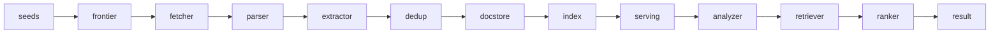
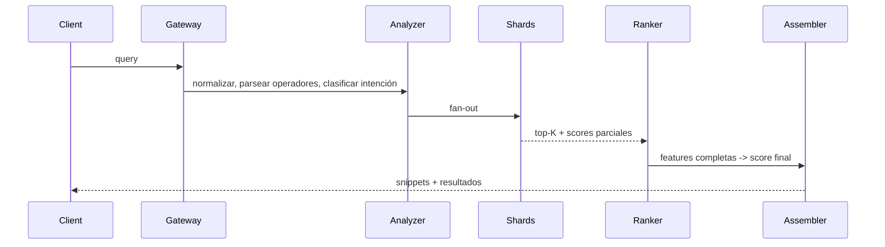

# Search Engine

Serie System Design #3 (EP24). Topic skill: `.claude/agents/system-architect/skills/search-engine/SKILL.md`. La tarea es un buscador web con crawler, indexación, ranking y serving a escala.

# El problema

El usuario escribe una query y recibe diez links. Debajo, descubres páginas, decides qué vale la pena descargar, descargas sin dañar sitios de terceros, extraes texto, links y metadatos, normalizas, deduplicas, construyes un inverted index, calculas features offline, construyes embeddings de forma opcional, y sirves queries en milisegundos con un ranking relevante.

La arquitectura cambia con el objetivo: la búsqueda en documentación interna y la búsqueda pública a escala web son problemas distintos. Un search engine es una fábrica distribuida que convierte URLs en documentos rankeables. Es una cadena de decisiones sobre qué descubrir, descargar, guardar, indexar, recuperar y promover, y cada etapa corta costo malo y conserva señal útil.

# Subsistemas

Cuatro subsistemas: el crawler descubre y descarga páginas, el pipeline de procesamiento parsea, limpia, extrae y enriquece, el pipeline de indexación construye los índices, y el query serving analiza la query, recupera candidatos, rankea y arma el resultado.

Dos planos de apoyo están al lado. Metadata y política cubre robots.txt, politeness, reglas de canonical, agendamiento y dedup. Observabilidad y control cubre métricas, debugging, reprocesamiento, backfill, y listas de permitidos y bloqueados.

# Requisitos

Funcionales: aceptar seeds, descubrir links de forma recursiva, respetar la política de crawl (robots.txt, delays, límites por host), descargar HTML (de forma opcional PDFs, feeds, imágenes), extraer texto, links, título, headings, anchor text, canonical, idioma, timestamp y metadatos estructurados, detectar duplicados y casi duplicados, construir un inverted index para búsqueda léxica y de forma opcional un índice vectorial para recall semántico, responder queries con paginación, snippets, filtros y ranking por relevancia, y hacer re-crawl por freshness.

No funcionales: escala horizontal en cada etapa, throughput offline alto, latency de serving por debajo de 200 ms de punta a punta (idealmente bastante menos), alta disponibilidad en el camino de query, consistencia eventual entre crawl y búsqueda siempre que converja, costo predecible, comportamiento seguro hacia sitios de terceros, y suficiente observabilidad para explicar por qué una página no está indexada o por qué una query devolvió lo que devolvió.

# Modelo de punta a punta


```mermaid
flowchart LR
  seeds --> frontier --> fetcher --> parser --> extractor --> dedup
  dedup --> docstore --> index
  index --> serving
  serving --> analyzer --> retriever --> ranker --> result
```

El frontier elige una URL elegible, el fetcher la descarga, el parser convierte bytes en un documento estructurado, y el extractor produce texto limpio, outlinks y metadatos. El deduplicador decide si es nuevo, duplicado exacto o casi duplicado, y el document store persiste la versión canonical. La indexación tokeniza y construye postings lists, y jobs offline calculan señales globales como la popularidad en el link graph. Al momento de la query el analyzer normaliza, el retriever encuentra candidatos, el ranker puntúa, y el result builder arma los snippets.

# Crawler: el URL frontier

El frontier son varias estructuras. El URL-seen store responde si una URL ya apareció antes (un Bloom filter delante de un store persistente). El crawl-state store guarda el estado del último intento, el hash del contenido, el código HTTP, el tiempo de respuesta y la próxima ventana de recrawl. Las colas de prioridad del scheduler eligen la próxima URL por prioridad y politeness.

Un Bloom filter (Burton Bloom, 1970) responde "ya vi esta URL" en O(1) con pocos bits por elemento, sin falsos negativos y con una tasa de falsos positivos ajustable. A escala web no puedes guardar cada URL vista en memoria de forma exacta, así que da "seguro es nueva" contra "probablemente vista, revisa el store" a bajo costo.

# Crawler: colas por host

Una sola cola global crea dominios calientes (un dominio con muchos links llena la cola) y pierde politeness (muchos requests concurrentes a un host parecen un DDoS). Usa una cola pendiente por host, cada una con un `next_eligible_timestamp`, y un heap global que ordena los hosts por menor tiempo elegible y mayor prioridad. Cuando un host se vuelve elegible, saca una URL, descarga, actualiza el backoff y reinserta el host. Esto da equidad y politeness juntas.

# Crawler: canonicalización y politeness

Normaliza antes de encolar: host en minúsculas, quitar fragmentos y puertos default, limpiar query params irrelevantes, resolver paths relativos, quitar session ids conocidos, normalizar la barra final. Saltarse esto multiplica los duplicados y el costo de crawl.

Cachea robots.txt por host con un TTL y respeta allow, disallow y crawl-delay (el Robots Exclusion Protocol, RFC 9309, 2022). La politeness es una función, no un sleep fijo:

```
next_request_allowed = max(min_delay, k * observed_latency, robots_crawl_delay)
```

Agrega una concurrencia máxima por host y backoff exponencial ante errores para que los sitios lentos no reciban golpes de más.

# Crawler: fetcher y trampas

El fetcher no tiene estado y es pesado en I/O: red asíncrona, connection pooling, cache de DNS, reuso de TLS, gzip y brotli, límites de redirect, tamaño máximo de descarga, detección de content-type (no confíes solo en el header), y GET condicional (`ETag`, `If-Modified-Since`) para un recrawl barato. Persiste el código de estado, los headers, la URL final después de los redirects, el tiempo de respuesta y el checksum del body.

La web tiene páginas falsas infinitas: calendarios que generan fechas sin fin, combinaciones de facetas de e-commerce, URLs con parámetros arbitrarios, la búsqueda interna de un sitio, loops de paginación. Protégete con un crawl budget por host, un límite de fan-out por página, blocklists de parámetros por regex, un score de repetición de template y límites de profundidad. Sin ellos, el 80% del costo se va al peor 5% de la web.

# Agendamiento de crawl

Hacer crawl de toda la web a diario está fuera del alcance de casi todos. Con un presupuesto finito de requests, ancho de banda y CPU, el agendamiento es una decisión de negocio. Un score aproximado, como intuición y no como fórmula universal:

```
crawl_score ~ quality * freshness_need * business_priority / fetch_cost
```

El recrawl adaptativo le gana a un cron fijo: una página que cambió dos veces en un intervalo corto recibe una ventana más corta, una que no cambió muchas veces recibe una más larga, y los errores aplican backoff. Los tiers de freshness A, B, C, D (de minutos a casi nunca) se asignan por dominio, patrón de URL o score dinámico.

# Deduplicación

El mismo contenido aparece con y sin www, por http y https, con params distintos, como páginas de impresión, sindicación, mirrors, republicaciones y duplicados blandos. Deduplica en tres niveles: duplicado de URL (misma URL normalizada), duplicado exacto de contenido (mismo hash del texto limpio) y casi duplicado (contenido casi igual).

Para casi duplicados, saca un fingerprint con shingles más MinHash (Broder, 1997) o SimHash (Charikar, 2002). MinHash estima la similitud de Jaccard entre conjuntos de shingles a partir de unos pocos mínimos de hash. SimHash mapea un documento a un vector de bits donde la distancia de Hamming sigue a la similitud, así que agrupas por fingerprint a bajo costo.

Guarda un `document_fingerprint` y un `canonical_document_id`; muchas URLs apuntan a un documento canonical. Deduplica temprano y en capas, o pagas por procesar duplicados caros. Consolida las señales de ranking (links entrantes, clics) en el canonical.

# Storage por función

El raw content store guarda la respuesta original, comprimida, en object storage barato para reprocesamiento y auditoría.

El parsed document store guarda `doc_id, canonical_url, fetch_time, title, clean_text, language, outgoing_links, anchors_in, headers, content_type, quality_signals, fingerprint`.

El crawl metadata store guarda estado operativo con actualizaciones aleatorias frecuentes: `url, host, discovered_at, last_fetch_status, last_success_at, next_fetch_at, retry_count, robots_policy_version, blocked_reason`. Un KV o un store wide-column le sirve mejor que object storage.

# El inverted index

Para cada término, guarda la lista de documentos donde aparece. Esa lista es una postings list:

```
term: crawler
postings: [(doc1, tf=3, positions=[4,18,22]), (doc7, tf=1, positions=[9])]
```

Cada posting lleva `doc_id`, la frecuencia del término, posiciones (para queries de frase), info del campo (título contra cuerpo) y payloads opcionales.

Pipeline de build: tokenizar, normalizar (minúsculas, quitar acentos, stemming o lematización), quitar stopwords donde tenga sentido, emitir pares `term → posting`, hacer sort-merge por término, comprimir postings, persistir segmentos inmutables, publicar una nueva versión del índice. Se distribuye de forma natural como MapReduce (Dean y Ghemawat, 2004) o como streaming con compactación batch.

El sharding es por documento (cada shard guarda un subconjunto de documentos y sus términos) o por término (cada shard guarda un subconjunto de términos). El sharding por documento en general simplifica el serving, la replicación y el rebalanceo: una query hace fan-out a todos los shards, cada uno devuelve un top-K local, y un agregador los combina.

El modelo de Lucene (Doug Cutting) usa segmentos inmutables más merges periódicos en segundo plano en lugar de actualizaciones en el lugar. Ganas escrituras secuenciales baratas, snapshots simples, rollback fácil y serving durante el reindex. Pagas con trabajo de merge en segundo plano, documentos borrados que quedan como tombstones hasta el merge, y un costo de query más alto a medida que se acumulan segmentos.

Comprime las postings o el índice explota: delta encoding de los doc ids, variable-byte encoding, frame-of-reference, bit packing y skip lists para saltar bloques. El objetivo son lecturas rápidas sin quemar CPU en la descompresión.

# Query serving


```mermaid
sequenceDiagram
  Client->>Gateway: query
  Gateway->>Analyzer: normalizar, parsear operadores, clasificar intención
  Analyzer->>Shards: fan-out
  Shards-->>Ranker: top-K + scores parciales
  Ranker->>Assembler: features completas -> score final
  Assembler-->>Client: snippets + resultados
```

El analyzer normaliza mayúsculas, tokeniza, corrige ortografía de forma opcional, expande sinónimos, detecta el idioma, parsea operadores (comillas, `-`, `site:`, `filetype:`) y clasifica la intención (navegacional, informacional, transaccional, fresca). La intención cambia el ranking: las mismas palabras pueden querer cosas distintas.

La recuperación de candidatos trae un conjunto de candidatos en lugar de rankear toda la web: BM25 sobre el índice léxico, filtros por campo, boosts de título y anchor, de forma opcional búsqueda ANN sobre embeddings, o una unión híbrida. Toma unos 500 a 1000 por shard, después combina.

BM25 (Robertson y Zaragoza, *The Probabilistic Relevance Framework: BM25 and Beyond*) premia la frecuencia del término con saturación y penaliza los documentos largos, ajustado por `k1` y `b`. Es la base léxica sobre la que todavía construyen los sistemas fuertes.

# Ranking

El score final combina cuatro familias de features. Match textual: BM25, término en el título, término en un heading, proximidad de términos, match de frase, match de anchor text. Documento: autoridad del dominio, calidad de la página, freshness, score de spam, coincidencia de idioma, estructura. Query: intención, necesidad de freshness, tipo de entidad, ambigüedad. Comportamiento, si está disponible: CTR, clics largos, reformulaciones de query, dwell time, abandono rápido.

Empieza con un score lineal ponderado como `0.45*bm25 + 0.20*title + 0.15*authority + 0.10*freshness + 0.10*anchor`. Pasa a learning-to-rank solo cuando tengas buenas features y datos de clics, o compras complejidad cara.

El armado del resultado construye un snippet resaltado, la URL canonical, un título limpio, breadcrumbs, la fecha cuando es relevante, sitelinks, y deduplica resultados casi idénticos. La calidad del snippet define la calidad percibida.

# Link graph y señales globales

El texto de la página solo no alcanza. Si muchas páginas relevantes apuntan a un documento, eso sugiere autoridad. Construye un grafo dirigido (los vértices son documentos o dominios, las aristas son hipervínculos ponderados por contexto, posición del link y anchor text) y corre jobs batch offline, diarios o por hora y nunca en el camino de query, para autoridad, hub, centralidad y reputación de dominio.

PageRank (Brin y Page, *The Anatomy of a Large-Scale Hypertextual Web Search Engine*, 1998) define la importancia de una página como la distribución estacionaria de un navegante aleatorio que sigue links con un damping factor. La práctica moderna lo combina con chequeos antispam, porque las link farms lo manipulan. HITS (Kleinberg, 1999) es la formulación relacionada de hub y autoridad.

# Spam y calidad

La búsqueda abierta atrae adversarios: keyword stuffing, texto oculto, doorway pages, link farms, cloaking, contenido masivo de poco valor, duplicación agresiva, redirects engañosos. Defiéndete con un clasificador de spam sobre features de contenido y del link graph, reputación de dominio, límites por template y por cluster, detección de boilerplate, chequeos de similitud masiva, revisión manual para casos estratégicos, y un loop de feedback de clics y rebote. Sin una capa de calidad, el mejor índice sirve basura rápido.

# Freshness contra costo

Más freshness cuesta más crawl y procesamiento; menos da resultados viejos y pérdida de confianza. Usa tiers: Tier A (muy dinámico, alto valor) con recrawl en minutos u horas, Tier B diario, Tier C semanal o mensual, Tier D casi nunca, asignados por dominio, patrón de URL o score dinámico.

# Publicación del índice

El índice y los documentos rara vez están sincronizados en tiempo real, así que opera con versiones. Los workers construyen segmentos nuevos, un manifest describe la versión completa del índice, el publisher la confirma de forma atómica, y los query servers calientan la versión nueva antes del swap. Ganas rollback simple, serving sin downtime y consistencia de lectura por versión. Para actualizaciones frecuentes, combina un snapshot base con índices delta más chicos.

# Búsqueda híbrida

Para búsqueda general, lo léxico sigue siendo la base y los embeddings lo complementan. Lo léxico es preciso para términos raros, nombres, códigos y queries específicas. Lo semántico ayuda al recall para lenguaje natural, sinónimos y redacción variada. El ranking híbrido en general le gana a cualquiera de los dos por separado.

Implementación: inverted index para el recall léxico, un índice ANN (por ejemplo HNSW) para los embeddings de documentos, un embedding de la query generado online o cacheado, la unión de los dos conjuntos de candidatos, y el ranker final decide. Generar embeddings, guardar vectores y correr ANN a escala cuesta dinero de verdad, así que agrégalos solo cuando el problema lo exija.

# Escala y particionamiento

Particiona el frontier por hash de host, un dueño por host, para que la coordinación de politeness quede en un solo lugar. Los fetchers no tienen estado y escalan solos. El índice corre como, por ejemplo, 64 shards lógicos con 2 a 3 réplicas cada uno: un líder publica segmentos, los seguidores sirven, y el rebalanceo es gradual. Los jobs del link graph corren como batch distribuido pesado en ventanas, nunca en el camino de query.

# Observabilidad

Métricas de crawl: URLs descubiertas por minuto, tasa de éxito de descarga, bytes por minuto, latency por host, tasa de bloqueo por robots, errores por DNS, timeout, TLS, 4xx, 5xx, backlog del frontier por partición, atraso de recrawl. Métricas de indexación: documentos parseados por minuto, tasa de duplicados, tamaño del índice, duración del merge, atraso de descarga a publicación, fallas por etapa. Métricas de serving: QPS, p50, p95, p99, tasa de error, tiempo de fan-out, cache hit rate, top queries, queries sin resultados, CTR, tasa de reformulación.

Construye cuatro herramientas de debugging desde el inicio: inspección de URL (estado de crawl e indexación de una URL), query explain (qué shards respondieron, candidatos, features, score final), un dashboard por host (errores, politeness, backlog, bloqueos por host) y replay de un documento por el pipeline. Sin ellas el equipo adivina.

# Modos de falla

| Falla | Causa | Solución |
|---|---|---|
| Cuello de botella del scheduler central | proceso único | particionar el frontier, distribuir la propiedad |
| Costo enorme por dedup tardío | dedup solo al final | dedup en capas: URL, exacto, casi duplicado |
| El p99 explota | fan-out excesivo | sharding balanceado, caches, poda de candidatos |
| La relevancia se estanca | sin loop de feedback | instrumentar clics, abandono, cero resultados; análisis offline continuo |
| Crawler atrapado en trampas | sin presupuesto/heurísticas por host | crawl budget por dominio, bloqueos dinámicos, filtros de params |
| La publicación del índice rompe el serving | publicación sin versiones | snapshots atómicos + warmup antes del swap |

# Plan incremental

Fase 1, vertical slice: conjunto chico de seeds, solo HTML, frontier por host con politeness básica, parser simple, inverted index básico (Lucene u OpenSearch sirven), query con BM25, herramienta de inspección de URL.

Fase 2, eficiencia y calidad: dedup exacto y casi duplicado, mejor canonicalización, recrawl adaptativo, scoring inicial de calidad, mejores snippets, más observabilidad.

Fase 3, escala real: frontier particionado, fetchers distribuidos, índice con sharding y versiones, jobs del link graph, ranking multifactor, disaster recovery y replay.

Fase 4, relevancia avanzada: learning-to-rank, señales de comportamiento, embeddings híbridos, personalización, antispam sofisticado. Relevancia avanzada sobre una ingesta mala es maquillaje caro, así que respeta el orden.

# Estrella guía

Un buen crawler elige bien qué descargar. Un buen parser sobrevive a la web rota y aun así extrae señal útil. Un buen índice organiza la información para recuperar candidatos relevantes rápido. Un buen ranking combina señales locales, señales globales e intención de la query. Una buena operación explica rápido por qué algo falló y se recupera sin caos.

# Referencias

Sergey Brin y Lawrence Page, *The Anatomy of a Large-Scale Hypertextual Web Search Engine*, WWW, 1998 (PageRank).

Jon Kleinberg, *Authoritative Sources in a Hyperlinked Environment* (HITS), JACM, 1999.

Stephen Robertson y Hugo Zaragoza, *The Probabilistic Relevance Framework: BM25 and Beyond*, 2009.

Andrei Broder, *On the Resemblance and Containment of Documents* (shingling, MinHash), 1997.

Moses Charikar, *Similarity Estimation Techniques from Rounding Algorithms* (SimHash), STOC, 2002.

Burton Bloom, *Space/Time Trade-offs in Hash Coding with Allowable Errors* (Bloom filter), CACM, 1970.

Dean y Ghemawat, *MapReduce: Simplified Data Processing on Large Clusters*, OSDI, 2004.

Manning, Raghavan y Schütze, *Introduction to Information Retrieval*, Cambridge, 2008 (inverted index, tokenización, ranking).

Documentación de Apache Lucene (segmentos inmutables, merge policy).

*RFC 9309: Robots Exclusion Protocol*, 2022.

Malkov y Yashunin, *Efficient and robust approximate nearest neighbor search using Hierarchical Navigable Small World graphs*, 2016 (ANN para búsqueda híbrida).
