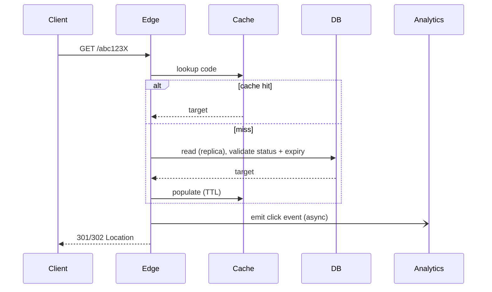

# Acortador de URL

> Serie System Design #1 (EP22). Skill del tema: `skills/url-shortener/`.
> Diseñar un TinyURL / bit.ly a escala, desde el requisito hasta la operación.

## 1. El problema y por qué engaña

El producto cabe en una frase: recibir una URL larga, devolver una URL corta, redirigir al usuario a la
original. Por eso mismo es una trampa excelente de entrevista. Debajo están casi todos los temas
centrales de system design: carga read-heavy, generación de clave única, cache, particionamiento,
consistencia, abuso, analytics, multi-región, costo y evolución de la arquitectura.

El encuadre más importante de todos: hay **dos flujos muy distintos**.

- **Crear**: escritura moderada. Un link se crea una vez.
- **Resolver**: lectura enorme, crítica en latency. Ese mismo link puede leerse millones de veces.

Diseñe la arquitectura alrededor del redirect. Todo lo demás se pliega a él. Quien empieza dibujando
Kafka en los primeros tres minutos está respondiendo la pregunta equivocada. Producto y prioridad
primero, tecnología después.

## 2. Requisitos

**Funcionales:** URL larga a URL corta única; resolver la corta para redirigir; expiración opcional;
alias personalizado; analytics básico (clic, timestamp, user agent, referer, país aproximado);
deshabilitar/banear links maliciosos.

**No funcionales, en orden de prioridad:**

1. **Disponibilidad del redirect.** Si la creación falla por unos segundos es malo; si falla el
   redirect, el producto muere.
2. Latency baja en el redirect, decenas de ms en cache hit.
3. Durabilidad: una vez emitido un código, el mapeo nunca puede desaparecer.
4. Escala horizontal de lectura.
5. Seguridad / antiabuso: este producto se convierte rápido en vector de phishing/malware/spam.
6. Observabilidad y auditabilidad.

**Extras de nivel staff** que separan una respuesta senior de una respuesta staff: links con TTL,
borrado lógico/tombstone, dedup opcional, página de preview para links sospechosos, rate limit por
cuenta/IP/tenant, dominios personalizados multi-tenant y **SLAs distintos para redirect y para
analytics**.

## 3. Dimensionamiento de escala (cuentas de servilleta)

Supuestos: 100M de links nuevos/mes, 3B de redirects/mes, lectura:escritura ~30:1, pico 5x el promedio,
retención de 5 años.

```
Writes:  100M / 2.6M s  ~ 38 wps avg,   ~200 wps peak.   Trivial.
Reads:   3B   / 2.6M s  ~ 1157 rps avg, ~6k rps peak.    Comfortable.
```

Pero clientes enterprise, una campaña viral, un código QR de un evento o uso global pueden empujar las
lecturas a decenas o cientos de miles por segundo. Diseñe para crecer aunque el v1 sea chico.

**Almacenamiento:** ~1 KB/registro (código 8-10 B, URL larga ~500 B, metadatos 100-200 B). 6B de
registros en 5 años = ~6 TB en bruto, 15-25 TB con indexes, replicación y backup. La distinción
crucial: **el dato caliente es chico, el dato total es grande.** Eso obliga a un cache pesado delante
de un almacenamiento durable y particionable.

**Analytics:** 3B de eventos/mes. Nunca un contador síncrono en la DB transaccional. Desacóplelo.

## 4. API

```
POST /v1/links   {long_url, custom_alias?, expires_at?, domain?, idempotency_key?}
              -> {short_url, code, created_at, expires_at}

GET /{code}   -> 301 if the mapping is immutable (lowest perceived latency on repeat)
                 302/307 if you want flexibility (avoids aggressive client caching when target
                 may change)
```

La elección entre 301 y 302 es **control versus eficiencia**. El 301 lo cachean con fuerza clientes e
intermediarios, así que los redirects repetidos son instantáneos, pero se pierde la capacidad de
cambiar o revocar barato. El 302 mantiene el control al costo de un round trip al servidor cada vez.
Preguntas de producto que cambian la arquitectura: ¿un link se puede editar después de creado? ¿un
alias se puede reusar después de expirar? ¿la misma URL larga da el mismo código o no? Esas respuestas
determinan idempotencia, cache e invalidación.

## 5. Modelo de datos

Dos dominios, separados a propósito.

**Tabla transaccional de links**

```
code PK, long_url, url_hash?, owner_id?, domain, created_at, expires_at?,
status(active|disabled|expired|banned), is_custom, redirect_type, metadata_json
```

Indexes: PK en `code`, `(owner_id, created_at)`, `expires_at` si la limpieza por TTL es frecuente,
`url_hash` si hay dedup.

**Eventos de analytics** (asíncrono, columnar / data lake / stream)

```
code, timestamp, ip_prefix or hashed IP, user_agent_hash, referer_domain, country, device_type
```

Nunca en el camino síncrono del redirect.

## 6. Teoría: generación del short code

El núcleo clásico de la entrevista. Cuatro enfoques, con sus modos de falla.

### A. Hash de la URL larga, truncado, base62
Determinístico y trivial de deduplicar, pero el truncamiento **colisiona**, la misma entrada siempre
produce el mismo código (malo cuando dos usuarios quieren links distintos para la misma landing page),
y la salida es predecible y enumerable.

### B. ID secuencial, codificado en base62
Simple, corto, libre de colisiones con un buen generador. Pero un ID puramente secuencial es
**predecible**: filtra el volumen total y se raspa trivialmente incrementando.

### C. ID único + ofuscación reversible, base62  ← recomendado
Genere un ID único de 64 bits, páselo por una **biyección con clave** (una red de Feistel u otra
permutación biyectiva) y luego codifique en base62. La biyección preserva la unicidad (sin colisiones)
mientras destruye la predictibilidad (no se pueden adivinar los vecinos sin la clave). El padding de
largo fijo es opcional.

> **¿Por qué una red de Feistel?** Es una construcción (Horst Feistel, IBM, años 1970, base del DES)
> que convierte cualquier función en una permutación invertible sobre un ancho de bits fijo. Para short
> codes da un revuelto 1:1, reversible y dependiente de la clave del espacio de IDs: unicidad gratis,
> impredictibilidad por construcción. Es el truco estándar de "cifrar el contador".

### Base62 y largo del código
Base62 = `[A-Za-z0-9]`. Capacidad: `62^7 ~ 3.5 trillion`, `62^8 ~ 218 trillion`. Siete caracteres
alcanzan para la mayoría de las plataformas; ocho dan holgura operativa. Los alias personalizados se
saltan todo esto.

### Encuadre staff
ID único coordinado centralmente por rangos (o descentralizado con garantía de unicidad), biyección
reversible para cortar la predictibilidad, codificación base62, y **validar la unicidad en el
almacenamiento como última línea de defensa** (un index único atrapa lo imposible).

## 7. Teoría: generación de ID único

| Enfoque | Cómo | Trade-off |
|---|---|---|
| Auto-increment de la DB | la base entrega el siguiente entero | sirve para MVP; hotspot central; bloquea multi-región activa |
| **Estilo Snowflake** | `timestamp \| worker id \| local sequence` en 64 bits | horizontal, más o menos ordenado en el tiempo, independiente de la DB; ojo con clock skew, coordinación de worker-id, layout de bits |
| **Asignación por rangos** | un servicio entrega a cada instancia un bloque de 1M de IDs para consumir localmente | muy simple, coordinación casi nula por request; desperdicia IDs al reiniciar (normalmente está bien), necesita un refill confiable |

El **Snowflake** de Twitter (2010) es el esquema canónico de 64 bits: ~41 bits de timestamp, ~10 bits
de máquina, ~12 bits de secuencia. Para un acortador de URL, tanto la asignación por rangos como
snowflake funcionan bien.

## 8. Flujo de creación

1. Valide la URL (ver abajo).
2. Si hay alias personalizado, verifique disponibilidad y política.
3. Genere el código.
4. Persista en la DB transaccional.
5. Haga write-through al cache.
6. Devuelva la `short_url`.

**Validar la URL no es cosmético.** Acepte solo http/https. Bloquee objetivos de SSRF: `127.0.0.1`,
`169.254.169.254` (metadatos de cloud), rangos privados RFC1918, hostnames internos. Canonicalice.
Imponga un límite de tamaño. Maneje punycode y caracteres sospechosos. (SSRF, Server-Side Request
Forgery, es el riesgo real: su validador buscando una URL interna provista por el atacante.)

**Idempotencia.** Guarde la respuesta por `idempotency_key` durante una ventana corta, para que un
retry del cliente tras un timeout no acuñe links duplicados.

**Dedup, por defecto no.** Deduplicar globalmente por URL larga rompe el analytics por campaña y por
tenant, filtra privacidad (un usuario se entera de que otra persona ya acortó un link) e impide links
distintos para la misma landing page. Si lo quiere igual, deduplique solo como optimización interna de
almacenamiento, separando la entidad lógica del link del destino físico de la URL.

## 9. Flujo de redirect (el corazón)



**Negative caching.** Si alguien martilla códigos al azar, cada miss pega en la DB: una tormenta de
misses. Cachee el resultado "no existe" por un TTL corto (30-60s).

**Elección del TTL.** Si el mapeo es inmutable, el TTL puede ser de horas y la invalidación casi
desaparece. Si los links se pueden deshabilitar o editar, elija un TTL corto, invalidación por evento,
o separe capas: mantenga el destino casi inmutable (cacheado con fuerza) y use una capa rápida de
**blacklist** para bloqueos urgentes.

## 10. Teoría: cache y el camino de lectura

Este es un **camino de lectura cache-heavy** de manual.

- **L1**: cache local in-process para claves extremadamente calientes (chico, TTL corto).
- **L2**: cache distribuido (Redis) compartido entre instancias.
- **DB** como fuente de verdad.

**Problema de hot key.** Un link viral concentra carga. Más allá de un buen cache, el staff piensa en:

- **Single-flight** (coalescencia de requests) en el miss: si 1000 requests fallan al mismo tiempo,
  exactamente uno va a la DB y el resto espera su resultado. Sin esto, una hot key fría causa un **cache
  stampede** (también llamado thundering herd o dog-piling) capaz de tumbar la DB.
- **Refresh-ahead:** refresque una entrada caliente antes de que expire, para que nunca se enfríe bajo
  carga. La variante probabilística (Vattani et al., *Optimal Probabilistic Cache Stampede Prevention*,
  2015) refresca temprano con una probabilidad que sube a medida que se acerca la expiración.
- Asegure que el valor caliente entre en L1; limite el refresh concurrente.

## 11. Teoría: elección de almacenamiento

La carga: lookup por PK usando el código, pocas relaciones, escritura moderada, lectura altísima,
durabilidad fuerte. SQL o un KV persistente sirven. Lo que importa es un lookup eficiente por clave,
replicación madura, backup/restore confiable y familiaridad del equipo.

**Elección pragmática:** una base relacional madura (Postgres) con particionamiento cuando haga falta,
read replicas y cache pesado adelante. Evolucione a un KV distribuido estilo Dynamo/Cassandra solo
cuando la escala realmente lo obligue. La respuesta staff es el **sistema más chico que aguanta la
carga con margen y evoluciona seguro**, no la tecnología más exótica. (Amazon Dynamo, DeCandia et al.
2007, es la referencia para el extremo de KV distribuido de ese espectro: consistent hashing,
lecturas/escrituras por quórum, consistencia eventual.)

## 12. Particionamiento

Particione por `code` o por su ID interno.

- **Partición por hash:** distribución pareja, buena para lookup aleatorio; rebalanceo más difícil, sin
  localidad temporal. **Consistent hashing** (Karger et al., 1997) minimiza las claves que se mueven
  cuando se agrega o quita un nodo: la técnica estándar.
- **Partición por rango de tiempo/ID:** buena para archivo y ciclo de vida, buena localidad, pero un ID
  monotónico crea un shard más nuevo caliente.

Para el lookup del redirect, prefiera hash o una distribución pseudoaleatoria sobre el ID ofuscado. El
analytics particiona distinto (por tiempo).

## 13. Consistencia

- **Consistencia fuerte obligatoria:** unicidad del alias personalizado (index único en
  `(domain, code)`), link persistido antes de la respuesta de éxito, cambios críticos de status hechos
  por el admin.
- **Consistencia eventual aceptable:** analytics, replicación de DR entre regiones, dashboards
  agregados.

**Read-after-write.** Si un usuario crea un link y lo clickea al instante, espera que funcione, aunque
una read replica todavía no se haya puesto al día. Resuélvalo con lecturas pegadas a la región por unos
segundos, cache write-through (lo más limpio: el redirect lee el cache que la creación acaba de
escribir), o un fallback al primary cuando la réplica se atrasa.

## 14. Multi-región

Separe crear y resolver.

- **Resolver** está dominado por lectura y es cacheable: empújelo a la edge y a varias regiones,
  servicio regional stateless con un cache regional fuerte.
- **Crear** puede arrancar con un único writer por región primaria, lo que simplifica la unicidad de
  alias y la generación de ID.

Evolución: (1) una región de creación, muchas regiones de redirect con réplica + cache; (2) creación
multi-región con rangos/namespaces de ID por región; (3) active-active sofisticado solo si el negocio
lo exige. Evite el active-active prematuro.

## 15. Analytics sin lastimar el redirect

> El redirect es el camino A. El analytics es el camino B. Nunca los acople con fuerza.

El redirect responde rápido; el evento de clic va a una cola o log; los consumidores agregan contadores
por minuto/hora/día/país/dispositivo/referer; los dashboards consultan un store analítico separado. Si
la cola muere: best-effort (descarte el analytics, mantenga el redirect), buffer local corto con retry,
o muestreo bajo degradación. Preserve siempre el redirect primero. Capas de retención: crudo 30 días,
agregado por hora 1 año, agregado por día 5 años. Para conteos de visitantes únicos a ese volumen,
**HyperLogLog** (Flajolet et al., 2007) estima cardinalidad en kilobytes en vez de guardar cada ID.

## 16. Seguridad y antiabuso

Riesgos: phishing, distribución de malware, spam, enumeración de links, abuso de open redirect, SSRF
durante la validación. Controles: rate limit por IP/token/tenant/ASN sospechoso, reputación de dominio
al momento de crear, chequeos de safe browsing (síncronos o asíncronos según el riesgo), desactivación
rápida de links, interstitial de preview para links sospechosos, fricción progresiva/CAPTCHA, auth más
fuerte para cuentas de alto volumen.

**Antienumeración:** ofuscación + largo de código adecuado + rate limit en el endpoint de resolución +
monitoreo de patrones de escaneo. **Privacidad:** minimice, trunque o haga hash de las IPs en ventana
corta.

## 17. Ciclo de vida y alias personalizado

**Expiración:** persista `expires_at`, valide al leer (no dependa solo de un job offline de limpieza:
un link expirado podría sobrevivir en el cache), haga evict al expirar, corra un job asíncrono de
limpieza para archivo/borrado lógico. Use **tombstone** en links baneados o eliminados, para impedir el
reuso y ayudar a la auditoría.

**El alias personalizado** necesita consistencia fuerte (index único en `(domain, code)`), palabras
reservadas (admin, login, api), política por tenant y ninguna colisión con rutas internas. Es una
minoría del tráfico pero de alto valor, así que se justifica un flujo de creación más estricto.

## 18. Observabilidad

Métricas: QPS de creación/resolución, p50/p95/p99 de la resolución, cache hit ratio por capa, errores
por clase, tasa de not-found, tasa de acceso a baneados/expirados, tiempo de propagación de la creación
hasta la primera resolución, throughput y lag del pipeline de analytics. Logs: logs de acceso
muestreados, logs de auditoría para operaciones de admin, estructurados con correlation id. Tracing:
completo en la creación; muestreado en el camino caliente de resolución. Alertas: caída del cache hit
ratio, subida del p99, error de redirect por encima del threshold, crecimiento anormal de 404
(escaneo), crecimiento del backlog de analytics.

## 19. Modos de falla

| Falla | Impacto | Mitigación |
|---|---|---|
| Cache caído | avalancha en la DB | rate limit + circuit breaker, L1 para hot keys, degradar analytics, cortar tráfico sospechoso |
| DB degradada | sufren los misses y las creaciones | servir hot keys desde el cache, encolar/reintentar las creaciones, failover a una réplica promovida, proteger las operaciones de alias |
| Región caída | indisponibilidad regional | DNS/anycast a otra región, réplicas/caches precalentados; la creación puede pausarse, el redirect debe sobrevivir |
| Sistema de reputación caído | riesgo de abuso | modo degradado con reglas locales, más fricción para usuarios nuevos, review posterior de los links de esa ventana |

## 20. Roadmap

1. **MVP robusto**: una región, API stateless, Postgres primary + replica, cache Redis, generador de ID
   por rangos, analytics en una cola, dashboard offline básico.
2. **Escala media**: cache local L1, control de hot key, particionamiento de la DB o almacenamiento
   distribuido, redirect multi-región, analytics más maduro, reputación en capas.
3. **Escala global**: creación multi-región con rangos por región, failover automático probado,
   dominios personalizados por tenant, links premium con marca y SLA por cliente, edge compute para
   algunos redirects.

## 21. Errores comunes

Partir de la tecnología en vez de los requisitos; dejar que el analytics bloquee el camino crítico del
redirect; hash truncado sin discutir colisión y predictibilidad; ignorar seguridad y abuso; hacer
sharding demasiado temprano cuando relacional + cache todavía aguantan; saltear la invalidación de
cache, la expiración y el read-after-write; saltear la operación (métricas, failover, degradación).

## Referencias

- Martin Kleppmann, *Designing Data-Intensive Applications*, O'Reilly, 2017 (parámetros de carga,
  consistencia, replicación, particionamiento).
- DeCandia et al., *Dynamo: Amazon's Highly Available Key-value Store*, SOSP, 2007 (KV distribuido,
  consistent hashing, consistencia eventual).
- Karger et al., *Consistent Hashing and Random Trees*, STOC, 1997.
- Twitter Engineering, *Announcing Snowflake*, 2010 (IDs únicos distribuidos).
- Horst Feistel, *Cryptography and Computer Privacy*, Scientific American, 1973 (redes de Feistel).
- Flajolet et al., *HyperLogLog: the analysis of a near-optimal cardinality estimation algorithm*,
  2007.
- Vattani, Chierichetti, Lowenstein, *Optimal Probabilistic Cache Stampede Prevention*, VLDB, 2015.
- Michael Nygard, *Release It!*, 2ª ed., 2018 (circuit breaker, bulkhead, pensamiento single-flight).
- OWASP, *Server-Side Request Forgery Prevention Cheat Sheet*.
