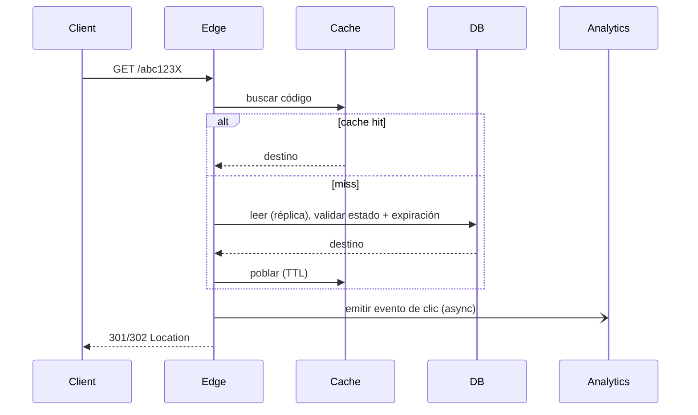

# Acortador de URL

Serie System Design #1 (EP22). Topic skill: `.claude/agents/system-architect/skills/url-shortener/SKILL.md`. La tarea es un TinyURL o bit.ly a escala, del requisito a la operación.

# El problema

El producto cabe en una frase: recibir una URL larga, devolver una corta, redirigir a la original. Debajo están la mayoría de los temas centrales de system design: carga dominada por lectura, generación de claves únicas, cache, particionamiento, consistencia, abuso, analytics, multi-región, costo y evolución.

Hay dos flujos muy distintos. Crear es una escritura moderada: un link se crea una vez. Resolver es una lectura enorme y crítica en latency: ese link puede leerse millones de veces. Diseña alrededor del redirect y acomoda todo lo demás a él. Primero producto y prioridad, después tecnología.

# Requisitos

Funcionales: URL larga a URL corta única, resolver la corta para redirigir, expiración opcional, alias personalizado, analytics básico (clic, timestamp, user agent, referer, país aproximado), y deshabilitar o banear links maliciosos.

No funcionales, en orden de prioridad: primero la disponibilidad del redirect (que un create falle unos segundos es malo, que un redirect falle mata el producto), después la latency del redirect en decenas de ms con cache hit, la durabilidad de cada código emitido, la escala horizontal de lectura, la seguridad y el antiabuso (el producto se convierte rápido en vector de phishing, malware y spam), y la observabilidad con auditoría.

Extras de nivel staff: links con TTL, borrado lógico con tombstone, dedup opcional, página de vista previa para links sospechosos, rate limit por cuenta, IP y tenant, dominios personalizados multi-tenant, y SLAs distintos para redirect y analytics.

# Dimensionamiento de escala

Supuestos: 100M links nuevos por mes, 3B redirects por mes, lectura:escritura cerca de 30:1, pico 5x el promedio, retención de 5 años.

```
Writes:  100M / 2.6M s  ~ 38 wps avg,   ~200 wps peak.   Trivial.
Reads:   3B   / 2.6M s  ~ 1157 rps avg, ~6k rps peak.    Comfortable.
```

Clientes enterprise, una campaña viral, un código QR de un evento o el uso global llevan las lecturas a decenas o cientos de miles por segundo, así que diseña para crecer aunque la v1 sea chica.

El almacenamiento es cerca de 1 KB por registro (código de 8 a 10 B, URL larga de unos 500 B, metadata de 100 a 200 B). 6B registros en 5 años son unos 6 TB en crudo, 15 a 25 TB con índices, replicación y backup. Los datos calientes son pocos y los datos totales son muchos, lo que pide cache pesado delante de un almacenamiento durable y particionable.

Analytics son 3B eventos por mes. Nunca mantengas un contador síncrono en la DB transaccional; desacóplalo.

# API

```
POST /v1/links   {long_url, custom_alias?, expires_at?, domain?, idempotency_key?}
              -> {short_url, code, created_at, expires_at}

GET /{code}   -> 301 if the mapping is immutable (lowest perceived latency on repeat)
                 302/307 if you want flexibility (avoids aggressive client caching when target
                 may change)
```

301 contra 302 es control contra eficiencia. Clientes e intermediarios cachean un 301 con fuerza, así que las repeticiones son instantáneas pero cambiar o revocar el link sale caro. Un 302 mantiene el control al costo de un round trip al servidor cada vez.

Tres preguntas de producto cambian la arquitectura: si un link se puede editar después de crearlo, si un alias se puede reusar después de expirar, y si la misma URL larga recibe el mismo código. Definen idempotencia, cache e invalidación.

# Modelo de datos

Dos dominios, separados. La tabla transaccional de links:

```
code PK, long_url, url_hash?, owner_id?, domain, created_at, expires_at?,
status(active|disabled|expired|banned), is_custom, redirect_type, metadata_json
```

Índices: PK en `code`, `(owner_id, created_at)`, `expires_at` si la limpieza por TTL corre seguido, `url_hash` si haces dedup.

Los eventos de analytics van a un store columnar, un data lake o un stream, de forma asíncrona y nunca en el camino síncrono del redirect:

```
code, timestamp, ip_prefix or hashed IP, user_agent_hash, referer_domain, country, device_type
```

# Generación del short code

Hash de la URL larga, truncado, base62. Determinístico y fácil de deduplicar, pero el truncado colisiona, la misma entrada siempre da el mismo código (malo cuando dos usuarios quieren links distintos para una misma landing page), y la salida es predecible y enumerable.

ID secuencial, base62. Corto y sin colisiones con un buen generador, pero predecible: filtra tu volumen total y cualquiera puede extraerlo incrementando.

ID único más ofuscación reversible, base62 (recomendado). Genera un ID único de 64 bits, pásalo por una biyección con clave (una red Feistel u otra permutación biyectiva), y después codifícalo en base62, con un padding opcional de largo fijo. La biyección mantiene la unicidad y quita la predictibilidad: no puedes adivinar vecinos sin la clave.

Una red Feistel (Horst Feistel, IBM, años 70, la base de DES) convierte cualquier función en una permutación invertible sobre un ancho fijo de bits. Para short codes da una mezcla 1:1, reversible y dependiente de la clave del espacio de IDs. Es el truco estándar de "cifrar el contador".

Base62 es `[A-Za-z0-9]`. La capacidad es `62^7 ~ 3.5 trillion` y `62^8 ~ 218 trillion`. Siete caracteres alcanzan para la mayoría de las plataformas; ocho dan holgura operativa. Los alias personalizados se saltan esto.

La respuesta staff: IDs únicos asignados de forma central por rangos (o descentralizada con garantía de unicidad), una biyección reversible contra la predictibilidad, codificación base62, y un índice único en el almacenamiento como última línea de defensa.

# Generación de ID único

| Enfoque | Cómo | Trade-off |
|---|---|---|
| Auto-increment de la DB | la base de datos entrega el siguiente entero | sirve para MVP; hotspot central; bloquea multi-región activo |
| Estilo Snowflake | `timestamp \| worker id \| local sequence` en 64 bits | horizontal, ordenado más o menos por tiempo, independiente de la DB; cuidado con el clock skew, la coordinación de worker-id y la distribución de bits |
| Asignación por rangos | un servicio le entrega a cada instancia un bloque de 1M IDs para consumir localmente | coordinación por request casi nula; desperdicia IDs al reiniciar (en general no importa), necesita recarga confiable |

El Snowflake de Twitter (2010) es el esquema canónico de 64 bits: unos 41 bits de timestamp, 10 bits de máquina, 12 bits de secuencia. La asignación por rangos y Snowflake sirven los dos para un acortador de URL.

# Flujo de creación

Valida la URL, revisa disponibilidad y política si hay alias personalizado, genera el código, persiste en la DB transaccional, escribe en cache con write-through, devuelve `short_url`.

La validación de URL es un control de seguridad. Acepta solo http y https. Bloquea destinos de SSRF: `127.0.0.1`, `169.254.169.254` (metadata de la nube), rangos privados RFC1918, hostnames internos. Canonicaliza, impone un límite de tamaño, y maneja punycode y caracteres sospechosos. SSRF (Server-Side Request Forgery) es tu validador pidiendo una URL interna que mandó un atacante.

Idempotencia: guarda la respuesta por `idempotency_key` durante una ventana corta para que un reintento del cliente después de un timeout no cree links duplicados.

El dedup por default es no. El dedup global por URL larga rompe analytics por campaña y por tenant, filtra privacidad (un usuario se entera de que alguien ya acortó ese link) y bloquea links distintos para una misma landing page. Si lo quieres, deduplica solo como optimización interna de almacenamiento, separando el link lógico del destino físico de la URL.

# Flujo de redirect


```mermaid
sequenceDiagram
  Client->>Edge: GET /abc123X
  Edge->>Cache: buscar código
  alt cache hit
    Cache-->>Edge: destino
  else miss
    Edge->>DB: leer (réplica), validar estado + expiración
    DB-->>Edge: destino
    Edge->>Cache: poblar (TTL)
  end
  Edge-)Analytics: emitir evento de clic (async)
  Edge-->>Client: 301/302 Location
```

Cache negativo: cuando alguien golpea códigos al azar, cada miss llega a la DB en una tormenta de misses. Cachea el resultado "no existe" por 30 a 60 s.

TTL: si el mapeo es inmutable, el TTL puede ser de horas y la invalidación casi desaparece. Si los links se pueden deshabilitar o editar, elige un TTL corto, invalidación por eventos, o capas separadas: cachea el destino con fuerza y mantén una capa rápida de blacklist para bloqueos urgentes.

# Cache y el camino de lectura

Es un camino de lectura cargado de cache. L1 es una cache local en el proceso para hot keys extremas (chica, TTL corto). L2 es una cache distribuida (Redis) compartida entre instancias. La DB es la fuente de verdad.

Un link viral concentra la carga en una hot key. Single-flight (request coalescing) en el miss significa que cuando 1000 requests fallan a la vez, uno va a la DB y el resto espera su resultado. Sin eso, una hot key fría provoca un cache stampede (thundering herd, dog-piling) que puede tumbar la DB.

Refresh-ahead refresca una entrada caliente antes de que expire para que nunca se enfríe bajo carga. La variante probabilística (Vattani et al., *Optimal Probabilistic Cache Stampede Prevention*, 2015) refresca antes con una probabilidad que sube a medida que se acerca la expiración. Asegúrate de que el valor caliente quepa en L1 y limita el refresco concurrente.

# Elección de almacenamiento

La carga es búsqueda por PK según código, pocas relaciones, escritura moderada, lectura muy alta, durabilidad fuerte. SQL o un KV persistente sirven los dos. Lo que importa es la búsqueda rápida por clave, una replicación madura, backup y restore confiables, y que el equipo conozca la herramienta.

La elección pragmática es Postgres con particionamiento cuando haga falta, réplicas de lectura y cache pesado delante. Pasa a un KV distribuido estilo Dynamo o Cassandra solo cuando la escala lo exija. La respuesta staff es el sistema más chico que aguanta la carga con margen y evoluciona de forma segura. Amazon Dynamo (DeCandia et al., 2007) es la referencia del extremo KV distribuido: consistent hashing, lecturas y escrituras por quórum, consistencia eventual.

# Particionamiento

Particiona por `code` o por su ID interno. El particionamiento por hash reparte la carga de forma pareja y sirve para búsquedas aleatorias, pero rebalancear es más difícil y no hay localidad temporal. Consistent hashing (Karger et al., 1997) minimiza las claves que se mueven cuando agregas o quitas un nodo.

El particionamiento por rango de tiempo o de ID da buen archivado, ciclo de vida y localidad, pero un ID monótono crea un shard más nuevo caliente. Para la búsqueda del redirect prefiere hash o una distribución pseudoaleatoria sobre el ID ofuscado. Analytics particiona por tiempo.

# Consistencia

La consistencia fuerte es obligatoria para la unicidad del alias personalizado (índice único en `(domain, code)`), para persistir el link antes de la respuesta de éxito, y para cambios críticos de estado de administración. La consistencia eventual sirve para analytics, la replicación de DR entre regiones y los dashboards agregados.

Read-after-write: un usuario que crea un link y le hace clic de inmediato espera que funcione, aunque una réplica esté atrasada. Resuélvelo con lecturas pegadas a la región por unos segundos, una cache write-through (la opción más limpia, porque el redirect lee lo que el create escribió un momento antes), o un fallback al primario cuando la réplica se atrasa.

# Multi-región

Separa create y resolve. Resolve está dominado por lectura y es cacheable, así que llévalo al edge y a varias regiones como un servicio regional sin estado con una cache regional fuerte. Create puede empezar como un solo escritor en una región primaria, lo que mantiene simples la unicidad de alias y la generación de IDs.

Evoluciona en tres pasos: una región de create con muchas regiones de redirect sobre réplica más cache, después create multi-región con rangos de ID o namespaces por región, después active-active solo si el negocio lo exige. Evita el active-active prematuro.

# Analytics fuera del camino del redirect

El redirect es el camino A y analytics es el camino B; nunca los acoples de forma rígida. El redirect responde rápido, el evento de clic va a una cola o log, los consumidores agregan contadores por minuto, hora, día, país, dispositivo y referer, y los dashboards consultan un store analítico separado.

Si la cola muere, elige best-effort (perder analytics, mantener el redirect), un buffer local corto con reintento, o muestreo en degradación. El redirect siempre gana. Niveles de retención: crudo 30 días, agregado por hora 1 año, agregado por día 5 años. Para visitantes únicos a este volumen, HyperLogLog (Flajolet et al., 2007) estima la cardinalidad en kilobytes en lugar de guardar cada ID.

# Seguridad y antiabuso

Riesgos: phishing, distribución de malware, spam, enumeración de links, abuso de open redirect, SSRF durante la validación. Controles: rate limit por IP, token, tenant y ASN sospechoso, reputación de dominio al crear, chequeos de safe browsing (síncronos o asíncronos según el riesgo), deshabilitación rápida de links, una página intersticial de vista previa para links sospechosos, fricción progresiva y CAPTCHA, y autenticación más fuerte para cuentas de alto volumen.

El antienumeración combina ofuscación, un largo de código adecuado, rate limit en resolve y monitoreo de patrones de escaneo. Para privacidad, minimiza, trunca o aplica hash de ventana corta a las IPs.

# Ciclo de vida y alias personalizado

Expiración: persiste `expires_at`, valídalo al momento de la lectura (un job de limpieza offline solo deja que un link expirado sobreviva en cache), desaloja al expirar, y corre una limpieza asíncrona para archivado o borrado lógico. Marca con tombstone los links baneados o eliminados para impedir el reuso y mantener un rastro de auditoría.

Los alias personalizados necesitan consistencia fuerte (índice único en `(domain, code)`), palabras reservadas (admin, login, api), política por tenant, y ninguna colisión con rutas internas. Son una parte chica del tráfico con valor alto, lo que justifica un flujo de creación más estricto.

# Observabilidad

Métricas: QPS de create y resolve, p50, p95 y p99 de resolve, cache hit ratio por capa, errores por clase, tasa de not-found, tasa de acceso a links baneados y expirados, tiempo de propagación de create al primer resolve, throughput y atraso de analytics. Logs: access logs muestreados y logs de auditoría para operaciones de administración, estructurados con un correlation id. Tracing: completo en create, muestreado en el camino caliente de resolve.

Alerta ante una caída del cache hit ratio, una suba del p99, errores de redirect por encima del umbral, un crecimiento anormal de 404 (un escaneo) y un crecimiento del backlog de analytics.

# Modos de falla

| Falla | Impacto | Mitigación |
|---|---|---|
| Cache caída | avalancha sobre la DB | rate limit + circuit breaker, L1 para hot keys, degradar analytics, descartar tráfico sospechoso |
| DB degradada | misses y creates sufren | servir hot keys desde cache, encolar/reintentar creates, failover a réplica promovida, proteger operaciones de alias |
| Región caída | caída regional | DNS/anycast a otra región, réplicas/caches precalentadas; create puede pausar, redirect tiene que sobrevivir |
| Sistema de reputación caído | riesgo de abuso | modo degradado con reglas locales, más fricción para usuarios nuevos, revisión posterior de links de esa ventana |

# Roadmap

MVP: una región, API sin estado, Postgres primario más réplica, cache Redis, generador de IDs por rangos, analytics sobre una cola, dashboard offline básico.

Escala media: cache local L1, control de hot keys, particionamiento de la DB o almacenamiento distribuido, redirect multi-región, analytics más maduro, reputación en capas.

Escala global: create multi-región con rangos por región, failover automático probado, dominios personalizados por tenant, links premium con marca y SLA por cliente, edge compute para algunos redirects.

# Errores comunes

Empezar por la tecnología en lugar de los requisitos. Dejar que analytics bloquee el camino del redirect. Usar un hash truncado sin discutir colisión y predictibilidad. Ignorar seguridad y abuso. Hacer sharding temprano cuando relacional más cache todavía aguanta. Saltarse la invalidación de cache, la expiración y read-after-write. Saltarse la operación: métricas, failover, degradación.

# Referencias

Martin Kleppmann, *Designing Data-Intensive Applications*, O'Reilly, 2017 (parámetros de carga, consistencia, replicación, particionamiento).

DeCandia et al., *Dynamo: Amazon's Highly Available Key-value Store*, SOSP, 2007 (KV distribuido, consistent hashing, consistencia eventual).

Karger et al., *Consistent Hashing and Random Trees*, STOC, 1997.

Twitter Engineering, *Announcing Snowflake*, 2010 (IDs únicos distribuidos).

Horst Feistel, *Cryptography and Computer Privacy*, Scientific American, 1973 (redes Feistel).

Flajolet et al., *HyperLogLog: the analysis of a near-optimal cardinality estimation algorithm*, 2007.

Vattani, Chierichetti, Lowenstein, *Optimal Probabilistic Cache Stampede Prevention*, VLDB, 2015.

Michael Nygard, *Release It!*, 2a ed., 2018 (circuit breaker, bulkhead, la lógica de single-flight).

OWASP, *Server-Side Request Forgery Prevention Cheat Sheet*.
