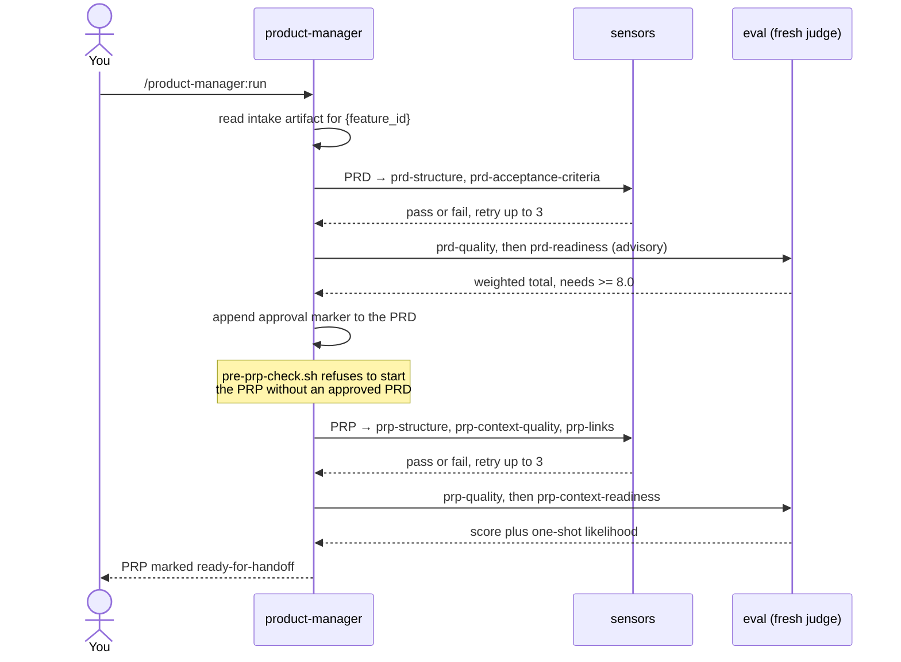
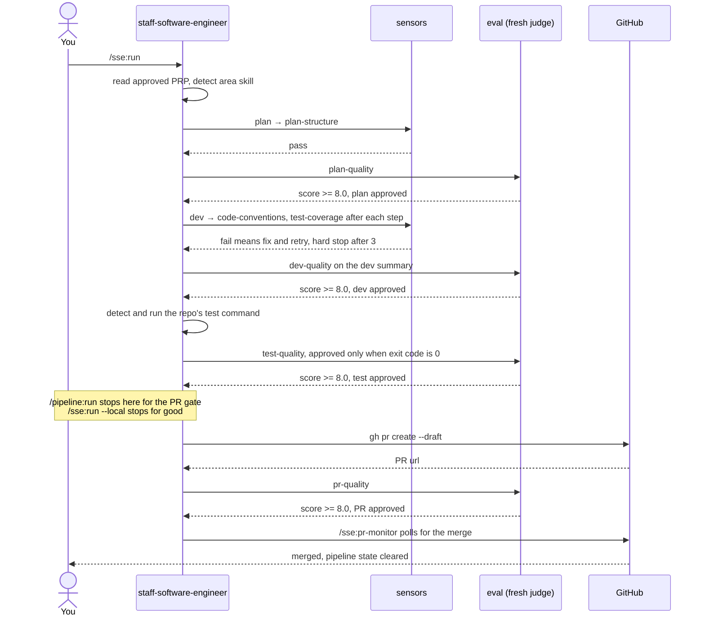
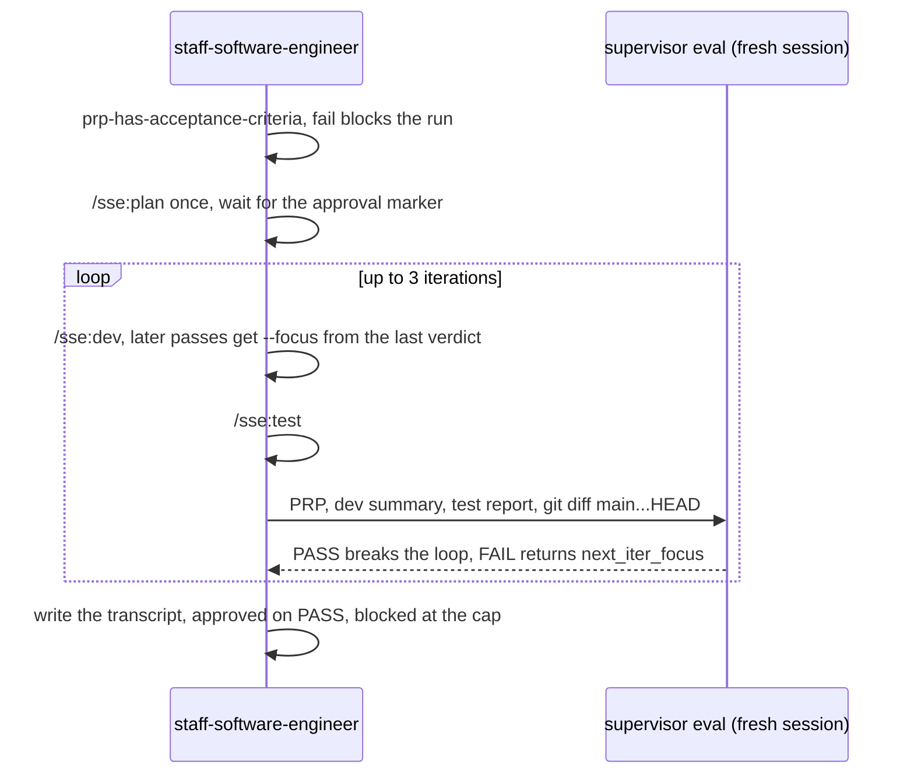
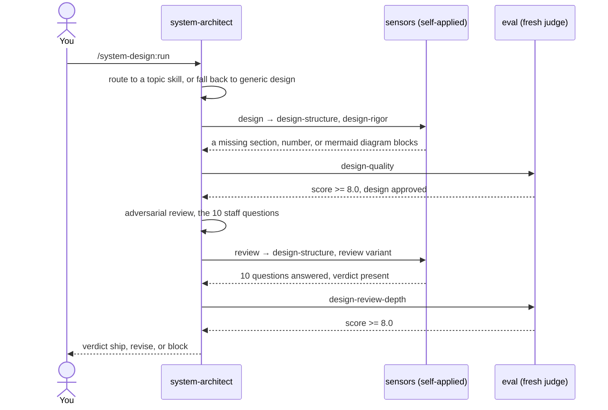

# Pipelines dos agents

Um diagrama de sequência por agent, mostrando o que de fato acontece entre o comando que você digita e
o artefato que volta: quais sensors rodam, qual eval pontua o resultado, e onde fica a gate.

[Pipeline e stages](Pipeline-and-Stages) descreve os stages em si. [Sensors](Sensors) e
[Evals](Evals) descrevem os dois tipos de feedback. Esta página é a fiação.

## O que todo stage compartilha

O mesmo loop roda em todo stage de todo agent, então leia uma vez e os três diagramas abaixo ficam bem
mais curtos:

1. O agent gera o artefato em `.claude/runtime/outputs/`.
2. Os **sensors** checam de forma determinística. Passa ou falha, sem nota, sem julgamento.
3. Um **eval** pontua. O avaliador é um sub-agent novo (ferramenta Task, `general-purpose`) que recebe
   apenas o caminho do artefato e o caminho da rubric. O autor nunca corrige o próprio trabalho.
4. Abaixo do threshold, o agent regenera só as seções que falharam ou pontuaram baixo e tenta de novo.
   **No máximo três tentativas**, depois disso ele devolve um blocker em vez de seguir.
5. Ao passar, ele anexa um marker de aprovação: `<!-- approved: {YYYY-MM-DD} score={weighted-total} -->`.
   Esse marker é a gate que o stage seguinte checa.

O threshold é **total ponderado >= 8.0** para todo eval pontuado: `prd-quality`, `prp-quality`,
`plan-quality`, `dev-quality`, `test-quality`, `pr-quality`, `design-quality` e
`design-review-depth`.

As gates humanas pertencem ao orquestrador, não aos agents. O `/pipeline:run` para em exatamente duas:
aprovar a direção depois do PRD, e aprovar o PR antes de ele abrir. Stages individuais nunca criam
gates próprias.

## product-manager

`prd → prp`. Ponto de entrada `/product-manager:run`. As entradas vêm do artefato de intake, não de
você, então o agent não para para perguntar.

Os artefatos caem em `.claude/runtime/outputs/pm/prd/{feature_id}.md` e
`.claude/runtime/outputs/pm/prp/{feature_id}.md`.

Dois detalhes que o diagrama comprime. O `prd-readiness` é consultivo e não tem threshold numérico,
então ele reporta sem bloquear. O `prp-context-readiness` é a gate de handoff de verdade: só passa
quando todo sensor estrutural passou, `shippable` é yes ou partial, existem no máximo duas perguntas
bloqueantes, e `one_shot_likelihood >= 0.7`.

## staff-software-engineer

`plan → dev → test → pr`. Ponto de entrada `/sse:run`. Ele lê o PRP aprovado mais recente e detecta
sozinho o area skill (`backend`, `web`, `mobile`, `devops`) pelos arquivos do repo, colocando o skill
`designer` por cima quando o trabalho é claramente uma UI nova.

Os artefatos caem em `.claude/runtime/outputs/sse/{plan,dev,test,pr}/{feature_id}.md`.

O stage `dev` é o único que passa por gate duas vezes: `code-conventions` e `test-coverage` rodam
contra o código depois de cada passo de implementação, e `dev-structure` mais `dev-quality` rodam
depois contra o resumo escrito. Testes falhando nunca são repetidos automaticamente; o agent devolve
um blocker e deixa a decisão com você.

### A variante SDD

O `/sse:sdd` troca os stages lineares de dev e test por um loop guiado por objetivo. Ele plana uma vez
e depois itera até o spec do próprio PRP ser satisfeito. É local apenas e nunca abre um PR.

O predicado é construído a partir do próprio PRP: todo bullet sob `Success criteria (verifiable)` tem
que ser atendido por código e por um teste, e todo comando no bloco `Validation gates` tem que sair
com 0. O supervisor roda em uma sessão nova, então o contexto do worker não vaza para a nota que ele
mesmo recebe. Bater no teto de três iterações é sinal real de que o spec e o código discordam.

## system-architect

`design → review`. Ponto de entrada `/system-design:run`. Este agent é um stage opcional na frente do
PRP, não faz parte do golden path. Ele escolhe um **topic skill** do mesmo jeito que o staff engineer
escolhe um area skill: `url-shortener`, `rate-limiter` ou `search-engine` quando o problema bate com
um deles, e o skill genérico `design` caso contrário.

Os artefatos caem em `.claude/runtime/outputs/architect/design/{feature_id}.md` e
`.claude/runtime/outputs/architect/review/{feature_id}.md`.

Este agent é deliberadamente livre de hooks: seus sensors são regras em markdown auto-aplicadas, não
scripts rodados por hooks do `settings.json`, o que o mantém portátil para qualquer ferramenta que leia
o `AGENTS.md`. O review é cético por padrão e interroga em vez de resumir. Um verdict `block` é
terminal, o design não é marcado como pronto e o run mostra os blockers no lugar.

## Relacionados

- [Pipeline e stages](Pipeline-and-Stages), os stages e seus artefatos
- [Sensors](Sensors) e [Evals](Evals), os dois mecanismos de feedback
- [Agents](Agents), para que serve cada agent
- [Golden path](Golden-Path), a porta de entrada ponta a ponta
- [Método de system design](System-Design-Method), o método por trás do architect
