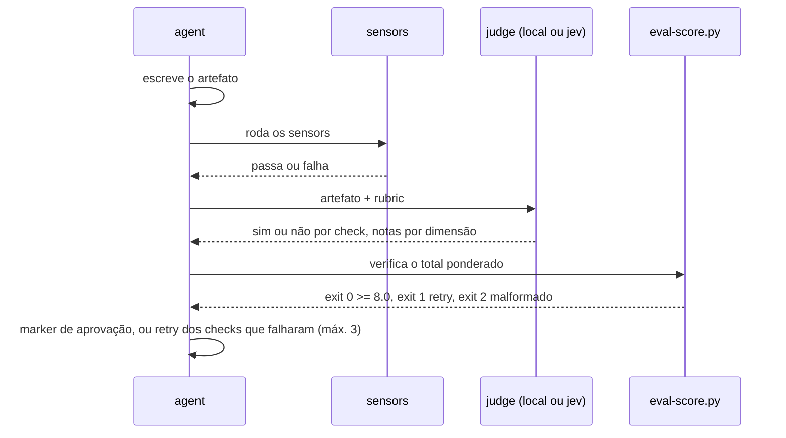

# Pipelines dos agents

Quais sensors rodam, qual eval pontua o resultado e onde fica a gate, do comando ao artefato. [Pipeline e stages](Pipeline-and-Stages) descreve os stages, e [Sensors](Sensors) e [Evals](Evals) descrevem os dois tipos de feedback.

# O loop que todo stage roda

O agent escreve o artefato em `.claude/runtime/outputs/`. Os sensors checam de forma determinística pelo runner versionado, passa ou falha, sem nota. Depois um judge que não escreveu o artefato responde os checks de sim ou não da rubric em `.claude/agents/{agent}/evals/*.md`.

O judge é o escolhido com `/hk:eval jev | local`: um avaliador Claude novo que recebe só os caminhos do artefato e da rubric, ou o Jev, que escala para o Claude quando fica incerto num check decisivo. O `eval-score.py` recalcula o total ponderado e recusa um judge cuja aritmética ou cujas chaves não batem. Abaixo de 8.0 o agent regenera só os checks que falharam, em até 3 tentativas, e depois devolve um blocker. Ao passar, ele anexa `<!-- approved: {YYYY-MM-DD} score={weighted-total} -->`, o marker que o stage seguinte checa. Detalhes em [Evals](Evals).

```mermaid
sequenceDiagram
    participant A as agent
    participant S as sensors
    participant J as judge (local ou jev)
    participant V as eval-score.py
    A->>A: escreve o artefato
    A->>S: roda os sensors
    S-->>A: passa ou falha
    A->>J: artefato + rubric
    J-->>A: sim ou não por check, notas por dimensão
    A->>V: verifica o total ponderado
    V-->>A: exit 0 >= 8.0, exit 1 retry, exit 2 malformado
    A->>A: marker de aprovação, ou retry dos checks que falharam (máx. 3)
```

As gates humanas pertencem ao orquestrador. O `/pipeline:run` para em duas: aprovar a direção depois do PRD e aprovar o PR antes de ele abrir. Os stages nunca criam gates próprias.

# Consulta por stage

| Stage | Sensors | Eval |
|---|---|---|
| prd | prd-structure, prd-acceptance-criteria | prd-quality, prd-readiness (consultivo) |
| prp | prp-structure, prp-context-quality, prp-links | prp-quality, prp-context-readiness |
| plan | plan-structure | plan-quality |
| dev | code-conventions, test-coverage, dev-structure | dev-quality |
| test | test-structure | test-quality, aprovado só com exit code 0 |
| pr | pr-structure | pr-quality |
| design | design-structure, design-rigor | design-quality |
| review | design-structure (variante de review) | design-review-depth |

Os artefatos ficam em `.claude/runtime/outputs/pm/{prd,prp}/{feature_id}.md`, `.claude/runtime/outputs/sse/{plan,dev,test,pr}/{feature_id}.md` e `.claude/runtime/outputs/architect/{design,review}/{feature_id}.md`.

# product-manager

O `/product-manager:run` roda `prd` e depois `prp`. As entradas vêm do artefato de intake, então o agent não para para perguntar. O `pre-prp-check.sh` se recusa a iniciar o PRP sem um PRD aprovado.

O `prd-readiness` é consultivo e nunca bloqueia. O `prp-context-readiness` é a gate de handoff: só passa quando todo sensor estrutural passou, `shippable` é yes ou partial, há no máximo 2 perguntas bloqueantes e `one_shot_likelihood >= 0.7`. Um PRP que passa é marcado `ready-for-handoff`.

# staff-software-engineer

O `/sse:run` roda `plan`, `dev`, `test` e `pr`. Ele lê o PRP aprovado mais recente, detecta o skill de área (`backend`, `web`, `mobile`, `devops`) pelos arquivos do repo e adiciona o [designer skill](Designer-Skill) quando o trabalho é uma UI nova.

O `dev` tem gate duas vezes: `code-conventions` e `test-coverage` rodam sobre o código depois de cada passo de implementação, e depois `dev-structure` e `dev-quality` rodam sobre o resumo escrito. Testes que falham nunca são repetidos automaticamente; o agent devolve um blocker com os nomes dos testes que falharam. O `/sse:run --local` para depois do test. Caso contrário, o `pr` roda `gh pr create --draft`, pontua o `pr-quality`, e o `/sse:pr-monitor` faz polling até o merge limpar o estado do pipeline.

# A variante SDD

O `/sse:sdd` planeja uma vez e depois faz loop de dev, test e um eval supervisor por até 3 iterações. É só local e nunca abre PR. O sensor `prp-has-acceptance-criteria` roda primeiro e bloqueia a run se falhar.

O eval supervisor, `spec-satisfied`, sempre roda no Claude, numa sessão nova que recebe o PRP, o resumo do dev, o relatório de test e o `git diff main...HEAD`. Todo item em `Success criteria (verifiable)` precisa ser atendido por código e por um teste, e todo comando em `Validation gates` precisa sair com 0. Um FAIL devolve `next_iter_focus`, passado ao próximo `/sse:dev --focus`. Bater no limite significa que a spec e o código discordam.

# system-architect

O `/system-design:run` roda `design` e depois `review`. É um stage opcional antes do PRP, fora do golden path. Ele direciona para um skill de tópico (`url-shortener`, `rate-limiter`, `search-engine`) quando o problema bate com um deles, e para o skill genérico `design` nos demais casos.

O agent não tem hooks nem runner de sensors; ele mesmo aplica as regras dos sensors, então funciona em qualquer ferramenta que leia o `AGENTS.md`. O review responde as 10 perguntas de staff com ceticismo e devolve ship, revise ou block. Um veredito `block` é terminal: o design não é marcado como pronto e a run expõe os blockers.

# Relacionadas

[Pipeline e stages](Pipeline-and-Stages), [Sensors](Sensors), [Evals](Evals), [Agents](Agents), [Golden Path](Golden-Path), [Método de System Design](System-Design-Method).
