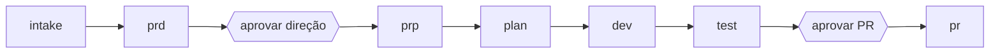

# Autonomia

Um comando leva uma ideia até um PR e só pausa onde um humano agrega julgamento. O stage `intake` e a regra resolver, marcar, seguir valem em todo stage (prd, prp, plan, dev, test, pr, system-design). O formato canônico é o [`.claude/shared/pipeline-pattern.md`](https://github.com/Pierry/harness-kit/blob/main/.claude/shared/pipeline-pattern.md). Ainda planejado: model tiering para Haiku nos checks baratos, e cada organização preenchendo o próprio `context-library/repos.md`.

# Perguntas são falta de contexto

A primeira versão parava antes de cada artefato para perguntar squad, problema, clientes, hipótese, link da aposta e caminhos do repo. Apagar essas perguntas e deixar o agent chutar produz um squad alucinado ou uma métrica inventada. Em vez disso, o harness-kit faz o agent ler o repo, o histórico dele e a context library antes de tudo, e só pergunta o que é externo.

Nos termos de [Harness Engineering](Harness-Engineering), isso sai do feedback para o feedforward. Perguntar no meio da run é feedback: o agent produz uma lacuna e espera. Coletar contexto antes é feedforward: a lacuna nunca se forma.

# O stage de intake

O `intake` roda antes do `prd` como um [subagent](Orchestration-and-Subagents) (`/intake:run`). Ele lê o repo alvo (código, README, commits recentes, PRs e issues abertos), o `context-library/` (business-info, squads, metrics, decisions) e os remotes do git. Ele escreve `.claude/runtime/outputs/intake/{feature_id}.md` com `squad`, `problem`, `customers`, `hypothesis`, `repos`, `metrics` e `unknowns`.

Como roda num contexto isolado, a exploração dele nunca chega aos stages seguintes. Eles leem o artefato destilado. O agent de PRD lê esse artefato em vez de perguntar a você.

# Resolver, marcar, seguir

Toda entrada recebe uma de três disposições, no lugar de perguntar ou bloquear.

| Disposição | Quando | O que acontece |
|---|---|---|
| Resolver | A resposta está no repo ou na context library | O valor entra no artefato, sem contato humano |
| Marcar | A resposta não é encontrada (um link de aposta, uma meta executiva) | `NOT FOUND - NEEDS REVIEW: {detail}` entra inline e em `unknowns`, e a run continua |
| Seguir | Sempre | A run nunca bloqueia por falta de entrada; os unknowns aparecem na gate seguinte |

Os evals toleram um número limitado de markers: o `prp-context-quality` só bloqueia acima de 5. Um artefato anterior ausente é a única parada obrigatória, e o stage aborta com o comando que precisa rodar antes.

# Duas gates

O humano sai de dentro do loop, respondendo antes de cada artefato, para cima do loop, aprovando nos pontos onde revisar é barato e errar é caro. A distinção vem dos textos de Böckeler sobre harness engineering.

A gate do PRD leva cerca de 30 segundos e evita uma run de dev inteira apontada para o lado errado. A gate do PR protege a única ação voltada para fora que é difícil de desfazer. O `/pipeline:run --yolo` remove as duas em fluxos confiáveis e de baixo risco.

# O que continua determinístico

Consultas são código. O `context-library/repos.md` mapeia squad para caminhos de repo; ele vem como `context-library/repos-template.md` para cada organização preencher. Sem uma entrada, o intake detecta os repos pelo diretório de trabalho e pelos remotes do git. O `feature_id` é calculado como `{YYYY-MM-DD}-{squad}-{slug}`.

# O que não muda

Sensors e evals disparam em todo stage, então um PRD autônomo enfrenta as mesmas réguas de `prd-structure` e `prd-quality` que um guiado. Markers, contagem de tokens e `.pipeline-state.json` funcionam como antes, e o intake muda o estado pelos mesmos hooks. O `/pipeline:continue` retoma no próximo stage pendente depois de uma falha.

# Veja também

[Orquestração e subagents](Orchestration-and-Subagents), [Pipeline e stages](Pipeline-and-Stages), [Harness Engineering](Harness-Engineering).
