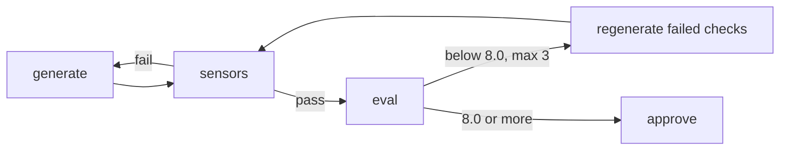

# Evals (feedback inferencial)

Um [sensor](Sensors) checa estrutura com regex. Um eval julga significado, como se o plan decorre do PRP. Cada eval é uma rubric ponderada com nota de 0 a 10; a aprovação é 8.0, com até 3 retries.

# Anatomia de uma rubric

As rubrics ficam em `.claude/agents/{agent}/evals/*.md`. Cada dimensão `### Name (weight N%)` traz checks atômicos de sim ou não: linhas `- check:` são perguntas para o judge, linhas `- absent:` são regexes rodadas em código (palavras banidas, em dash, diagramas de caixas em ASCII).

```markdown
### Metric completeness (weight 20%)
- check: Every metric in `sections.success_metrics` has a baseline value.
- check: Every metric in `sections.success_metrics` has a target value.
- check: `sections.success_metrics` states a kill criterion with a numeric threshold.

### Voice (weight 5%)
- absent: (?i)\b(delve|leverage|utilize|unlock|streamline|robust|cutting-edge|seamless|best-in-class)\b
- absent: (?m)^\s*\+[-=]{3,}\+
```

Uma dimensão vale 10 vezes a fração dos seus checks atendidos; as âncoras 0/5/10 só servem para desempate.

# Aritmética verificada

`eval-score.py` recalcula o total ponderado a partir dos pesos da rubric e recusa um judge cuja aritmética ou cujas chaves não batem.

```
python3 .claude/scripts/eval-score.py --rubric evals/prd-quality.md --scores judge.json
```

| Saída | Significado |
|---|---|
| `0` | consistente e igual ou acima de 8.0; imprime a nota para o approval marker |
| `1` | abaixo do threshold, retry |
| `2` | saída malformada, total errado, ou dimensões faltando ou sobrando |

# O loop de retry

Os sensors rodam primeiro, então nenhuma chamada ao judge vai para um artefato malformado. Um eval reprovado regenera só os checks que falharam, que são o feedback literal. Depois de 3 tentativas reprovadas o stage devolve um blocker.



# Dois judges

`/hk:eval jev | local` escolhe o judge por projeto. A escolha fica em `.claude/hk-config.json`, perguntada uma vez na instalação, com default `local`.

`local` é um avaliador Claude novo que vê só o artefato e a rubric. `jev` é o Jev da [TypeSafe AI](https://typesafe.ai), um modelo System One que devolve probabilidades calibradas em vez de texto, chamado por `.claude/scripts/jev-judge.py`. Cada check é uma pergunta Noul (sim ou não). O artefato vai dividido por seção `## ` (`sections.success_metrics`), então um check lê só a parte que nomeia; um check sobre uma seção ausente reprova sem chamada. Cada execução acrescenta uma linha em `.claude/runtime/outputs/evals/jev-judge.jsonl`.

# Escalada para o Claude

A execução escala para o avaliador Claude quando o Jev fica em dúvida em checks que decidem o resultado: o total recalculado com as respostas incertas forçadas para não e para sim cai dos dois lados de 8.0. Ela também escala quando não há chave, quando o artefato passa de 32k tokens ou quando a API dá erro.

A chave fica numa variável de ambiente (default `TYPESAFE_API_KEY`) ou no bloco `env` de `.claude/settings.local.json`, nunca num arquivo commitado. O Jev é uma API paga, cerca de $0.042 por milhão de tokens de entrada, então roda localmente e nunca no CI. `spec-satisfied` e os gates de readiness sempre usam Claude.

# Evals por stage

| Stage | Evals |
|---|---|
| `prd` | `prd-quality`, `prd-readiness` |
| `prp` | `prp-quality`, `prp-context-readiness` |
| `plan` | `plan-quality` |
| `dev` | `dev-quality` |
| `test` | `test-quality` |
| `pr` | `pr-quality` |
| loop `sdd` | `spec-satisfied` |
| system design | `design-quality`, `design-review-depth` |

Os pesos dizem com o que cada gate se importa; a qualidade do PRD põe 20% em clareza e 20% em completude das métricas. Você ajusta um peso uma vez e ele vale para todo artefato futuro. `design-review-depth` reprova uma review que só carimba: nenhuma lacuna nomeada, severidade plana, conselho genérico.

# spec-satisfied

`/sse:sdd` usa o `spec-satisfied`, que devolve PASS ou FAIL contra `Success criteria (verifiable)` e `Validation gates` do PRP. Um FAIL volta ao loop de dev e test com uma dica `next_iter_focus`, até 3 iterações. Ele roda numa sessão nova, sem o contexto do worker.

# Por que esta forma

Um judge Claude avaliando saída do Claude infla as notas ([Wataoka et al.](https://arxiv.org/abs/2410.21819); [Panickssery et al.](https://arxiv.org/abs/2404.13076)); uma família diferente reduz isso, não elimina. Checklists atômicos aumentam a concordância entre judges ([CheckEval](https://arxiv.org/abs/2403.18771), [TICK](https://arxiv.org/abs/2410.03608)). A escalada segue [Trust or Escalate](https://arxiv.org/abs/2407.18370). Os checks do Jev seguem a [orientação](https://docs.typesafe.ai/model-jaggedness/jev-1.13) dele: um julgamento por pergunta, sem contagem, estado filtrado.

# O que a nota não é

Nenhum dos judges foi validado contra rótulos humanos ainda, e 8.0 é uma convenção, não uma fronteira calibrada. [Hamel Husain](https://hamel.dev/blog/posts/llm-judge/) recomenda cerca de 100 exemplos rotulados por modo de falha; o log jsonl é o começo desse conjunto. Leia os checks que falharam, não só o número.

# Veja também

[Sensores](Sensors), [Guides](Guides), [Pipeline e stages](Pipeline-and-Stages), [Referências](References).
