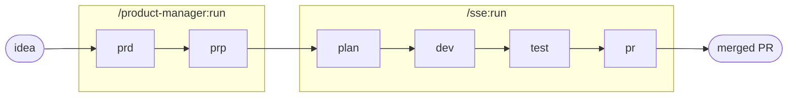

# Golden Path

O golden path é o **caminho pavimentado, opinativo e suportado, da ideia até produção**. O termo vem do
Spotify; a Netflix chama de "paved road". Não é o *único* jeito de atravessar o harness, é o
*recomendado*.

```
/golden-path
```

Um comando roda os seis stages com gate: `/product-manager:run` (prd → prp) e depois `/sse:run`
(plan → dev → test → pr → monitor). Ideia entra, PR mergeado sai.

## As cinco propriedades

Um golden path de verdade se define por cinco propriedades, e o harness-kit busca satisfazer todas:

- **Opinativo**: um pipeline, as convenções do repo, sem bikeshedding do fluxo.
- **Suportado**: sensors + evals dão gate em todo stage. Quem pega o drift é o harness, não você.
- **Opcional**: saia do caminho quando quiser, rode stages avulsos. Sem imposição, sem punição.
- **Self-service**: um comando. Sem ticket, sem esperar time de plataforma.
- **Transparente / extensível**: todo stage diz o que rodou (sensors, guides, evals); dá para sobrescrever
  por repo via `conventions/`. Uma abstração que você enxerga por dentro e consegue dobrar.

A combinação é o ponto: opinativo *e* opcional, suportado *e* transparente. Pavimenta uma pista sem
levantar uma cerca.



## Comece por um brief

O construtor de idea-brief coleta os inputs que o PRD precisa (squad, problema, hipótese, clientes,
métrica) e emite um kick de `/golden-path` pronto para colar, com validação inline que te segura nas
convenções do PRD enquanto você digita. Hospedado em `pierry.github.io/harness-kit/brief/`. Já sabe a
ideia de cor? Pule o construtor e digite `/golden-path` com o brief você mesmo.

## Flags (repassadas para a metade SSE)

- `--local`, para depois do test, sem PR. Dev + test local.
- `--sdd`, variante do loop guiado por spec (plan uma vez, dev↔test↔eval até bater a spec do PRP). Só
  local.
- `--no-monitor`, o PR abre, pula o merge-watch automático.

## Saindo do caminho

A propriedade "opcional" na prática. Rode qualquer stage avulso:

| Desvio | Comando |
|---|---|
| Só o PRD / PRP | `/product-manager:prd` · `:prp` |
| Só plan / dev / test / pr | `/sse:plan` · `:dev` · `:test` · `:pr` |
| Dev + test, sem PR | `/sse:run --local` |
| Loop guiado por spec | `/sse:sdd` |
| Retomar de onde parou | `/pipeline:continue` |
| Abandonar a run ativa | `/pipeline:reset` |

Mesmos sensors, mesmos evals, mesmos artefatos. Você perde a conveniência de um comando só, não o
suporte.

## Pavimentação por disciplina

Um princípio de golden path: uma pista pavimentada por disciplina de engenharia. O harness-kit faz isso no
stage de dev, selecionando automaticamente as convenções da disciplina do repo:

```
.claude/conventions/{backend,web,mobile,devops}.md
```

Quando o arquivo existe, o projeto ganha dos defaults do SSE. Esses overrides *são* a pavimentação por
disciplina, feedforward sob controle do time. Veja [Guides](Guides).

## Transparência: o que roda atrás da cortina

O golden path abstrai, nunca esconde. O resumo de cada stage nomeia os sensors, evals, guides e refs que
rodaram, nomes reais, não um "done" genérico:

```
sensors: plan-structure ok, plan-feasibility ok
eval:    plan-quality 8/10 (attempts: 1)
guides:  pipeline.md, coding-style.md, skills/{area}/SKILL.md
refs:    prp/{feature_id}.md, conventions/{area}.md
```

Quer ver mais fundo? Leia os `sensors/`, `evals/`, `guides/` dentro de `.claude/agents/<agent>/`. Markdown
puro. Nada lacrado.

## Veja também

- [Pipeline e stages](Pipeline-and-Stages): os seis stages em detalhe
- [Engenharia de harness](Harness-Engineering): por que o caminho tem gate do jeito que tem
- [Agents](Agents): os agents que o caminho orquestra
