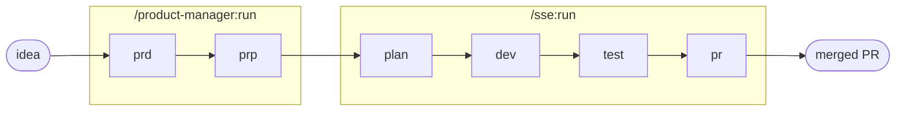

# Golden Path

O golden path é o caminho recomendado da ideia até produção, um termo do Spotify que a Netflix chama de paved road. Você também pode rodar qualquer stage sozinho.

```
/golden-path
```

Um comando roda `/product-manager:run` (prd, prp) e depois `/sse:run` (plan, dev, test, pr, monitor). Entra a ideia, sai o merged PR. Para a versão sem intervenção, com dois gates de aprovação e um stage `intake`, use `/pipeline:run`; veja [Autonomia](Autonomy).


```mermaid
flowchart LR
    idea([idea]) --> prd --> prp --> plan --> dev --> test --> pr --> merged([merged PR])
    subgraph PM["/product-manager:run"]
        prd
        prp
    end
    subgraph SSE["/sse:run"]
        plan
        dev
        test
        pr
    end
```

# As cinco propriedades

Ele é opinativo: um pipeline e as convenções do repo. Ele tem suporte: sensors e evals fazem o gate de cada stage, então o harness pega o desvio. Ele é opcional: você sai dele quando quiser e roda stages sozinhos. Ele é autosserviço: um comando, nenhum ticket para um time de plataforma. Ele é transparente e extensível: cada stage diz o que rodou, e você sobrescreve por repo via `.claude/conventions/`.

# Comece por um brief

O construtor de idea brief em `pierry.github.io/harness-kit/brief/` coleta squad, problema, hipótese, clientes e métrica, confere tudo contra as convenções de PRD enquanto você digita e gera uma chamada `/golden-path` pronta para colar. Se você já conhece a ideia, digite `/golden-path` com o brief você mesmo.

# Flags

As flags são repassadas para a metade SSE.

| Flag | Efeito |
|---|---|
| `--local` | para depois do test, sem PR |
| `--sdd` | loop guiado por spec: planeja uma vez, depois dev, test e eval até o PRP ser atendido; só local |
| `--no-monitor` | abre o PR, pula a observação do merge |

# Saindo do caminho

| Desvio | Comando |
|---|---|
| PRD ou PRP sozinho | `/product-manager:prd`, `/product-manager:prp` |
| um stage do SSE | `/sse:plan`, `/sse:dev`, `/sse:test`, `/sse:pr` |
| dev e test, sem PR | `/sse:run --local` |
| loop guiado por spec | `/sse:sdd` |
| retomar | `/pipeline:continue` |
| abandonar a execução | `/pipeline:reset` |

Os desvios rodam os mesmos sensors, evals e artefatos. Só a conveniência do comando único some.

# Pavimentação por disciplina

O stage dev lê as convenções de disciplina do repo por cima dos defaults do SSE, e o projeto vence:

```
.claude/conventions/{backend,web,mobile,devops}.md
```

Esses arquivos são feedforward que o time controla; veja [Guides](Guides).

# O que roda atrás da cortina

O resumo de cada stage diz quais sensors, evals, guides e refs rodaram:

```
sensors: plan-structure ok
eval:    plan-quality 8.4/10 (attempts: 1)
guides:  pipeline.md, coding-style.md, skills/{area}/SKILL.md
refs:    prp/{feature_id}.md, conventions/{area}.md
```

Os arquivos por trás deles são markdown simples em `.claude/agents/<agent>/sensors/`, `evals/` e `guides/`. Qual judge pontuou o eval depende de `/hk:eval`; veja [Evals](Evals).

Veja também [Pipeline e stages](Pipeline-and-Stages), [Harness Engineering](Harness-Engineering), [Agents](Agents).
