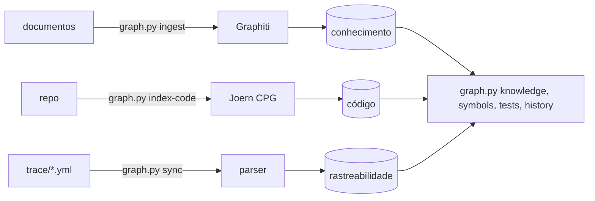

# Teoria dos grafos

Um agent de código que recebe um ticket lê prosa, separa as partes que parecem instruções, busca o código por nome e edita o que encontra. Nada diz a ele qual requisito um método atende, quais callers quebram quando esse método muda, ou o que o time decidiu no trimestre passado sobre o mesmo campo. Ele preenche essas lacunas com texto plausível. Uma resposta errada que parece certa é o tipo caro, porque passa na revisão.

Graph engineering troca os palpites por consultas. Requisitos viram átomos com ids estáveis, o código vira um grafo de símbolos e chamadas, e os links entre eles carregam evidência e um status. A configuração, os comandos e os modos estão em [Graph Engineering](Graph-Engineering). As ideias abaixo são a base de cada parte, com as fontes que as moldaram.

# Requisitos como átomos

A ISO/IEC/IEEE 29148:2018 lista as características de um requisito bem formado, e uma delas é ser singular: um requisito declara uma capacidade, uma característica ou uma restrição. Um requisito que junta dois comportamentos pode ficar meio implementado e ainda parecer pronto, e um teste não consegue provar as duas metades. O requisito singular é o átomo ao qual todo o resto se liga.

O EARS, Easy Approach to Requirements Syntax (Mavin et al., RE 2009), dá uma gramática ao átomo. Ele nasceu do trabalho de controle de motores da Rolls-Royce e fixa um conjunto pequeno de padrões, cada um aberto por uma palavra-chave: `When` para um evento, `While` para um estado, `If ... then` para comportamento indesejado, `Where` para uma feature opcional, e um `shall` sozinho para comportamento que vale sempre. Um gatilho, uma resposta, um requisito.

```
REQ-001: When a shipment is created with a weight above the carrier limit,
         the API shall reject it with HTTP 422 and the code WEIGHT_OVER_LIMIT.
```

O id importa mais que a redação. O texto é editado na revisão; o id não muda. Quando o ticket vira REQ-001 até REQ-00n, todo passo seguinte usa o id como chave e o texto original do ticket nunca é lido de novo, então um critério reescrito mantém seus links, testes e commits. No harness-kit o PRP escreve cada critério de sucesso como `- [ ] REQ-001: ...`, e `trace.py init` lê essas linhas, ou mantém os ids que a skill atomize já atribuiu.

# Rastreabilidade e por que os links apodrecem

Gotel e Finkelstein deram nome ao problema em An Analysis of the Requirements Traceability Problem (RE 1994). Eles o dividiram em dois: a rastreabilidade pós-requisitos segue um requisito para frente, até design, código e testes, e a rastreabilidade pré-requisitos o segue para trás, até quem pediu e por quê. O levantamento deles encontrou a maior parte do problema sem solução no lado pré, onde a origem de um requisito vive em reuniões e documentos aos quais nenhuma ferramenta faz link.

Gotel et al. voltaram ao tema em The Grand Challenge of Traceability (2012) com uma meta que chamaram de rastreabilidade ubíqua: links criados como efeito colateral do trabalho normal de engenharia, confiáveis e baratos o bastante para que ninguém precise decidir se vale mantê-los. O obstáculo que eles descrevem é a deterioração. Um link escrito à mão no primeiro dia continua igual enquanto o código por baixo dele muda toda semana, e ninguém é dono de atualizá-lo.

Um link desatualizado faz mais mal que um link ausente, porque parece procedência. O artigo Graph Engineering #1, de Pierry Borges, registra um mapa de ownership em que um agent escreveu 16 hashes de commit, e nenhum deles batia com qualquer objeto do git. Nada os checou na hora da escrita, e eles ficaram no arquivo por meses, tipograficamente idênticos aos reais, até uma auditoria pegá-los.

A correção é fazer o link carregar como ele foi criado e quanto confiar nele: status, confiança, os métodos por trás dele, evidência, commit e data. PROPOSED quer dizer que uma análise acha que o requisito toca o símbolo. VALIDATED quer dizer que a mudança entrou no merge e um teste prova isso. STALE quer dizer que o símbolo mudou de lugar ou sumiu. Duas checagens mantêm o status honesto: na hora da escrita o commit é resolvido contra o git e um hash que o git não encontra é recusado, e na hora do acerto cada símbolo é procurado de novo na árvore atual. Nas palavras do artigo, a documentação envelhece em silêncio, a evidência expira fazendo barulho.

# Grafos de propriedades de código

Um compilador constrói várias visões do mesmo código, e cada uma responde a uma pergunta diferente. A árvore sintática abstrata (AST) é a estrutura do código-fonte depois do parse: este método, esta chamada, estes argumentos. Ela diz o que o código é e nada sobre a ordem em que ele roda.

O grafo de fluxo de controle (CFG) tem um nó por instrução e uma aresta para cada instrução que pode rodar em seguida, então desvios e laços viram bifurcações e ciclos. Ele responde o que pode executar depois do quê. O grafo de dependência de programa (PDG) acrescenta dois tipos de aresta: dependência de dados, em que a instrução B lê um valor que a instrução A escreveu, e dependência de controle, em que B só roda se a condição de A for verdadeira. Ele responde quais instruções influenciam quais.

Yamaguchi et al. juntaram os três em Modeling and Discovering Vulnerabilities with Code Property Graphs (IEEE S&P 2014). O grafo de propriedades de código mantém os nós da AST e coloca as arestas do CFG e do PDG por cima deles, tudo num único grafo de propriedades, então uma única travessia pode fazer uma pergunta que atravessa sintaxe, ordem e fluxo de dados, como um argumento que vem da entrada do usuário e chega a uma chamada de cópia sem checagem de limites no caminho. Eles o usaram para achar 18 vulnerabilidades até então desconhecidas no kernel do Linux.

O [Joern](https://github.com/joernio/joern) é a implementação open source, com o schema publicado em [cpg.joern.io](https://cpg.joern.io). Ele traz frontends para C e C++, Java, JavaScript, Python, Kotlin e outras linguagens, acrescenta um grafo de chamadas e informação de tipos por cima das três camadas base, e é consultado numa linguagem baseada em Scala.

Para um agent, a fatia útil é o grafo de chamadas. Uma mudança no método M só pode quebrar código que chega a M, ou seja, os callers dele, os callers desses, e assim por diante até os entrypoints. Esse conjunto transitivo é o limite superior do que revisar e testar de novo, e ele limita o raio de impacto antes que alguém edite. O grep acha um nome; o grafo de chamadas resolve cada chamada para uma única declaração, então dois métodos chamados `validate` em classes diferentes ficam separados.

O harness-kit guarda só essa fatia. `graph.py index-code` roda um frontend do Joern, exporta métodos e pontos de chamada por `.claude/graph/export_callgraph.sc` e os carrega como nós `Fn` ligados por arestas `CALLS`. `graph.py symbols` então imprime até 10 callers para cada símbolo candidato. O artigo acrescenta uma nota de campo: num projeto Java com Lombok, o Joern sem `--fetch-dependencies --delombok-mode no-delombok` pulou 4.351 de 4.890 arquivos e produziu um grafo plausível de 188 KB, contra 16 MB com as flags. Conte o que o grafo contém em vez de confiar que ele existe.

# Grafos de conhecimento temporais e Graphiti

Conhecimento muda de um jeito que código não muda. Uma transportadora aumenta o limite de peso, uma decisão é revertida, uma política expira. Um grafo que guarda os dois fatos dá duas respostas contraditórias, e um grafo que sobrescreve o antigo perde o registro do que era verdade quando o código anterior foi escrito.

Rasmussen et al. descrevem a resposta em Zep: A Temporal Knowledge Graph Architecture for Agent Memory ([arXiv:2501.13956](https://arxiv.org/abs/2501.13956), 2025), o paper por trás do [Graphiti](https://github.com/getzep/graphiti). O Graphiti mantém três subgrafos. Episódios guardam a entrada bruta, um documento ou uma mensagem, com seu timestamp, então todo fato pode apontar de volta para onde veio. Entidades e os fatos entre elas são extraídos dos episódios. Comunidades agrupam entidades relacionadas com um resumo.

Toda aresta de fato é bitemporal. O tempo de validade registra quando o fato valeu no mundo, e o tempo de transação registra quando o sistema ficou sabendo dele e quando o marcou como expirado. Quando um episódio novo contradiz um fato antigo, o Graphiti fecha a validade da aresta antiga em vez de apagá-la, então você pode perguntar o que era verdade em 1º de março e também o que o sistema acreditava em 1º de março. O paper reporta 94,8% no benchmark Deep Memory Retrieval contra 93,4% do MemGPT, e no LongMemEval ganhos de acurácia de até 18,5% com a latência de resposta reduzida em cerca de 90%.

O artigo traz o alerta que acompanha isso. Requisitos tipados que o atomize já tinha produzido foram passados pelo modelo mesmo assim: 25 a 30 segundos por requisito, fatos inventados, uma transportadora guardada sob dois nomes de nó, e 35 de 42 arestas sem data de validade, o que tornou a revogação impossível. Um parser lendo o mesmo arquivo carregou 26 requisitos em 0,86 segundo como 107 nós e 248 arestas, nada inventado, toda aresta datada. O modelo merece seu lugar onde há julgamento, nunca onde um parser já sabe a resposta.

No harness-kit o Graphiti só roda em `graph.py ingest`, para documentos não estruturados como decisões e notas de reunião, em modelos do NVIDIA build em vez de um Ollama local. `graph.py ingest` passa o momento da ingestão como tempo de referência de cada episódio. Manifests e o CPG entram por parsers.

# A ontologia como contrato

Uma ontologia aqui é a lista de tipos de nó que podem existir e das arestas válidas entre eles, com os campos que cada aresta exige. Ela é o contrato entre todo processo que escreve no grafo e todo processo que lê dele.

O artigo começa pelo que acontece sem uma. Um grafo de conhecimento tinha 19.262 nós, incluindo 1.100 requisitos tipados, e respondia toda pergunta com nada. O writer usava um conjunto de labels de nó, o reader consultava outro, e o cliente buscava numa partição chamada "main" à qual nenhum nó pertencia. Ficou assim por semanas, porque um grafo que não devolve nada parece igual a um grafo que não tem nada. Em um mês os autores catalogaram oito defeitos em dois projetos, entre eles os hashes inventados, uma data fixa no código carimbada em arquivos gerados, e uma política de recuperação escrita como instruções para o LLM que se afastou do código de pontuação que nunca a lia. Todos eram um writer e um reader sem um contrato verificado.

A ontologia continua sendo um arquivo versionado para que uma mudança chegue como um pull request que alguém pode contestar. Ela só cresce quando um documento real ou código real pede um tipo. A primeira ontologia do artigo aguentou dois documentos; o terceiro precisou de uma aresta para uma política que restringe uma feature, e ela entrou marcada como local em vez de canônica. Uma aresta que contava níveis de abstração pulados, em vez de inventar os que faltavam, transformou "onde a nossa documentação pula níveis" numa consulta que respondeu 23 lugares.

O harness-kit traz `.claude/graph/ontology.yml` na versão 1 com quatro tipos de nó (Requirement, Decision, Method, Test) e três arestas (AFFECTS, IMPLEMENTS, VERIFIED_BY). `trace.py` o lê em toda escrita e `trace.py validate` rejeita um tipo de aresta que ele não lista, um campo obrigatório ausente, um status desconhecido, um requisito não declarado ou um commit que o git não encontra.

# Um writer por camada

O grafo guarda três camadas separadas por labels de nó. Conhecimento é requisitos, decisões e fatos. Código é arquivos, métodos e chamadas. Rastreabilidade é os links entre os dois. Cada camada tem exatamente um writer e o banco só armazena.



A regra existe por causa do desencontro de labels. Quando dois processos escrevem os mesmos labels, cada um guarda a sua ideia do schema e nada falha até um reader voltar vazio. Com um writer por camada, um único lugar codifica cada parte do schema, e o reader pode ser testado contra esse lugar. O agent não vê nada disso: ele faz quatro perguntas pelo `graph.py` e as respostas vêm dos backends que o modo liga.

# O arquivo é a verdade, o grafo é projeção

O artigo relata um teste que ninguém planeja fazer: o time apagou o banco Neo4j, sem backup para restaurar. Todo arquivo de requisito sobreviveu no git, o grafo foi reconstruído a partir desses arquivos numa tarde, e o grafo reconstruído ficou melhor que o perdido porque a ontologia tinha melhorado nesse meio tempo. Se o grafo fosse o único lugar desses dados, um mês de trabalho teria ido embora com um comando.

A lição que o artigo tira é simplificar a infraestrutura e nunca os dados. A infraestrutura pode ser trocada depois; dado que nunca foi registrado se perdeu. O harness-kit mantém `trace/{feature_id}.yml` no git e o entrega junto com o PR. O grafo é o FalkorDB embutido pelo falkordblite, guardado em `.claude/runtime/graph/kg.db` e ignorado pelo git, sem Docker e sem servidor. `graph.py sync` e `graph.py index-code` o reconstroem a partir de arquivos. A camada de conhecimento se reconstrói ingerindo os documentos de origem de novo, o que custa chamadas de modelo, então esses documentos também devem ficar no repo.

# Recuperação antes da geração

Lewis et al. apresentaram a geração aumentada por recuperação em Retrieval-Augmented Generation for Knowledge-Intensive NLP Tasks ([arXiv:2005.11401](https://arxiv.org/abs/2005.11401), NeurIPS 2020). Um retriever puxa trechos de um índice e o gerador se condiciona a eles, então os fatos vêm de texto que você pode inspecionar e atualizar mudando o índice em vez de treinar o modelo de novo. Edge et al. estenderam a ideia em From Local to Global: A Graph RAG Approach to Query-Focused Summarization ([arXiv:2404.16130](https://arxiv.org/abs/2404.16130), 2024): um LLM constrói um grafo de entidades a partir do corpus, o grafo é dividido em comunidades, e cada comunidade é resumida com antecedência, o que responde perguntas sobre o corpus inteiro que a recuperação dos poucos trechos mais parecidos deixa passar.

Graph engineering pega a ordem do primeiro paper e a estrutura do segundo. A recuperação roda primeiro e segue arestas, de requisito para símbolo, para caller, para teste, em vez de ordenar texto só por similaridade. Todas as consultas disparam em paralelo: símbolos, histórico do git, documentos, testes, memória e o CPG. No monólito do artigo, com 4.900 arquivos Java, o CPG leva 15 minutos para ser construído e encontra 1.062 entrypoints, 990 deles HTTP, agrupados em 77 features com 2.124 cláusulas de contrato. Ele é construído uma vez e reindexado a cada commit novo, nunca por ticket; um serviço menor foi indexado em menos de um minuto.

# Estreitando o contexto

Liu et al. mediram por que mais contexto não é melhor em Lost in the Middle: How Language Models Use Long Contexts ([arXiv:2307.03172](https://arxiv.org/abs/2307.03172), TACL 2024). A acurácia em perguntas e respostas com vários documentos é mais alta quando o trecho relevante fica no começo ou no fim da entrada e cai quando ele fica no meio. Em algumas configurações o modelo foi pior com a resposta enterrada no meio do contexto do que sem documento nenhum.

Por isso o grafo estreita o contexto e nunca o enche. O harness-kit devolve no máximo 5 fatos do Graphiti e 5 resumos de entidade por consulta de conhecimento e 10 callers por símbolo, e a lista de escopo do plan é o único conjunto de arquivos que o dev pode tocar, imposto por `trace.py gate`. A mesma regra vale para o juiz de eval, que recebe uma seção por checagem; veja [Jev e System One](Jev-and-System-One).

# Como o harness-kit mapeia cada ideia

| Ideia | Onde fica |
|---|---|
| Requisito singular, id estável | Linhas `- [ ] REQ-001:` do PRP, lidas por `trace.py init` |
| Link com evidência e status | `trace/{feature_id}.yml`, escrito só por `.claude/scripts/trace.py` |
| Commit checado na hora da escrita | `resolve_commit` em `trace.py` |
| Links se acertam depois do merge | `trace.py settle --all`, rodado no começo de todo plan |
| Ontologia como contrato | `.claude/graph/ontology.yml`, imposta por `trace.py validate` |
| Grafo de chamadas limita o raio de impacto | `graph.py index-code`, `graph.py symbols` |
| Conhecimento temporal | `graph.py ingest` no Graphiti com modelos do NVIDIA build |
| Um writer por camada | Graphiti, Joern, `trace.py`; o FalkorDB só armazena |
| O arquivo é a verdade | `graph.py sync` e `index-code` reconstroem `kg.db` |
| Escopo como lista | `trace.py scope`, `trace.py gate` |

# Referências

Pierry Borges, Graph Engineering #1: Introduction, artigo não publicado, fonte das notas de campo e dos números de uso em produção.

ISO/IEC/IEEE 29148:2018, Systems and software engineering, Life cycle processes, Requirements engineering, para o requisito singular. Mavin et al., Easy Approach to Requirements Syntax (EARS), RE 2009.

Gotel e Finkelstein, An Analysis of the Requirements Traceability Problem, RE 1994. Gotel et al., The Grand Challenge of Traceability (v1.0), em Software and Systems Traceability, Springer, 2012.

Yamaguchi et al., Modeling and Discovering Vulnerabilities with Code Property Graphs, IEEE S&P 2014. [Joern](https://github.com/joernio/joern) e a [especificação do CPG](https://cpg.joern.io).

Rasmussen et al., [Zep: A Temporal Knowledge Graph Architecture for Agent Memory](https://arxiv.org/abs/2501.13956), 2025. [Graphiti](https://github.com/getzep/graphiti). [FalkorDB](https://github.com/FalkorDB/FalkorDB).

Lewis et al., [Retrieval-Augmented Generation for Knowledge-Intensive NLP Tasks](https://arxiv.org/abs/2005.11401), NeurIPS 2020. Edge et al., [From Local to Global: A Graph RAG Approach to Query-Focused Summarization](https://arxiv.org/abs/2404.16130), 2024. Liu et al., [Lost in the Middle: How Language Models Use Long Contexts](https://arxiv.org/abs/2307.03172), TACL 2024.

# Veja também

[Graph Engineering](Graph-Engineering), [Jev e System One](Jev-and-System-One), [Evals](Evals), [Referências](References).
