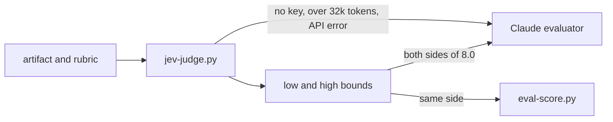

# Jev e System One

Todo stage do harness-kit termina num eval: um judge lê o artefato contra uma rubric ponderada e o stage passa em 8.0. Quando o judge é um modelo da mesma família que escreveu o artefato, o gate mede familiaridade junto com qualidade. O Jev, um modelo System One da [TypeSafe AI](https://typesafe.ai), é o segundo judge que o harness-kit oferece por esse motivo. Como trocar de judge e ler a saída está em [Evals](Evals). A pesquisa e o desenho do modelo por trás dessa escolha estão abaixo.

# O problema de um judge LLM

Zheng et al. definiram a base em Judging LLM-as-a-Judge with MT-Bench and Chatbot Arena ([arXiv:2306.05685](https://arxiv.org/abs/2306.05685), 2023). O GPT-4 como judge concordou com as preferências humanas em mais de 80% das vezes, o mesmo nível em que humanos concordam entre si. O mesmo artigo mediu três vieses. Posição: com as duas respostas trocadas de lugar, o GPT-4 deu um veredito consistente em 65,0% dos casos, que subiu para 77,5% com exemplos few-shot. Verbosidade: uma resposta inflada com uma cópia reescrita da própria lista venceu a original para o Claude-v1 e o GPT-3.5 em 91,3% de 23 casos, e para o GPT-4 em 8,7%. Autofavorecimento: o GPT-4 favoreceu as próprias respostas com uma taxa de vitória 10% maior e o Claude-v1 com 25%, embora os autores digam que os dados eram limitados demais para confirmar o efeito.

Trabalhos posteriores confirmaram. Panickssery et al., em LLM Evaluators Recognize and Favor Their Own Generations ([arXiv:2404.13076](https://arxiv.org/abs/2404.13076), 2024), mostraram que os modelos conseguem distinguir a própria saída da de outros, e que a força da autopreferência cresce de forma linear com esse autorreconhecimento; fazer fine-tuning de um modelo para se reconhecer melhor o fez preferir mais a si mesmo. Wataoka et al., em Self-Preference Bias in LLM-as-a-Judge ([arXiv:2410.21819](https://arxiv.org/abs/2410.21819), 2024), rastrearam um mecanismo: judges dão notas maiores a textos com perplexidade menor, textos mais familiares para eles, tenham ou não sido escritos por eles.

Para um pipeline do Claude avaliado pelo Claude, esse é o pior caso. O PRD em análise é o texto mais familiar possível para o judge. Um avaliador novo com contexto limpo remove o raciocínio de quem escreveu, e os pesos que acham a prosa familiar continuam os mesmos.

Verga et al. testaram a resposta óbvia em Replacing Judges with Juries ([arXiv:2404.18796](https://arxiv.org/abs/2404.18796), 2024). Um painel de três judges menores de famílias de modelos diferentes concordou mais com humanos do que um único judge GPT-4 nos datasets deles, mostrou menos viés intramodelo e custou mais de sete vezes menos. O harness-kit dá um passo nessa direção: um judge de outra família, com o Claude como fallback. Ainda não é um painel.

# Modelos System One e System Two

Os nomes ecoam os dois modos de pensamento de Kahneman: o System 1 é rápido e intuitivo, o System 2 é lento e deliberado. Um LLM trabalha no segundo modo. Ele gera raciocínio token por token e responde em prosa que o seu código depois interpreta, e essa interpretação pode falhar.

Os modelos [System One](https://typesafe.ai/blog/introducing-system-one-models-and-jev) da TypeSafe fazem o primeiro tipo de trabalho: o julgamento que uma pessoa experiente faz em um segundo quando tem o contexto certo. Você envia um estado (o conteúdo a julgar) e um conjunto de perguntas tipadas, e o Jev devolve uma distribuição de probabilidade sobre as opções que você forneceu. Ele nunca produz um valor fora delas, então a resposta não tem como vir malformada. A TypeSafe o treina com um método que chama de RLCD para devolver probabilidades calibradas, e os mesmos pesos atendem todas as contas.

O Jev não escreve texto, não chama ferramentas nem mantém uma conversa, e a [página sobre coding agents](https://docs.typesafe.ai/introduction/coding-agents) diz com todas as letras que ele não substitui o modelo por trás do Claude Code. A divisão no harness-kit segue essa linha. O Claude escreve o PRD, que é trabalho de System Two. Se `sections.success_metrics` nomeia uma baseline é uma pergunta de System One.

# O que o Jev devolve

Toda pergunta tem um id, um tipo e instruções. O id fica no seu código e nunca chega ao modelo.

| Tipo | Resposta | Leia como |
|---|---|---|
| Noul | `noul` | probabilidade de a resposta ser sim |
| Score | `score`, `probabilities`, `confidence` | posição em níveis ordenados que você descreve |
| Choice | `choice`, `probabilities`, `confidence` | uma opção de um conjunto sem ordem |

Um valor Noul é a resposta e a certeza num número só. A documentação mostra respostas registradas para "Is the customer asking for a human agent?": 0,02 para "Thanks, that fixed it!", 0,40 para "Are you a bot?", 0,84 para "Is there any way to speak to someone about my invoice?". Um valor perto de 0,5 é o modelo dizendo que não sabe.

Um Score é a média dos números dos níveis ponderada pela probabilidade. Para um relato de bug dividido entre "workaround exists" e "no workaround", as probabilidades são 0,0, 0,57 e 0,43, então o score é 0 x 0.0 + 1 x 0.57 + 2 x 0.43 = 1.43. Os níveis precisam descrever situações: o mesmo relato teve score 0,55 com os níveis secos "0", "1", "2" e 0,0 com confiança total usando níveis descritivos.

Um Noul é uma probabilidade, não uma escala. Na pergunta "Is the candidate strong in Python?", um candidato com dois anos de uso diário recebeu 0,81 e um com oito anos recebeu 0,92. A diferença mede o quanto o modelo tem certeza de que "strong" se aplica, e não diz nada sobre quanta experiência a mais o segundo tem. Quando você quer grau, use um Score.

Calibrado quer dizer que as probabilidades batem com as frequências: entre muitas respostas de 0,8, cerca de 80% devem acabar sendo sim. É essa propriedade que permite ao código pôr thresholds nos números.

# Confiança em três fórmulas

Respostas Choice e Score vêm com uma `confidence` de 0 a 1, calculada a partir da distribuição devolvida. Um Noul não tem, já que a sua única probabilidade já descreve uma distribuição de dois resultados.

```
Noul    confidence = |2p - 1|
Choice  confidence = (p_max - 1/n) / (1 - 1/n)
Score   confidence = max(0, 1 - sum_i p_i |i - m| / MAD_unif)
        MAD_unif   = (1/n) sum_i |i - (n - 1)/2|
```

A forma do Noul é a distância de um cara ou coroa: 0 em p = 0.5, 1 em p = 0 ou 1. A forma do Choice mede o quanto a opção do topo fica acima de uma divisão igual de 1/n, então 0 é um chute uniforme e 1 é certeza; ela lê só a probabilidade do topo, e é por isso que (0.6, 0.3, 0.1) e (0.6, 0.2, 0.2) recebem 0,4.

A forma do Score conta o quanto a probabilidade fica longe do nível mais provável m, medido em níveis, e compara isso com o mesmo espalhamento numa distribuição uniforme. Probabilidade num nível vizinho custa menos que probabilidade na outra ponta: com três níveis, (0, 0.5, 0.5) recebe 0,25 e (0.5, 0, 0.5) recebe 0. O relato de bug acima recebe 1 - 0.43 / (2/3), cerca de 0,35. A [página de confiança](https://docs.typesafe.ai/confidence) da TypeSafe trata essas fórmulas como defaults sensatos e devolve as probabilidades completas para você calcular outra medida se o seu caso pedir.

# Um julgamento por pergunta

A documentação do Jev pede um julgamento rápido por pergunta. Um Noul que pergunta duas coisas de uma vez, como "Is the customer angry and asking for a refund?", força o modelo a julgar as duas juntas, e o valor passa a dizer menos. Divida em dois Nouls e combine os dois em código com pesos que você controla.

A pesquisa de evals chegou à mesma conclusão pelo outro lado. O CheckEval ([arXiv:2403.18771](https://arxiv.org/abs/2403.18771)) decompõe cada critério em perguntas binárias de checklist e aumentou em 0,45 a concordância média entre modelos avaliadores. O TICK ([arXiv:2410.03608](https://arxiv.org/abs/2410.03608)) faz um LLM escrever um checklist por instrução, e julgar contra ele aumentou a concordância exata entre os julgamentos do LLM e as preferências humanas de 46,4% para 52,2%.

O harness-kit aplica os dois. Uma dimensão de rubric como a completude das métricas perguntava "every metric has baseline, target, horizon? guardrails listed? kill criteria numeric?" de uma vez só. Agora ela traz uma linha `- check:` por condição, e `jev-judge.py` envia cada linha como um Noul:

```markdown
### Metric completeness (weight 20%)
- check: Every metric in `sections.success_metrics` has a baseline value.
- check: Every metric in `sections.success_metrics` has a target value.
- check: `sections.success_metrics` states a kill criterion with a numeric threshold.
```

Todos os checks de uma rubric vão numa única requisição. O Jev avalia os checks em paralelo, então mais perguntas quase não mudam o tempo de resposta; o cookbook de perguntas paralelas da TypeSafe mediu 13 perguntas numa chamada a um custo 11,5 vezes menor e 9,6 vezes mais rápido que 13 chamadas separadas, com as mesmas respostas.

# Valor esperado em vez da resposta mais provável

Um judge de texto emite um único token de nota, o mais provável, e joga fora o resto da sua distribuição. O G-Eval ([arXiv:2303.16634](https://arxiv.org/abs/2303.16634)) manteve essa distribuição: ele pondera cada nota possível pela probabilidade do seu token e soma tudo. No benchmark SummEval, o G-Eval com GPT-4 chegou a uma correlação de Spearman de 0,514 com as avaliações humanas usando probabilidades, contra 0,502 sem elas, e a versão ponderada também desfez os empates que notas inteiras produzem.

Wang, Zhang e Choi defenderam o caso geral em Improving LLM-as-a-Judge Inference with the Judgment Distribution ([arXiv:2503.03064](https://arxiv.org/abs/2503.03064), 2025). Em todos os cenários deles, a média da distribuição de julgamento superou a moda, que é o que a decodificação greedy devolve. Eles também viram que prompting com chain-of-thought pode colapsar a distribuição em torno de uma resposta, o que remove a informação de que a média depende.

O Jev devolve a distribuição direto, e o seu campo Score já é o valor esperado. `jev-judge.py` usa a mesma ideia para os checks: uma dimensão vale 10 vezes a média de p(yes) entre os seus checks, a fração esperada de checks atendidos. Um check em 0,6 contribui com 0,6, não com um 1 arredondado. Uma dimensão sem checks cai para um único Score sobre as âncoras 0/5/10 da própria rubric, um modo mais fraco que nenhuma rubric ponderada do repo usa mais.

# Onde o Jev é fraco

A TypeSafe publica as [arestas irregulares do jev-1.13](https://docs.typesafe.ai/model-jaggedness/jev-1.13): ele lê instruções ao pé da letra, não conta com confiabilidade, trata números e datas como texto, perde precisão com indireção e com um estado grande cheio de detalhe irrelevante, pode ser influenciado por conteúdo adversarial, pode pender para a primeira opção num Choice e não gera texto. O harness-kit contorna cada um que encontra.

| Fraqueza | O que o harness-kit faz |
|---|---|
| Contagem, aritmética | regexes `- absent:` rodam em código; `eval-score.py` calcula o total ponderado e aplica 8.0 |
| Números e datas | os checks perguntam se um valor está presente, nunca comparam nem calculam valores |
| Estado grande e que distrai | artefato enviado como `sections`; cada check nomeia `sections.x`; uma seção ausente reprova em código sem chamada |
| Limite de contexto | artefato acima de cerca de 30k tokens (120.000 caracteres) escala para o Claude |
| Leitura literal | cada check declara uma condição exata, escrita de forma que sim signifique bom |
| Ordem das opções no Choice | nenhuma pergunta Choice é usada |
| Geração | o feedback é o texto do check que falhou, escrito por código |

Duas arestas continuam. Um check como "Every metric in `sections.success_metrics` has a baseline value" pede ao Jev que aplique uma condição sobre uma lista, o que fica perto da fraqueza de contagem quando a lista é longa; dividir por métrica em código seria mais rigoroso. Conteúdo adversarial também segue em aberto: o artefato é texto escrito por modelo, e uma frase que defende a própria qualidade pode mover uma resposta. A escalada pega os casos incertos, e nada pega um erro confiante.

# Escalada

Jung et al., em Trust or Escalate: LLM Judges with Provable Guarantees for Human Agreement ([arXiv:2407.18370](https://arxiv.org/abs/2407.18370), 2024), deixam um judge decidir só quando a sua confiança passa de um threshold, e passam o resto para um judge mais forte. Com o threshold calibrado em rótulos humanos, o método garante um nível escolhido de concordância com humanos nos casos que o judge mantém.

O harness-kit aplica a forma sem a calibração. Uma resposta com 0.3 < p < 0.7 conta como incerta. `jev-judge.py` recalcula o total ponderado duas vezes: o limite inferior conta como atendidas só as respostas em 0,7 ou mais, o que força toda resposta incerta para não, e o limite superior conta toda resposta acima de 0,3, o que as força para sim. Quando um limite chega a 8.0 e o outro não, as respostas incertas decidem o veredito, e o script sai com 3 para que o avaliador Claude julgue o artefato. Respostas incertas que não conseguem virar o resultado não escalam.



A mesma saída manda a execução para o Claude quando o judge está em `local`, a chave falta, o artefato é grande demais ou a API falha. Execuções escaladas são registradas com o veredito `escalated`. Os limites 0,3 e 0,7 são uma convenção escolhida; Jung et al. definiram os deles a partir de dados humanos, e o harness-kit ainda não tem nenhum.

# Custo e latência

O jev-1.13 custa $0.042 por milhão de tokens de entrada, e tokens de saída são gratuitos. Uma requisição de 10.000 tokens de entrada custa $0.00042. O contexto comporta 64k tokens por requisição, dos quais o estado mais a maior pergunta podem usar 32k, e os limites de taxa são 100K tokens por segundo e 80 requisições por segundo. A documentação da TypeSafe diz que a maioria das consultas termina em cerca de 100 ms, e o post de lançamento fala em 70 a 500 ms.

Barato ainda é pago. O Jev roda na máquina do desenvolvedor com uma chave de uma variável de ambiente ou do bloco `env` de `.claude/settings.local.json`, e nunca no CI. O alias `jev-latest` muda quando sai uma nova versão, então as respostas por trás dele podem mudar; toda execução registrada guarda o id versionado do modelo que respondeu, e você pode fixar um com `TYPESAFE_MODEL` quando os thresholds estiverem ajustados contra ele.

# O que ainda não está provado

Nenhum dos judges foi medido contra rótulos humanos em artefatos do harness-kit. A calibração do Jev é uma afirmação da TypeSafe sobre dados da TypeSafe, a faixa de 0,3 a 0,7 é uma convenção, e 8.0 é uma convenção. A pesquisa acima diz que checks atômicos, valores esperados e um judge de outra família movem a concordância na direção certa, cada um. Nada disso diz em quanto num PRD.

Hamel Husain, em [Using LLM-as-a-Judge for evaluation](https://hamel.dev/blog/posts/llm-judge/), descreve a saída: um especialista no domínio rotula exemplos como aprovado ou reprovado com uma crítica escrita, cerca de 100 por modo de falha, e você mede com que frequência o judge concorda. A concordância bruta favorece um judge quando a maioria das respostas é sim. Dois avaliadores que dizem sim 90% das vezes concordam 82% das vezes só por acaso (0.9 x 0.9 + 0.1 x 0.1), e é por isso que medidas corrigidas pelo acaso, como o kappa de Cohen, são o relato usual.

Toda execução do Jev acrescenta as probabilidades por check, os limites, o veredito e o id do modelo em `.claude/runtime/outputs/evals/jev-judge.jsonl`. Rotular esses registros transforma o log nesse conjunto, e até lá os checks que falharam valem mais que o número.

# Referências

Zheng et al., [Judging LLM-as-a-Judge with MT-Bench and Chatbot Arena](https://arxiv.org/abs/2306.05685), NeurIPS 2023. Panickssery et al., [LLM Evaluators Recognize and Favor Their Own Generations](https://arxiv.org/abs/2404.13076), 2024. Wataoka et al., [Self-Preference Bias in LLM-as-a-Judge](https://arxiv.org/abs/2410.21819), 2024. Verga et al., [Replacing Judges with Juries: Evaluating LLM Generations with a Panel of Diverse Models](https://arxiv.org/abs/2404.18796), 2024.

Liu et al., [G-Eval: NLG Evaluation using GPT-4 with Better Human Alignment](https://arxiv.org/abs/2303.16634), 2023. Wang, Zhang e Choi, [Improving LLM-as-a-Judge Inference with the Judgment Distribution](https://arxiv.org/abs/2503.03064), 2025. Lee et al., [CheckEval](https://arxiv.org/abs/2403.18771), 2024. Cook et al., [TICK: Generated Checklists Improve LLM Evaluation and Generation](https://arxiv.org/abs/2410.03608), 2024. Jung et al., [Trust or Escalate](https://arxiv.org/abs/2407.18370), 2024. Liu et al., [Lost in the Middle](https://arxiv.org/abs/2307.03172), TACL 2024, sobre por que um estado longo e que distrai custa precisão.

TypeSafe AI, [Introducing System One models and Jev](https://typesafe.ai/blog/introducing-system-one-models-and-jev), e a [documentação da TypeSafe](https://docs.typesafe.ai): primitivas, Noul, Score, confiança, scoring composto, estado, modelos e jaggedness do jev-1.13. Hamel Husain, [Using LLM-as-a-Judge for evaluation](https://hamel.dev/blog/posts/llm-judge/).

# Veja também

[Evals](Evals), [Teoria dos grafos](Graph-Theory), [Graph Engineering](Graph-Engineering), [Referências](References).
