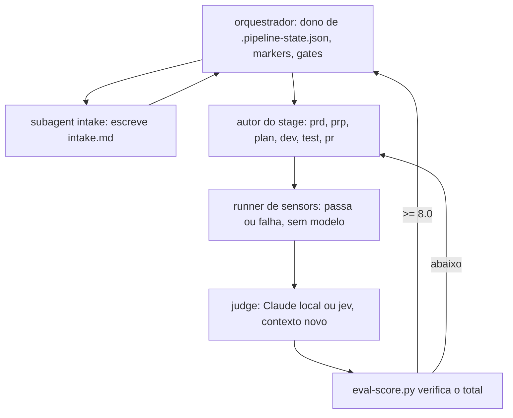

# Orquestração e subagents

O pipeline roda como um orquestrador mais subagents pequenos. O `intake` é um subagent somente leitura, o eval de cada stage vai para um judge que não escreveu o artefato, e as entradas seguem resolver, marcar, seguir. O formato canônico é o [`.claude/shared/pipeline-pattern.md`](https://github.com/Pierry/harness-kit/blob/main/.claude/shared/pipeline-pattern.md). O model tiering para Haiku está planejado; hoje todo agent roda no Opus.

# Por que subagents

Um subagent é um contexto novo e isolado, iniciado pela Task tool. Dividir compensa em três casos. O isolamento de contexto impede que um stage que lê centenas de arquivos, como o `intake`, carregue esse volume adiante. O paralelismo roda trabalho independente ao mesmo tempo. A separação adversarial impede que o autor avalie o próprio trabalho.

O terceiro é o que mais pesa. Um autor avaliando o próprio PRD infla a nota. Um avaliador novo, que recebe só o artefato e a rubric, não tem nada a defender. O eval `spec-satisfied` do loop SDD já rodava numa sessão nova; a v5 tornou isso a regra para toda gate.

# A armadilha da decomposição excessiva

Cada salto custa um boot de contexto, releitura de arquivos (subagents não compartilham memória), latência e tokens. Divida só quando o salto compra um dos três ganhos. Uma regra estrutural ("o PRD tem as seções obrigatórias") é um script de sensor sem modelo. Um julgamento ("esta hipótese é testável") é um eval.

# Três responsabilidades

| Responsabilidade | Dono | Regra |
|---|---|---|
| Coordenação: sequência, estado, markers, retries, gates | o orquestrador (sessão principal) | Nunca escreve um artefato |
| Geração: PRD, PRP, plan, código | o autor do stage | Entradas explícitas, saída estruturada |
| Verificação: sensors e eval | runner de sensors e um judge separado | Quem avalia nunca escreveu o que avalia |

# A topologia

As folhas nunca falam entre si. A informação passa pelo orquestrador e pelos artefatos em disco.

# O judge

O avaliador começa sem memória de como o artefato foi escrito e recebe só o artefato e a rubric. O projeto escolhe o judge com `/hk:eval jev | local`, guardado em `.claude/hk-config.json`. O `local` é um avaliador Claude novo. O `jev` é o Jev da TypeSafe AI, outra família de modelo, o que reduz o viés de autopreferência sem eliminá-lo; ele escala para o Claude quando fica incerto num check decisivo. O `spec-satisfied` e as gates de readiness sempre usam o Claude. Veja [Evals](Evals).

O padrão permite um painel de três avaliadores com lentes distintas para as gates de maior risco. Nenhum comando de stage usa isso hoje, e o `dev` roda como um autor único, sem fan-out por módulo.

# Restrições do Claude Code

Subagents são folhas sem estado: não alteram estado compartilhado, não herdam memória e não podem criar seus próprios subagents livremente. Por isso o orquestrador é dono de todo o estado e escreve `.claude/.pipeline-state.json` e os markers por meio de `pipeline.py` e `marker.sh`. Uma folha preenche um artefato e devolve um resultado; o orquestrador faz a transição de estado. A maquinaria de hooks, markers e tokens continua como era.

# Contratos

Cada subagent recebe caminhos de arquivo como entrada e devolve um formato que o orquestrador consegue parsear. O `intake` devolve `squad`, `problem`, `repos`, `customers` e `unknowns`, e o orquestrador lê `unknowns` para decidir o que a gate do PRD mostra a você. Com contratos, o fluxo de controle é determinístico enquanto as folhas são inferenciais.

# Rollout

A v5 provou primeiro uma fatia vertical: intake, autor do prd, script de sensor do prd e eval do prd num contexto novo. Depois que funcionou contra um repo real, ela virou o `pipeline-pattern.md`, e `prp`, `plan`, `dev`, `test`, `pr` e os stages de system design copiaram o formato. Stages novos seguem o mesmo arquivo.

# Veja também

[Autonomia](Autonomy), [Pipeline e stages](Pipeline-and-Stages), [Agents](Agents), [Harness Engineering](Harness-Engineering).
