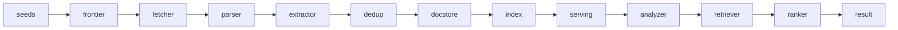
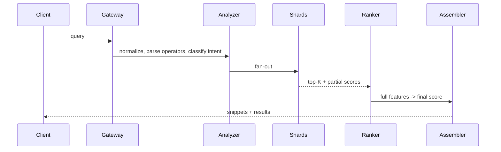

# Search Engine

> Série System Design #3 (EP24). Topic skill: `skills/search-engine/`.
> Projete um search engine web com crawler, indexing, ranking e serving em escala.

## 1. O problema e por que ele engana

A maioria das pessoas imagina uma caixinha simples: o usuário digita a query, recebe dez links, fim. Por
baixo existe um pipeline enorme. Você descobre páginas, decide o que vale a pena buscar, baixa conteúdo
sem prejudicar sites de terceiros, faz parse e extrai texto/links/metadados, normaliza, deduplica,
constrói um inverted index, calcula features offline, opcionalmente gera embeddings e, no fim, responde
queries em poucos milissegundos com ranking relevante.

A arquitetura muda enormemente conforme o objetivo. Busca em documentação interna é um problema. Busca
pública em escala web é outro mundo. Uma frase resume o sistema:

> Um search engine é uma **fábrica distribuída que transforma URLs em documentos rankeáveis.**

É uma **cadeia de decisões**: o que descobrir, buscar, armazenar, indexar, recuperar e promover. Cada
stage mata custo ruim e preserva sinal útil.

## 2. Quatro subsistemas + dois planos de apoio

- **Crawler**: descobre e busca páginas.
- **Pipeline de processamento**: parse, limpeza, extração, enriquecimento.
- **Pipeline de indexing**: constrói os indexes.
- **Query serving**: analisa a query, recupera candidatos, faz ranking, monta o resultado.
- Apoio: **metadados / política** (robots.txt, politeness, regras de canonical, agendamento, dedup) e
  **observabilidade / controle** (métricas, debugging, reprocessamento, backfill, allow/blocklists).

## 3. Requisitos

**Funcionais:** aceitar seeds; descobrir links recursivamente; respeitar a política de crawl (robots.txt,
delays, limites por host); buscar HTML (opcionalmente PDFs, feeds, imagens); fazer parse e extrair texto,
links, título, headings, anchor text, canonical, idioma, timestamp, metadados estruturados; detectar
duplicatas e quase-duplicatas; construir um inverted index para busca lexical; opcionalmente um index
vetorial para recall semântico; responder queries com paginação, snippets, filtros e ranking de
relevância; recrawlear periodicamente para manter freshness.

**Não funcionais:** escalabilidade horizontal em todo stage; alto throughput offline; **baixa latency de
serving** (tipicamente < 200 ms ponta a ponta, de preferência bem menos); alta disponibilidade no caminho
da query; consistência eventual entre crawl e busca é aceitável desde que convirja; custo previsível;
comportamento seguro e não abusivo com sites de terceiros; observabilidade suficiente para explicar por
que uma página não foi indexada ou por que uma query retornou o que retornou.

## 4. Modelo mental ponta a ponta



Seeds → o frontier escolhe uma URL elegível → o fetcher baixa → o parser transforma bytes em documento
estruturado → o extractor produz texto limpo, outlinks e metadados → o deduplicador decide novo/duplicata
exata/quase-duplicata → o document store persiste a versão canonical → o indexing tokeniza e constrói as
postings lists → jobs offline calculam sinais globais (por exemplo, popularidade no link graph) → na hora
da query o analyzer normaliza, o retriever acha candidatos, o ranker pontua e o result builder monta os
snippets.

## 5. O crawler (o coração)

### URL frontier
A estrutura central. Ela **não é uma fila só**. Uma implementação séria separa três conceitos:

- **URL-seen store**: essa URL já apareceu antes? (Bloom filter na frente de um store persistente.)
- **Crawl-state store**: status da última tentativa, hash do conteúdo, código HTTP, tempo de resposta,
  janela do próximo recrawl.
- **Filas de prioridade do scheduler**: escolhem a próxima URL respeitando prioridade e politeness.

> **Por que um Bloom filter?** (Burton Bloom, 1970.) Uma estrutura probabilística de pertinência a
> conjunto: responde "já vi essa URL?" em O(1) e poucos bits por elemento, sem falsos negativos e com
> taxa de falso positivo ajustável. Em escala web você não consegue manter cada URL vista em memória de
> forma exata; o Bloom filter entrega "definitivamente nova" vs "provavelmente vista, vá conferir no
> store" de forma barata.

### Multi-fila por host
Uma única fila global cria dois problemas: **domínios quentes** (um domínio muito linkado enche a fila) e
**perda de politeness** (você dispara muitas requisições concorrentes contra um host, parecendo um DDoS).
A correção: uma fila pendente por host, cada uma com um `next_eligible_timestamp`; um heap global ordena
os hosts pelo menor tempo elegível e maior prioridade. Quando um host fica elegível, você tira uma URL,
busca, atualiza o backoff e reinsere o host. Isso dá **fairness e politeness juntos**.

### Canonicalização
Normalize antes de enfileirar: host em minúsculas, remover fragmentos, portas default, limpar query
params irrelevantes, resolver caminhos relativos, remover session ids conhecidos, normalizar barra final.
Pular isso explode duplicatas e custo de crawl.

### robots.txt e politeness
Faça cache do robots.txt por host com TTL; respeite allow/disallow e crawl-delay (o Robots Exclusion
Protocol, hoje **RFC 9309**, 2022). Politeness não é um sleep fixo:

```
next_request_allowed = max(min_delay, k * observed_latency, robots_crawl_delay)
```

mais concorrência máxima por host e backoff exponencial em erros. Isso evita martelar sites lentos.

### Fetcher
Stateless, I/O pesado: rede assíncrona, connection pooling, cache de DNS, reuso de TLS, gzip/brotli,
limites de redirect, tamanho máximo de download, sniffing de content-type (não confie só no header) e
**GET condicional** (`ETag` / `If-Modified-Since`) para recrawl barato. Persista metadados: código de
status, headers, URL final após redirects, tempo de resposta, checksum do corpo.

### Armadilhas de crawler
A web tem infinitas páginas falsas: calendários gerando datas sem fim, combinações de facetas de
e-commerce, URLs com parâmetros arbitrários, a busca interna do próprio site, loops de paginação.
Guardrails: crawl budget por host, limite de fan-out por página, blocklists de regex de parâmetros, um
score de repetição de template, limites de profundidade. Sem isso, **80% do custo vai para os piores 5%
da web.**

## 6. Agendamento de crawl (onde dinheiro vira estratégia)

Crawlear a web inteira todo dia é impossível para quase todo mundo. Com um budget finito de requisições,
banda e CPU, agendar é uma decisão de negócio. Um crawl score aproximado:

```
crawl_score ~ quality * freshness_need * business_priority / fetch_cost
```

(Intuição, não uma fórmula universal literal.) **Recrawl adaptativo:** mudou duas vezes num intervalo
curto → encolha a janela; não mudou muitas vezes → aumente; erros → recue. Muito melhor que um cron fixo.
**Tiers de freshness** A/B/C/D (minutos → raramente) por domínio, padrão de URL ou score dinâmico.

## 7. Teoria, deduplicação

Busca web sem dedup é caos: o mesmo conteúdo aparece com/sem www, http/https, parâmetros diferentes,
páginas de impressão, sindicação, espelhos, republicações e duplicatas suaves.

Três níveis:

1. **Duplicata de URL**: mesma URL normalizada.
2. **Duplicata exata de conteúdo**: mesmo hash do texto limpo.
3. **Quase-duplicata**: conteúdo quase igual.

Para quase-duplicatas você gera fingerprint com **shingles + MinHash** (Broder, 1997) ou **SimHash**
(Charikar, 2002). O MinHash estima a similaridade de Jaccard entre conjuntos de shingles a partir de
alguns mínimos de hash; o SimHash mapeia um documento para um vetor de bits onde a distância de Hamming
acompanha a similaridade, o que permite clusterizar por fingerprint de forma barata. Guarde um
`document_fingerprint` e um `canonical_document_id`; muitas URLs mapeiam para um documento canonical.
Deduplique **cedo e em camadas**, senão você paga para processar duplicatas caras, e consolide os sinais
de ranking (links de entrada, cliques) no canonical.

## 8. Storage por função

- **Raw content store**: a resposta original, comprimida, em object storage barato, para reprocessamento
  e auditoria.
- **Parsed document store**: `doc_id, canonical_url, fetch_time, title, clean_text, language,
  outgoing_links, anchors_in, headers, content_type, quality_signals, fingerprint`.
- **Crawl metadata store**: estado operacional com updates aleatórios frequentes: `url, host,
  discovered_at, last_fetch_status, last_success_at, next_fetch_at, retry_count, robots_policy_version,
  blocked_reason`. Um store KV/wide-column encaixa melhor que object storage aqui.

## 9. Teoria, o inverted index

A estrutura lexical clássica. Em vez de guardar os termos por documento, guarde, para cada termo, a lista
de documentos em que ele aparece. Essa lista é uma **postings list**:

```
term: crawler
postings: [(doc1, tf=3, positions=[4,18,22]), (doc7, tf=1, positions=[9])]
```

Por posting: `doc_id`, frequência do termo, posições (para queries de frase), info de campo (título vs
corpo), payloads opcionais.

### Pipeline de build
Tokenizar → normalizar (minúsculas, remover acentos, stem/lematizar) → descartar stopwords quando fizer
sentido → emitir pares `term → posting` → **sort-merge por termo** → comprimir postings → persistir
segmentos imutáveis → publicar uma nova versão do index. Isso é naturalmente distribuível, modele como
**MapReduce** (Dean & Ghemawat, 2004) ou streaming com compactação em batch.

### Sharding
Duas estratégias: **document sharding** (cada shard guarda um subconjunto de documentos e seus termos) vs
**term sharding** (cada shard guarda um subconjunto de termos). Document sharding costuma simplificar
serving, replicação e rebalanceamento: a query faz fan-out para todos os document shards, cada um retorna
um top-K local e um agregador faz o merge.

### Segmentos e merge
Atualizar um index grande no lugar é caro. O modelo Lucene (Doug Cutting) usa **segmentos imutáveis**
mais merges periódicos em background: escritas sequenciais baratas, snapshots simples, rollback fácil,
serving concorrente durante o reindex. Custos: trabalho de merge em background, docs deletados ficam como
tombstones até o merge e mais segmentos elevam o custo da query.

### Compressão
Postings precisam ser comprimidas ou o index explode: delta encoding de doc ids, variable-byte encoding,
frame-of-reference, bit packing e **skip lists** para pular blocos. Objetivo: ler rápido sem queimar CPU
na descompressão.

## 10. Query serving (o caminho online)



### Analyzer
Normalizar caixa, tokenizar, correção ortográfica opcional, expansão de sinônimos, detecção de idioma,
parsing de operadores (aspas, `-`, `site:`, `filetype:`) e **classificação de intenção** (navegacional /
informacional / transacional / fresh). A intenção muda o ranking: as mesmas palavras podem querer coisas
diferentes.

### Recuperação de candidatos
Você não faz ranking da web inteira. Primeiro recupere um conjunto de candidatos via **BM25** no index
lexical, filtros de campo, boosts de título/anchor, opcionalmente busca **ANN** sobre embeddings, ou uma
união híbrida. Tipicamente top-N por shard (~500-1000), depois merge.

> **BM25** (Robertson & Zaragoza, *The Probabilistic Relevance Framework: BM25 and Beyond*) é a função
> padrão de relevância lexical: recompensa frequência de termo com saturação e penaliza documentos
> longos, com parâmetros ajustáveis `k1` e `b`. É o baseline burro de carga sobre o qual sistemas fortes
> ainda constroem.

### Ranking
O score final combina famílias de features:

- **Casamento textual**: BM25, termo no título, termo no heading, proximidade de termos, match de frase,
  match de anchor text.
- **Documento**: autoridade do domínio, qualidade da página, freshness, score de spam, match de idioma,
  estrutura.
- **Query**: intenção, necessidade de freshness, tipo de entidade, ambiguidade.
- **Comportamental (quando disponível)**: CTR, cliques longos, reformulações de query, tempo de
  permanência, abandono rápido.

Um começo simples é um score linear ponderado, por exemplo
`0.45*bm25 + 0.20*title + 0.15*authority + 0.10*freshness + 0.10*anchor`. Sistemas maduros migram para
**learning-to-rank**: mas só com boas features e dados de clique, senão você compra complexidade cara.

### Montagem do resultado
Snippet com destaque, URL canonical, título limpo, breadcrumbs, data quando relevante, sitelinks e dedup
de resultados quase idênticos. Um bom snippet dirige a qualidade percebida; não é cosmética.

## 11. Teoria, o link graph e sinais globais

Um search engine web de verdade não vive só do texto da página. O **link graph** é um sinal global forte:
se muitas páginas relevantes apontam para um documento, isso sugere autoridade. Construa um grafo
direcionado (vértices = documentos ou domínios, arestas = hyperlinks, pesos consideram contexto, posição
do link, anchor text) e rode jobs **batch offline** (diários/horários, nunca no caminho da query) para
calcular autoridade, hub, centralidade e reputação de domínio.

> **PageRank** (Brin & Page, *The Anatomy of a Large-Scale Hypertextual Web Search Engine*, 1998) é a
> aproximação famosa: a importância de uma página é a distribuição estacionária de um navegante aleatório
> seguindo links com um fator de amortecimento. A prática moderna combina isso com muitas checagens
> anti-spam, senão link farms e redes de spam manipulam o resultado. **HITS** (Kleinberg, 1999) é a
> formulação irmã de hub/autoridade.

## 12. Spam, abuso e qualidade

Busca aberta atrai adversários. Abusos: keyword stuffing, texto escondido, doorway pages, link farms,
cloaking, conteúdo de baixo valor em massa, duplicação agressiva, redirects enganosos. Defesas: um
classificador de spam sobre features de conteúdo + link graph, reputação de domínio, limites por
template/cluster, detecção de boilerplate, checagens de similaridade em massa, review manual para casos
estratégicos e um loop de feedback de clique/bounce. **Sem uma camada de qualidade, o melhor index do
mundo serve lixo rápido.**

## 13. Freshness vs custo

Mais freshness significa mais crawl, mais processamento e mais custo. Menos significa resultados velhos,
inconsistentes e confiança perdida. A resposta raramente é uniforme, use **tiers**: Tier A (muito
dinâmico, alto valor) recrawleado em minutos/horas; Tier B diário; Tier C semanal/mensal; Tier D
raramente. Defina o tier por domínio, padrão de URL ou score dinâmico.

## 14. Publicação do index e consistência

Index e documentos raramente estão sincronizados em tempo real. Opere com **versões**: workers constroem
novos segmentos, um **manifest** descreve a versão completa do index, o publisher faz o commit dela de
forma atômica, os query servers fazem **warm up** da nova versão e então ocorre o **swap**. Benefícios:
rollback simples, serving sem downtime, consistência de leitura por versão. Para updates frequentes,
combine um snapshot base com indexes delta menores.

## 15. Busca híbrida (lexical + semântica)

Muitos times pulam direto para embeddings. Para busca geral, o lexical continua sendo a fundação; os
embeddings complementam, não substituem automaticamente. O lexical é preciso para termos raros, nomes,
códigos e queries específicas; o semântico ajuda o recall para linguagem natural, sinônimos e fraseados
variados; o ranking híbrido normalmente ganha de qualquer um dos dois sozinho. Implementação: inverted
index para recall lexical, um index **ANN** (por exemplo HNSW) para embeddings de documentos, embedding
da query gerado online ou cacheado, união dos dois conjuntos de candidatos e o ranker final decide. Mas
gerar embeddings, guardar vetores e rodar ANN em escala não é barato, faça isso só quando o problema
exigir.

## 16. Escala e particionamento

Frontier particionado por hash do host (um dono por host, para a coordenação de politeness ficar num
lugar só). Fetchers stateless, com autoscaling. Index: por exemplo 64 shards lógicos × 2-3 réplicas, o
leader publica os segmentos, os followers servem, rebalanceamento gradual. Jobs de link graph como batch
distribuído pesado em janelas, nunca no caminho da query.

## 17. Observabilidade e SRE

- **Crawl:** URLs descobertas/min, taxa de sucesso de fetch, bytes/min, latency por host, taxa de bloqueio
  por robots, erros por DNS/timeout/TLS/4xx/5xx, backlog do frontier por partição, lag de recrawl.
- **Indexing:** docs parseados/min, taxa de duplicatas, tamanho do index, duração do merge, lag de
  fetch até a publicação do index, falhas por stage.
- **Serving:** QPS, p50/p95/p99, taxa de erro, tempo de fan-out, cache hit rate, top queries, queries com
  zero resultados, CTR, taxa de reformulação.

Ferramentas de debugging obrigatórias: **inspeção de URL** (status de crawl + index de uma URL),
**query explain** (quais shards responderam, candidatos, features, score final), **dashboard de host**
(erros, politeness, backlog, bloqueios por host) e replay de documento pelo pipeline. Sem isso, o time
passa a vida adivinhando.

## 18. Modos de falha

| Falha | Causa | Solução |
|---|---|---|
| Gargalo no scheduler central | processo único | particionar o frontier, distribuir a posse |
| Custo enorme por dedup tardio | dedup só no fim | dedup em camadas: URL, exata, quase |
| p99 estoura | fan-out excessivo | sharding balanceado, caches, poda de candidatos |
| Relevância estagna | sem loop de feedback | instrumentar cliques, abandono, zero-resultados; análise offline contínua |
| Crawler preso em armadilhas | sem budget/heurística por host | crawl budget por domínio, bloqueios dinâmicos, filtros de parâmetros |
| Publicação do index quebra o serving | publicação sem versão | snapshots atômicos + warmup antes do swap |

## 19. Plano incremental

1. **Fatia vertical**: conjunto pequeno de seeds, só HTML, frontier por host com politeness básico,
   parser simples, inverted index básico (Lucene/OpenSearch serve), query com BM25, ferramenta de
   inspeção de URL.
2. **Eficiência / qualidade**: dedup exata + quase, canonicalização melhor, recrawl adaptativo, scoring
   inicial de qualidade, snippets melhores, mais observabilidade.
3. **Escala real**: frontier particionado, fetchers distribuídos, index shardeado e versionado, jobs de
   link graph, ranking multi-fator, disaster recovery + replay.
4. **Relevância avançada**: learning-to-rank, sinais comportamentais, embeddings híbridos,
   personalização, anti-spam sofisticado.

Relevância avançada em cima de ingestão ruim é maquiagem cara. A ordem importa.

## 20. Resumo operacional (a estrela-guia)

- Um bom crawler não é o que baixa mais páginas. É o que **escolhe melhor o que baixar.**
- Um bom parser não é o que lê HTML perfeito. É o que **sobrevive à web quebrada e ainda extrai sinal
  útil.**
- Um bom index não é o que guarda tudo. É o que **organiza a informação para recuperar candidatos
  relevantes rápido.**
- Um bom ranking não é o mais complexo. É o que **combina bem sinais locais, sinais globais e a intenção
  da query.**
- Boa operação não é nunca falhar. É **explicar rápido por que falhou e se recuperar sem caos.**

## Referências

- Sergey Brin & Lawrence Page, *The Anatomy of a Large-Scale Hypertextual Web Search Engine*, WWW,
  1998 (PageRank).
- Jon Kleinberg, *Authoritative Sources in a Hyperlinked Environment* (HITS), JACM, 1999.
- Stephen Robertson & Hugo Zaragoza, *The Probabilistic Relevance Framework: BM25 and Beyond*, 2009.
- Andrei Broder, *On the Resemblance and Containment of Documents* (shingling/MinHash), 1997.
- Moses Charikar, *Similarity Estimation Techniques from Rounding Algorithms* (SimHash), STOC, 2002.
- Burton Bloom, *Space/Time Trade-offs in Hash Coding with Allowable Errors* (Bloom filter), CACM,
  1970.
- Dean & Ghemawat, *MapReduce: Simplified Data Processing on Large Clusters*, OSDI, 2004.
- Manning, Raghavan & Schütze, *Introduction to Information Retrieval*, Cambridge, 2008 (inverted
  index, tokenização, ranking).
- Documentação do Apache Lucene (segmentos imutáveis, política de merge).
- *RFC 9309: Robots Exclusion Protocol*, 2022.
- Malkov & Yashunin, *Efficient and robust approximate nearest neighbor search using HNSW graphs*,
  2016 (ANN para busca híbrida).
