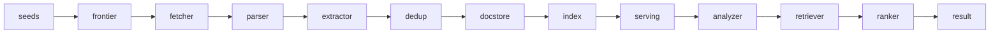
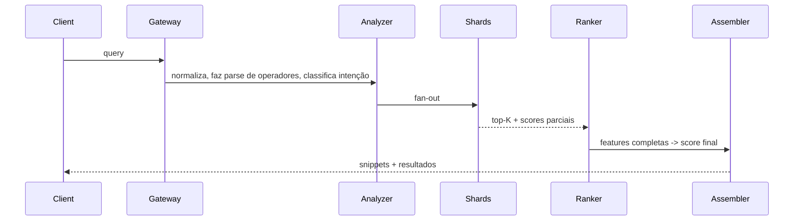

# Search Engine

Série System Design #3 (EP24). Topic skill: `.claude/agents/system-architect/skills/search-engine/SKILL.md`. A tarefa é um search engine web com crawler, indexação, ranking e serving em escala.

# O problema

O usuário digita uma query e recebe dez links. Por baixo, você descobre páginas, decide o que vale a pena buscar, baixa sem prejudicar sites de terceiros, extrai texto, links e metadados, normaliza, deduplica, constrói um inverted index, calcula features offline, opcionalmente gera embeddings, e responde queries em milissegundos com ranking relevante.

A arquitetura muda com o objetivo: busca em documentação interna e busca pública em escala web são problemas diferentes. Um search engine é uma fábrica distribuída que transforma URLs em documentos rankeáveis. É uma cadeia de decisões sobre o que descobrir, buscar, armazenar, indexar, recuperar e promover, e cada etapa corta custo ruim e preserva sinal útil.

# Subsistemas

Quatro subsistemas: o crawler descobre e busca páginas, o pipeline de processamento faz parse, limpa, extrai e enriquece, o pipeline de indexação constrói os índices, e o query serving analisa a query, recupera candidatos, faz o ranking e monta o resultado.

Dois planos de apoio ficam ao lado deles. Metadados e política cobre robots.txt, politeness, regras de canonical, agendamento e dedup. Observabilidade e controle cobre métricas, debugging, reprocessamento, backfill e listas de allow e block.

# Requisitos

Funcionais: aceitar seeds, descobrir links recursivamente, respeitar a política de crawl (robots.txt, delays, limites por host), buscar HTML (opcionalmente PDFs, feeds, imagens), extrair texto, links, título, headings, anchor text, canonical, idioma, timestamp e metadados estruturados, detectar duplicatas e quase-duplicatas, construir um inverted index para busca lexical e opcionalmente um índice vetorial para recall semântico, responder queries com paginação, snippets, filtros e ranking de relevância, e recrawlear para manter a freshness.

Não funcionais: escala horizontal em toda etapa, alto throughput offline, latência de serving abaixo de 200 ms ponta a ponta (de preferência bem abaixo), alta disponibilidade no caminho da query, consistência eventual entre crawl e busca desde que convirja, custo previsível, comportamento seguro com sites de terceiros, e observabilidade suficiente para explicar por que uma página não foi indexada ou por que uma query devolveu o que devolveu.

# Modelo ponta a ponta


```mermaid
flowchart LR
  seeds --> frontier --> fetcher --> parser --> extractor --> dedup
  dedup --> docstore --> index
  index --> serving
  serving --> analyzer --> retriever --> ranker --> result
```

O frontier escolhe uma URL elegível, o fetcher baixa, o parser transforma bytes em um documento estruturado, e o extractor produz texto limpo, outlinks e metadados. O deduplicador decide se é novo, duplicata exata ou quase-duplicata, e o document store persiste a versão canônica. A indexação tokeniza e constrói as postings lists, e jobs offline calculam sinais globais como a popularidade no grafo de links. Na hora da query, o analyzer normaliza, o retriever encontra candidatos, o ranker pontua e o result builder monta os snippets.

# Crawler: o URL frontier

O frontier é várias estruturas. O URL-seen store responde se uma URL já apareceu (um Bloom filter na frente de um store persistente). O crawl-state store guarda o status da última tentativa, hash do conteúdo, código HTTP, tempo de resposta e a próxima janela de recrawl. Filas de prioridade do scheduler escolhem a próxima URL por prioridade e politeness.

Um Bloom filter (Burton Bloom, 1970) responde "já vi esta URL" em O(1) com poucos bits por elemento, sem falsos negativos e com taxa de falso positivo ajustável. Em escala web você não consegue manter toda URL vista em memória de forma exata, então ele separa "com certeza nova" de "provavelmente vista, consulte o store" a baixo custo.

# Crawler: filas por host

Uma fila global cria domínios quentes (um domínio muito linkado enche a fila) e perde politeness (muitas requisições concorrentes a um host parecem um DDoS). Use uma fila de pendentes por host, cada uma com um `next_eligible_timestamp`, e um heap global ordenando hosts pelo menor tempo elegível e maior prioridade. Quando um host fica elegível, tire uma URL, busque, atualize o backoff e reinsira o host. Isso dá justiça e politeness juntos.

# Crawler: canonicalização e politeness

Normalize antes de enfileirar: host em minúsculas, remover fragmentos e portas padrão, limpar query params irrelevantes, resolver caminhos relativos, remover session ids conhecidos, normalizar a barra final. Pular isso multiplica duplicatas e custo de crawl.

Faça cache do robots.txt por host com TTL e respeite allow, disallow e crawl-delay (o Robots Exclusion Protocol, RFC 9309, 2022). Politeness é uma função, não um sleep fixo:

```
next_request_allowed = max(min_delay, k * observed_latency, robots_crawl_delay)
```

Acrescente uma concorrência máxima por host e backoff exponencial em erros para que sites lentos não sejam martelados.

# Crawler: fetcher e armadilhas

O fetcher é sem estado e pesado em I/O: rede assíncrona, pool de conexões, cache de DNS, reuso de TLS, gzip e brotli, limite de redirects, tamanho máximo de download, detecção do content-type pelo conteúdo (não confie só no header), e GET condicional (`ETag`, `If-Modified-Since`) para recrawl barato. Persista status code, headers, URL final depois dos redirects, tempo de resposta e checksum do corpo.

A web tem infinitas páginas falsas: calendários gerando datas sem fim, combinações de facetas de e-commerce, URLs com parâmetros arbitrários, a busca interna de um site, loops de paginação. Proteja com um crawl budget por host, um limite de fan-out por página, blocklists de parâmetros por regex, um score de repetição de template e limites de profundidade. Sem eles, 80% do custo vai para os piores 5% da web.

# Agendamento de crawl

Crawlear a web inteira todo dia está fora do alcance de quase todo mundo. Com um orçamento finito de requisições, banda e CPU, o agendamento é uma decisão de negócio. Um score aproximado, como intuição e não como fórmula universal:

```
crawl_score ~ quality * freshness_need * business_priority / fetch_cost
```

Recrawl adaptativo vence um cron fixo: uma página que mudou duas vezes em um intervalo curto ganha uma janela menor, uma que não mudou muitas vezes ganha uma maior, e erros fazem backoff. Os tiers de freshness A, B, C, D (de minutos até raramente) são atribuídos por domínio, padrão de URL ou score dinâmico.

# Deduplicação

O mesmo conteúdo aparece com e sem www, em http e https, com parâmetros diferentes, como página de impressão, syndication, espelhos, republicações e duplicatas suaves. Faça dedup em três níveis: duplicata de URL (mesma URL normalizada), duplicata exata de conteúdo (mesmo hash do texto limpo) e quase-duplicata (conteúdo quase igual).

Para quase-duplicatas, gere fingerprint com shingles mais MinHash (Broder, 1997) ou SimHash (Charikar, 2002). MinHash estima a similaridade de Jaccard entre conjuntos de shingles a partir de poucos mínimos de hash. SimHash mapeia um documento para um vetor de bits em que a distância de Hamming acompanha a similaridade, então você agrupa por fingerprint a baixo custo.

Guarde um `document_fingerprint` e um `canonical_document_id`; muitas URLs mapeiam para um documento canônico. Faça dedup cedo e em camadas, ou você paga para processar duplicatas caras. Consolide os sinais de ranking (links de entrada, cliques) no canônico.

# Armazenamento por função

O raw content store guarda a resposta original, comprimida, em object storage barato para reprocessamento e auditoria.

O parsed document store guarda `doc_id, canonical_url, fetch_time, title, clean_text, language, outgoing_links, anchors_in, headers, content_type, quality_signals, fingerprint`.

O crawl metadata store guarda estado operacional com atualizações aleatórias frequentes: `url, host, discovered_at, last_fetch_status, last_success_at, next_fetch_at, retry_count, robots_policy_version, blocked_reason`. Um store KV ou wide-column serve melhor que object storage.

# O inverted index

Para cada termo, guarde a lista de documentos em que ele aparece. Essa lista é uma postings list:

```
term: crawler
postings: [(doc1, tf=3, positions=[4,18,22]), (doc7, tf=1, positions=[9])]
```

Cada posting carrega `doc_id`, frequência do termo, posições (para queries de frase), informação de campo (título contra corpo) e payloads opcionais.

Pipeline de construção: tokenizar, normalizar (minúsculas, remover acentos, stemming ou lematização), remover stopwords quando fizer sentido, emitir pares `term → posting`, sort-merge por termo, comprimir postings, persistir segmentos imutáveis, publicar uma nova versão do índice. Ele se distribui de forma natural como MapReduce (Dean e Ghemawat, 2004) ou como streaming com compactação em batch.

O sharding é por documento (cada shard guarda um subconjunto de documentos e seus termos) ou por termo (cada shard guarda um subconjunto de termos). Sharding por documento em geral simplifica serving, replicação e rebalanceamento: uma query faz fan-out para todos os shards, cada um devolve um top-K local, e um agregador junta.

O modelo do Lucene (Doug Cutting) usa segmentos imutáveis mais merges periódicos em background em vez de atualizações no lugar. Você ganha escritas sequenciais baratas, snapshots simples, rollback fácil e serving durante a reindexação. Você paga com o trabalho de merge em background, documentos deletados ficando como tombstones até o merge, e custo maior de query conforme os segmentos se acumulam.

Comprima as postings ou o índice explode: delta encoding dos doc ids, variable-byte encoding, frame-of-reference, bit packing, e skip lists para pular blocos. O objetivo é leitura rápida sem queimar CPU com descompressão.

# Query serving


```mermaid
sequenceDiagram
  Client->>Gateway: query
  Gateway->>Analyzer: normaliza, faz parse de operadores, classifica intenção
  Analyzer->>Shards: fan-out
  Shards-->>Ranker: top-K + scores parciais
  Ranker->>Assembler: features completas -> score final
  Assembler-->>Client: snippets + resultados
```

O analyzer normaliza caixa, tokeniza, opcionalmente corrige ortografia, expande sinônimos, detecta idioma, faz parse de operadores (aspas, `-`, `site:`, `filetype:`) e classifica a intenção (navegacional, informacional, transacional, recente). A intenção muda o ranking: as mesmas palavras podem querer coisas diferentes.

A recuperação de candidatos traz um conjunto de candidatos em vez de ranquear a web inteira: BM25 no índice lexical, filtros de campo, boosts de título e anchor, opcionalmente busca ANN sobre embeddings, ou uma união híbrida. Pegue cerca de 500 a 1000 por shard e depois junte.

BM25 (Robertson e Zaragoza, *The Probabilistic Relevance Framework: BM25 and Beyond*) recompensa a frequência do termo com saturação e penaliza documentos longos, ajustado por `k1` e `b`. É a base lexical sobre a qual sistemas fortes ainda constroem.

# Ranking

O score final combina quatro famílias de features. Correspondência textual: BM25, termo no título, termo em heading, proximidade de termos, correspondência de frase, correspondência de anchor text. Documento: autoridade do domínio, qualidade da página, freshness, score de spam, correspondência de idioma, estrutura. Query: intenção, necessidade de freshness, tipo de entidade, ambiguidade. Comportamental, se disponível: CTR, cliques longos, reformulações de query, dwell time, abandono rápido.

Comece com um score linear ponderado como `0.45*bm25 + 0.20*title + 0.15*authority + 0.10*freshness + 0.10*anchor`. Passe para learning-to-rank só quando tiver boas features e dados de clique, ou você compra complexidade cara.

A montagem do resultado constrói um snippet com destaque, URL canônica, título limpo, breadcrumbs, data quando relevante, sitelinks, e faz dedup de resultados quase idênticos. A qualidade do snippet guia a qualidade percebida.

# Grafo de links e sinais globais

O texto da página sozinho não basta. Se muitas páginas relevantes apontam para um documento, isso sugere autoridade. Construa um grafo dirigido (vértices são documentos ou domínios, arestas são hyperlinks ponderados por contexto, posição do link e anchor text) e rode jobs offline em batch, diários ou de hora em hora e nunca no caminho da query, para autoridade, hub, centralidade e reputação de domínio.

PageRank (Brin e Page, *The Anatomy of a Large-Scale Hypertextual Web Search Engine*, 1998) define a importância de uma página como a distribuição estacionária de um navegador aleatório que segue links com um fator de amortecimento. A prática moderna combina isso com checagens antispam, já que fazendas de links o manipulam. HITS (Kleinberg, 1999) é a formulação relacionada de hub e autoridade.

# Spam e qualidade

Busca aberta atrai adversários: keyword stuffing, texto escondido, doorway pages, fazendas de links, cloaking, conteúdo de baixo valor em massa, duplicação agressiva, redirects enganosos. Defenda com um classificador de spam sobre features de conteúdo e do grafo de links, reputação de domínio, limites por template e por cluster, detecção de boilerplate, checagens de similaridade em massa, revisão manual para casos estratégicos, e um loop de feedback de cliques e rejeição. Sem uma camada de qualidade, o melhor índice serve lixo rápido.

# Freshness contra custo

Mais freshness custa mais crawl e processamento; menos dá resultados velhos e perda de confiança. Use tiers: Tier A (muito dinâmico, alto valor) recrawleado em minutos ou horas, Tier B diário, Tier C semanal ou mensal, Tier D raramente, atribuídos por domínio, padrão de URL ou score dinâmico.

# Publicação do índice

Índice e documentos raramente estão em sincronia em tempo real, então opere com versões. Workers constroem novos segmentos, um manifest descreve a versão completa do índice, o publisher faz o commit de forma atômica, e os query servers aquecem a nova versão antes da troca. Você ganha rollback simples, serving sem downtime e consistência de leitura por versão. Para atualizações frequentes, combine um snapshot base com índices delta menores.

# Busca híbrida

Para busca geral, o lexical continua sendo a base e os embeddings complementam. O lexical é preciso para termos raros, nomes, códigos e queries específicas. O semântico ajuda o recall para linguagem natural, sinônimos e formulações variadas. Ranking híbrido em geral vence cada um sozinho.

Implementação: inverted index para recall lexical, um índice ANN (por exemplo HNSW) para embeddings de documentos, um embedding da query gerado online ou em cache, a união dos dois conjuntos de candidatos, e o ranker final decide. Gerar embeddings, guardar vetores e rodar ANN em escala custa dinheiro de verdade, então acrescente só quando o problema exigir.

# Escala e particionamento

Particione o frontier por hash de host, um dono por host, para que a coordenação de politeness fique em um só lugar. Os fetchers são sem estado e escalam sozinhos. O índice roda como, por exemplo, 64 shards lógicos com 2 a 3 réplicas cada: um líder publica segmentos, seguidores servem, e o rebalanceamento é gradual. Jobs do grafo de links rodam como batch distribuído pesado em janelas, nunca no caminho da query.

# Observabilidade

Métricas de crawl: URLs descobertas por minuto, taxa de sucesso de fetch, bytes por minuto, latência por host, taxa de bloqueio por robots, erros por DNS, timeout, TLS, 4xx, 5xx, backlog do frontier por partição, atraso de recrawl. Métricas de indexação: documentos processados por minuto, taxa de duplicatas, tamanho do índice, duração de merge, atraso de fetch até publicação, falhas por etapa. Métricas de serving: QPS, p50, p95, p99, taxa de erro, tempo de fan-out, taxa de cache hit, top queries, queries sem resultado, CTR, taxa de reformulação.

Construa quatro ferramentas de debugging desde o início: inspeção de URL (status de crawl e indexação de uma URL), explain de query (quais shards responderam, candidatos, features, score final), um dashboard por host (erros, politeness, backlog, bloqueios por host) e replay de documento pelo pipeline. Sem elas o time chuta.

# Modos de falha

| Falha | Causa | Solução |
|---|---|---|
| Gargalo no scheduler central | processo único | particionar o frontier, distribuir a posse |
| Custo enorme por dedup tardio | dedup só no fim | dedup em camadas: URL, exata, quase |
| p99 explode | fan-out excessivo | sharding balanceado, caches, poda de candidatos |
| Relevância estagna | sem loop de feedback | instrumentar cliques, abandono, zero resultados; análise offline contínua |
| Crawler preso em armadilhas | sem budget/heurísticas por host | crawl budget por domínio, bloqueios dinâmicos, filtros de parâmetros |
| Publicação do índice quebra o serving | publicação sem versão | snapshots atômicos + aquecimento antes da troca |

# Plano incremental

Fase 1, fatia vertical: conjunto pequeno de seeds, só HTML, frontier por host com politeness básica, parser simples, inverted index básico (Lucene ou OpenSearch servem), query BM25, ferramenta de inspeção de URL.

Fase 2, eficiência e qualidade: dedup exato e aproximado, canonicalização melhor, recrawl adaptativo, score inicial de qualidade, snippets melhores, mais observabilidade.

Fase 3, escala real: frontier particionado, fetchers distribuídos, índice com sharding e versões, jobs do grafo de links, ranking multifator, recuperação de desastre e replay.

Fase 4, relevância avançada: learning-to-rank, sinais comportamentais, embeddings híbridos, personalização, antispam sofisticado. Relevância avançada em cima de ingestão ruim é maquiagem cara, então mantenha a ordem.

# Norte

Um bom crawler escolhe bem o que baixar. Um bom parser sobrevive à web quebrada e ainda extrai sinal útil. Um bom índice organiza a informação para recuperar candidatos relevantes rápido. Um bom ranking combina sinais locais, sinais globais e a intenção da query. Uma boa operação explica rápido por que algo falhou e se recupera sem caos.

# Referências

Sergey Brin e Lawrence Page, *The Anatomy of a Large-Scale Hypertextual Web Search Engine*, WWW, 1998 (PageRank).

Jon Kleinberg, *Authoritative Sources in a Hyperlinked Environment* (HITS), JACM, 1999.

Stephen Robertson e Hugo Zaragoza, *The Probabilistic Relevance Framework: BM25 and Beyond*, 2009.

Andrei Broder, *On the Resemblance and Containment of Documents* (shingling, MinHash), 1997.

Moses Charikar, *Similarity Estimation Techniques from Rounding Algorithms* (SimHash), STOC, 2002.

Burton Bloom, *Space/Time Trade-offs in Hash Coding with Allowable Errors* (Bloom filter), CACM, 1970.

Dean e Ghemawat, *MapReduce: Simplified Data Processing on Large Clusters*, OSDI, 2004.

Manning, Raghavan e Schütze, *Introduction to Information Retrieval*, Cambridge, 2008 (inverted index, tokenização, ranking).

Documentação do Apache Lucene (segmentos imutáveis, política de merge).

*RFC 9309: Robots Exclusion Protocol*, 2022.

Malkov e Yashunin, *Efficient and robust approximate nearest neighbor search using Hierarchical Navigable Small World graphs*, 2016 (ANN para busca híbrida).
