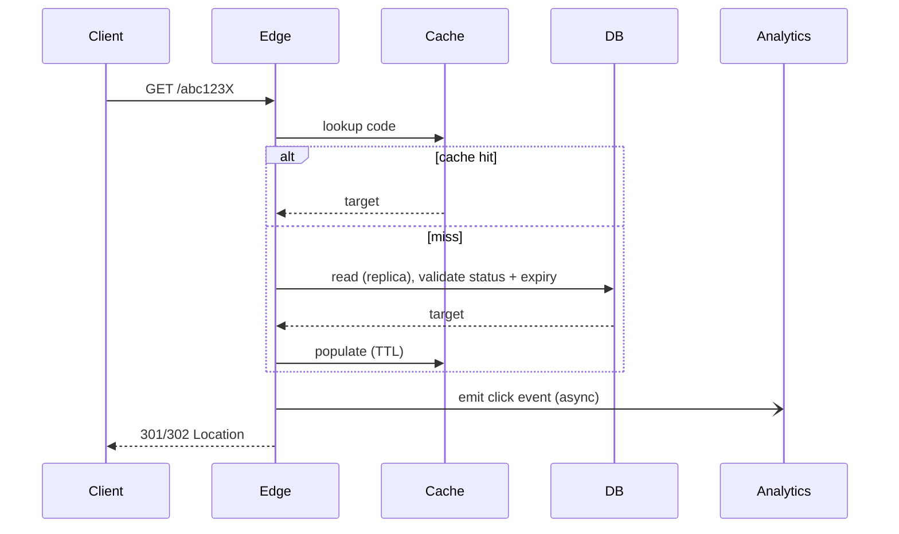

# Encurtador de URL

> Série System Design #1 (EP22). Skill do tópico: `skills/url-shortener/`.
> Projetar um TinyURL / bit.ly em escala, do requisito à operação.

## 1. O problema e por que ele engana

O produto cabe em uma frase: receba uma URL longa, devolva uma URL curta, redirecione o usuário para a
original. É exatamente por isso que ele é uma ótima armadilha de entrevista. Por baixo dele estão quase
todos os temas centrais de system design: carga read-heavy, geração de chave única, cache,
particionamento, consistência, abuso, analytics, multi-região, custo e evolução de arquitetura.

O enquadramento mais importante de todos: existem **dois fluxos bem diferentes**.

- **Criar**: escrita moderada. Um link é criado uma vez.
- **Resolver**: leitura enorme, crítica em latency. Esse mesmo link pode ser lido milhões de vezes.

Projete a arquitetura em torno do redirect. Todo o resto se dobra a ele. Quem começa desenhando Kafka
nos três primeiros minutos está respondendo à pergunta errada. Produto e prioridade primeiro,
tecnologia depois.

## 2. Requisitos

**Funcionais:** URL longa vira URL curta única; resolver a curta para redirecionar; expiração opcional;
alias customizado; analytics básico (clique, timestamp, user agent, referer, país aproximado);
desabilitar/banir links maliciosos.

**Não funcionais, em ordem de prioridade:**

1. **Disponibilidade do redirect.** Se a criação falhar por alguns segundos é ruim; se o redirect
   falhar, o produto morre.
2. Latency baixa no redirect, dezenas de ms em cache hit.
3. Durabilidade: uma vez emitido um código, o mapeamento nunca pode sumir.
4. Escala horizontal de leitura.
5. Segurança / antiabuso: este produto vira vetor de phishing/malware/spam rápido.
6. Observabilidade e auditabilidade.

**Extras de nível staff** que separam uma resposta sênior de uma resposta staff: links com TTL, delete
lógico/tombstone, dedup opcional, página de preview para links suspeitos, rate limit por conta/IP/tenant,
domínios customizados multi-tenant e **SLAs diferentes para redirect e para analytics**.

## 3. Dimensionamento de escala (conta de padeiro)

Premissas: 100M de links novos/mês, 3B de redirects/mês, leitura:escrita ~30:1, pico 5x a média,
retenção de 5 anos.

```
Writes:  100M / 2.6M s  ~ 38 wps avg,   ~200 wps peak.   Trivial.
Reads:   3B   / 2.6M s  ~ 1157 rps avg, ~6k rps peak.    Comfortable.
```

Mas clientes enterprise, uma campanha viral, um QR code de evento ou uso global podem empurrar as
leituras para dezenas ou centenas de milhares por segundo. Projete para crescer mesmo que o v1 seja
pequeno.

**Armazenamento:** ~1 KB/registro (código 8-10 B, URL longa ~500 B, metadados 100-200 B). 6B de
registros em 5 anos = ~6 TB brutos, 15-25 TB com indexes, replicação e backup. A distinção crucial:
**o dado quente é pequeno, o dado total é grande.** Isso puxa cache pesado na frente de um
armazenamento durável e particionável.

**Analytics:** 3B de eventos/mês. Nunca um contador síncrono no DB transacional. Desacople.

## 4. API

```
POST /v1/links   {long_url, custom_alias?, expires_at?, domain?, idempotency_key?}
              -> {short_url, code, created_at, expires_at}

GET /{code}   -> 301 if the mapping is immutable (lowest perceived latency on repeat)
                 302/307 if you want flexibility (avoids aggressive client caching when target
                 may change)
```

A escolha entre 301 e 302 é **controle versus eficiência**. O 301 é cacheado com força por clientes e
intermediários, então redirects repetidos são instantâneos, mas você perde a capacidade de mudar ou
revogar barato. O 302 mantém o controle ao custo de um round trip ao servidor toda vez. Perguntas de
produto que mudam a arquitetura: um link pode ser editado depois de criado? um alias pode ser reusado
depois de expirar? a mesma URL longa gera o mesmo código ou não? Essas respostas guiam idempotência,
cache e invalidação.

## 5. Modelo de dados

Dois domínios, separados de propósito.

**Tabela transacional de links**

```
code PK, long_url, url_hash?, owner_id?, domain, created_at, expires_at?,
status(active|disabled|expired|banned), is_custom, redirect_type, metadata_json
```

Indexes: PK em `code`, `(owner_id, created_at)`, `expires_at` se a limpeza por TTL for frequente,
`url_hash` se houver dedup.

**Eventos de analytics** (assíncrono, colunar / data lake / stream)

```
code, timestamp, ip_prefix or hashed IP, user_agent_hash, referer_domain, country, device_type
```

Nunca no caminho síncrono do redirect.

## 6. Teoria: geração do short code

O núcleo clássico da entrevista. Quatro abordagens, com seus modos de falha.

### A. Hash da URL longa, truncado, base62
Determinístico e trivial de deduplicar, mas o truncamento **colide**, a mesma entrada sempre produz o
mesmo código (ruim quando dois usuários querem links distintos para a mesma landing page), e a saída é
previsível e enumerável.

### B. ID sequencial, codificado em base62
Simples, curto, livre de colisão com um bom gerador. Mas um ID puramente sequencial é **previsível**:
vaza o seu volume total e é trivialmente raspável incrementando.

### C. ID único + ofuscação reversível, base62  ← recomendado
Gere um ID único de 64 bits, passe por uma **bijeção com chave** (uma rede de Feistel ou outra
permutação bijetiva), depois codifique em base62. A bijeção preserva a unicidade (sem colisões)
enquanto destrói a previsibilidade (você não consegue adivinhar os vizinhos sem a chave). Padding de
comprimento fixo é opcional.

> **Por que uma rede de Feistel?** É uma construção (Horst Feistel, IBM, anos 1970, base do DES) que
> transforma qualquer função em uma permutação inversível sobre uma largura de bits fixa. Para short
> codes, ela te dá um embaralhamento 1:1, reversível e dependente de chave do espaço de IDs: unicidade
> de graça, imprevisibilidade por construção. É o truque padrão de "criptografar o contador".

### Base62 e comprimento do código
Base62 = `[A-Za-z0-9]`. Capacidade: `62^7 ~ 3.5 trillion`, `62^8 ~ 218 trillion`. Sete caracteres
atendem à maioria das plataformas; oito dão folga operacional. Aliases customizados passam por cima
disso tudo.

### Enquadramento staff
ID único coordenado centralmente por faixas (ou descentralizado com garantia de unicidade), bijeção
reversível para cortar previsibilidade, codificação base62, e **validar a unicidade no armazenamento
como última linha de defesa** (um index único pega o impossível).

## 7. Teoria: geração de ID único

| Abordagem | Como | Trade-off |
|---|---|---|
| Auto-increment do DB | o banco entrega o próximo inteiro | ok para MVP; hotspot central; trava multi-região ativa |
| **Estilo Snowflake** | `timestamp \| worker id \| local sequence` em 64 bits | horizontal, mais ou menos ordenado no tempo, independente de DB; atenção a clock skew, coordenação de worker-id, layout de bits |
| **Alocação por faixas** | um serviço entrega a cada instância um bloco de 1M de IDs para consumir localmente | muito simples, coordenação quase zero por request; desperdiça IDs no restart (normalmente tudo bem), precisa de refill confiável |

O **Snowflake** do Twitter (2010) é o esquema canônico de 64 bits: ~41 bits de timestamp, ~10 bits de
máquina, ~12 bits de sequência. Para um encurtador de URL, alocação por faixas e snowflake funcionam
bem.

## 8. Fluxo de criação

1. Valide a URL (veja abaixo).
2. Se for alias customizado, cheque disponibilidade e política.
3. Gere o código.
4. Persista no DB transacional.
5. Faça write-through no cache.
6. Devolva a `short_url`.

**Validar a URL não é cosmético.** Aceite apenas http/https. Bloqueie alvos de SSRF: `127.0.0.1`,
`169.254.169.254` (metadados de cloud), faixas privadas RFC1918, hostnames internos. Canonicalize.
Imponha um limite de tamanho. Trate punycode e caracteres suspeitos. (SSRF, Server-Side Request
Forgery, é o risco real: o seu validador buscando uma URL interna fornecida pelo atacante.)

**Idempotência.** Guarde a resposta por `idempotency_key` em uma janela curta, para que um retry do
cliente depois de um timeout não cunhe links duplicados.

**Dedup, por padrão não.** Deduplicar globalmente pela URL longa quebra o analytics por campanha e por
tenant, vaza privacidade (um usuário descobre que outra pessoa já encurtou um link) e impede links
distintos para a mesma landing page. Se você quiser mesmo, deduplique só como otimização interna de
armazenamento, separando a entidade lógica do link do alvo físico da URL.

## 9. Fluxo de redirect (o coração)



**Negative caching.** Se alguém martelar códigos aleatórios, cada miss bate no DB: uma tempestade de
misses. Cacheie o resultado "não existe" por um TTL curto (30-60s).

**Escolha do TTL.** Se o mapeamento é imutável, o TTL pode ser de horas e a invalidação quase
desaparece. Se os links podem ser desabilitados ou editados, escolha um TTL curto, invalidação por
evento, ou separe as camadas: mantenha o destino quase imutável (cacheado com força) e use uma camada
rápida de **blacklist** para bloqueios urgentes.

## 10. Teoria: cache e o caminho de leitura

Este é um **caminho de leitura cache-heavy** de livro-texto.

- **L1**: cache local in-process para chaves extremamente quentes (pequeno, TTL curto).
- **L2**: cache distribuído (Redis) compartilhado entre as instâncias.
- **DB** como fonte da verdade.

**Problema de hot key.** Um link viral concentra carga. Além de um bom cache, o staff pensa em:

- **Single-flight** (coalescência de requests) no miss: se 1000 requests dão miss ao mesmo tempo,
  exatamente um busca no DB e o resto espera pelo resultado dele. Sem isso, uma hot key fria causa um
  **cache stampede** (também chamado de thundering herd ou dog-piling) capaz de derrubar o DB.
- **Refresh-ahead:** atualize uma entrada quente antes de ela expirar, para que nunca esfrie sob carga.
  A variante probabilística (Vattani et al., *Optimal Probabilistic Cache Stampede Prevention*, 2015)
  atualiza cedo com uma probabilidade que sobe conforme a expiração se aproxima.
- Garanta que o valor quente caiba no L1; limite o refresh concorrente.

## 11. Teoria: escolha de armazenamento

A carga: lookup por PK usando o código, poucas relações, escrita moderada, leitura altíssima,
durabilidade forte. SQL ou um KV persistente servem. O que importa é lookup eficiente por chave,
replicação madura, backup/restore confiável e familiaridade do time.

**Escolha pragmática:** um banco relacional maduro (Postgres) com particionamento quando necessário,
read replicas e cache pesado na frente. Evolua para um KV distribuído estilo Dynamo/Cassandra só
quando a escala realmente forçar. A resposta staff é o **menor sistema que aguenta a carga com margem
e evolui com segurança**, não a tecnologia mais exótica. (O Amazon Dynamo, DeCandia et al. 2007, é a
referência para a ponta de KV distribuído desse espectro: consistent hashing, leituras/escritas por
quórum, consistência eventual.)

## 12. Particionamento

Particione por `code` ou pelo seu ID interno.

- **Partição por hash:** distribuição uniforme, boa para lookup aleatório; rebalanceamento mais
  difícil, sem localidade temporal. **Consistent hashing** (Karger et al., 1997) minimiza as chaves que
  se movem quando você adiciona ou remove um nó: a técnica padrão.
- **Partição por faixa de tempo/ID:** bom para arquivamento e ciclo de vida, boa localidade, mas um ID
  monotônico cria um shard mais novo quente.

Para o lookup do redirect, prefira hash ou uma distribuição pseudoaleatória sobre o ID ofuscado. O
analytics particiona de outro jeito (por tempo).

## 13. Consistência

- **Consistência forte obrigatória:** unicidade do alias customizado (index único em `(domain, code)`),
  link persistido antes da resposta de sucesso, mudanças críticas de status feitas pelo admin.
- **Consistência eventual aceitável:** analytics, replicação de DR entre regiões, dashboards agregados.

**Read-after-write.** Se um usuário cria um link e clica nele na hora, ele espera que funcione, mesmo
que uma read replica ainda não tenha alcançado. Resolva com leituras presas à região por alguns
segundos, cache write-through (o mais limpo: o redirect lê o cache que a criação acabou de escrever),
ou um fallback para o primary quando a réplica atrasa.

## 14. Multi-região

Separe criar e resolver.

- **Resolver** é dominado por leitura e cacheável: empurre para a edge e para várias regiões, serviço
  regional stateless com um cache regional forte.
- **Criar** pode começar com um único writer por região primária, o que simplifica a unicidade de alias
  e a geração de ID.

Evolução: (1) uma região de criação, muitas regiões de redirect com réplica + cache; (2) criação
multi-região com faixas/namespaces de ID por região; (3) active-active sofisticado só se o negócio
exigir. Evite active-active prematuro.

## 15. Analytics sem machucar o redirect

> Redirect é o caminho A. Analytics é o caminho B. Nunca acople os dois com força.

O redirect responde rápido; o evento de clique vai para uma fila ou log; consumidores agregam
contadores por minuto/hora/dia/país/dispositivo/referer; dashboards consultam um store analítico
separado. Se a fila morrer: best-effort (descarte o analytics, mantenha o redirect), buffer local curto
com retry, ou amostragem sob degradação. Preserve o redirect sempre em primeiro lugar. Camadas de
retenção: bruto 30 dias, agregado por hora 1 ano, agregado por dia 5 anos. Para contagem de visitantes
únicos nesse volume, o **HyperLogLog** (Flajolet et al., 2007) estima cardinalidade em kilobytes em vez
de guardar cada ID.

## 16. Segurança e antiabuso

Riscos: phishing, distribuição de malware, spam, enumeração de links, abuso de open redirect, SSRF
durante a validação. Controles: rate limit por IP/token/tenant/ASN suspeito, reputação de domínio no
momento da criação, checagens de safe browsing (síncronas ou assíncronas conforme o risco), desativação
rápida de link, interstitial de preview para links suspeitos, fricção progressiva/CAPTCHA, auth mais
forte para contas de alto volume.

**Antienumeração:** ofuscação + comprimento de código adequado + rate limit no endpoint de resolução +
monitoramento de padrão de varredura. **Privacidade:** minimize, trunque ou faça hash de IPs em janela
curta.

## 17. Ciclo de vida e alias customizado

**Expiração:** persista `expires_at`, valide na leitura (não dependa só de um job offline de limpeza:
um link expirado poderia sobreviver no cache), faça evict na expiração, rode um job assíncrono de
limpeza para arquivamento/delete lógico. Use **tombstone** em links banidos ou removidos, para impedir
o reuso e ajudar a auditoria.

**Alias customizado** precisa de consistência forte (index único em `(domain, code)`), palavras
reservadas (admin, login, api), política por tenant e nenhuma colisão com rotas internas. É uma minoria
do tráfego mas de alto valor, então um fluxo de criação mais rígido se justifica.

## 18. Observabilidade

Métricas: QPS de criação/resolução, p50/p95/p99 da resolução, cache hit ratio por camada, erros por
classe, taxa de not-found, taxa de acesso a banidos/expirados, tempo de propagação da criação até a
primeira resolução, throughput e lag do pipeline de analytics. Logs: logs de acesso amostrados, logs de
auditoria para operações de admin, estruturados com correlation id. Tracing: completo na criação;
amostrado no caminho quente de resolução. Alertas: queda do cache hit ratio, subida do p99, erro de
redirect acima do threshold, crescimento anormal de 404 (varredura), crescimento do backlog de
analytics.

## 19. Modos de falha

| Falha | Impacto | Mitigação |
|---|---|---|
| Cache fora do ar | avalanche no DB | rate limit + circuit breaker, L1 para hot keys, degradar analytics, cortar tráfego suspeito |
| DB degradado | misses e criações sofrem | servir hot keys do cache, enfileirar/retry das criações, failover para uma réplica promovida, proteger as operações de alias |
| Região fora do ar | indisponibilidade regional | DNS/anycast para outra região, réplicas/caches pré-aquecidos; a criação pode pausar, o redirect precisa sobreviver |
| Sistema de reputação fora do ar | risco de abuso | modo degradado com regras locais, mais fricção para usuários novos, review posterior dos links daquela janela |

## 20. Roadmap

1. **MVP robusto**: uma região, API stateless, Postgres primary + replica, cache Redis, gerador de ID
   por faixas, analytics em uma fila, dashboard offline básico.
2. **Escala média**: cache local L1, controle de hot key, particionamento do DB ou armazenamento
   distribuído, redirect multi-região, analytics mais maduro, reputação em camadas.
3. **Escala global**: criação multi-região com faixas por região, failover automático testado, domínios
   customizados por tenant, links premium com marca e SLA por cliente, edge compute para alguns
   redirects.

## 21. Erros comuns

Partir da tecnologia em vez dos requisitos; deixar o analytics travar o caminho crítico do redirect;
hash truncado sem discutir colisão e previsibilidade; ignorar segurança e abuso; fazer sharding cedo
demais quando relacional + cache ainda aguentam; pular invalidação de cache, expiração e
read-after-write; pular operação (métricas, failover, degradação).

## Referências

- Martin Kleppmann, *Designing Data-Intensive Applications*, O'Reilly, 2017 (parâmetros de carga,
  consistência, replicação, particionamento).
- DeCandia et al., *Dynamo: Amazon's Highly Available Key-value Store*, SOSP, 2007 (KV distribuído,
  consistent hashing, consistência eventual).
- Karger et al., *Consistent Hashing and Random Trees*, STOC, 1997.
- Twitter Engineering, *Announcing Snowflake*, 2010 (IDs únicos distribuídos).
- Horst Feistel, *Cryptography and Computer Privacy*, Scientific American, 1973 (redes de Feistel).
- Flajolet et al., *HyperLogLog: the analysis of a near-optimal cardinality estimation algorithm*,
  2007.
- Vattani, Chierichetti, Lowenstein, *Optimal Probabilistic Cache Stampede Prevention*, VLDB, 2015.
- Michael Nygard, *Release It!*, 2ª ed., 2018 (circuit breaker, bulkhead, pensamento single-flight).
- OWASP, *Server-Side Request Forgery Prevention Cheat Sheet*.
