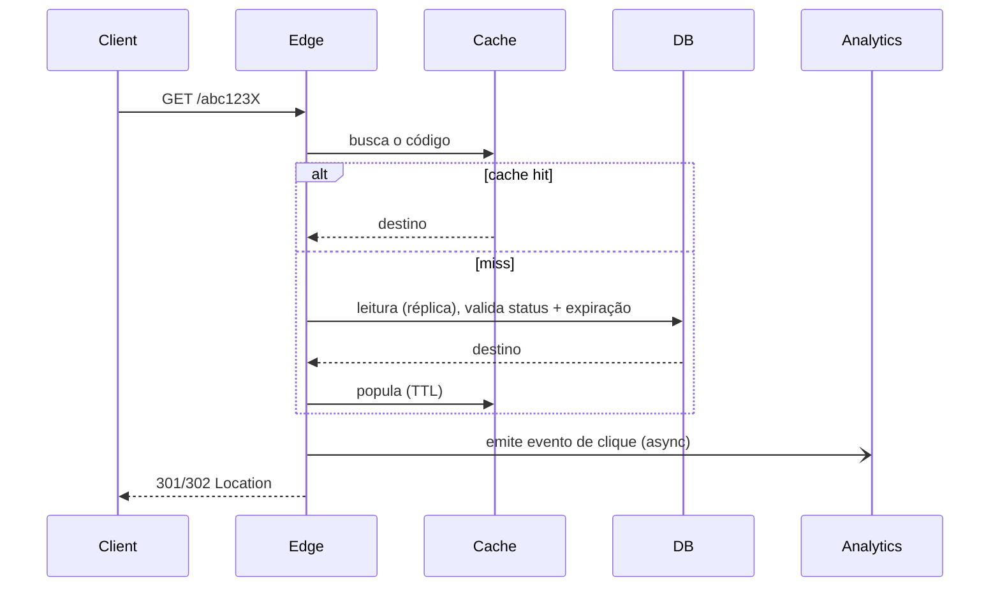

# Encurtador de URL

Série System Design #1 (EP22). Topic skill: `.claude/agents/system-architect/skills/url-shortener/SKILL.md`. A tarefa é um TinyURL ou bit.ly em escala, do requisito à operação.

# O problema

O produto cabe em uma frase: receba uma URL longa, devolva uma curta, redirecione para a original. Por baixo estão quase todos os temas centrais de system design: carga read-heavy, geração de chave única, cache, particionamento, consistência, abuso, analytics, multi-região, custo e evolução.

Existem dois fluxos muito diferentes. Criar é uma escrita moderada: um link é criado uma vez. Resolver é uma leitura enorme e crítica em latência: esse link pode ser lido milhões de vezes. Projete em torno do redirect e dobre todo o resto a ele. Produto e prioridade vêm primeiro, tecnologia depois.

# Requisitos

Funcionais: URL longa vira URL curta única, resolver a curta para redirecionar, expiração opcional, alias customizado, analytics básico (clique, timestamp, user agent, referer, país aproximado), e desabilitar ou banir links maliciosos.

Não funcionais, em ordem de prioridade: disponibilidade do redirect primeiro (uma criação falhando por alguns segundos é ruim, um redirect falhando mata o produto), depois latência do redirect em dezenas de ms em cache hit, durabilidade de todo código emitido, escala horizontal de leitura, segurança e antiabuso (o produto vira vetor de phishing, malware e spam rápido), e observabilidade com auditoria.

Extras de nível staff: links com TTL, delete lógico com tombstone, dedup opcional, página de preview para links suspeitos, rate limit por conta, IP e tenant, domínios customizados multi-tenant, e SLAs diferentes para redirect e para analytics.

# Dimensionamento de escala

Premissas: 100M de links novos por mês, 3B de redirects por mês, leitura:escrita de cerca de 30:1, pico de 5x a média, retenção de 5 anos.

```
Writes:  100M / 2.6M s  ~ 38 wps avg,   ~200 wps peak.   Trivial.
Reads:   3B   / 2.6M s  ~ 1157 rps avg, ~6k rps peak.    Comfortable.
```

Clientes enterprise, uma campanha viral, um QR code de evento ou uso global empurram as leituras para dezenas ou centenas de milhares por segundo, então projete para crescer mesmo que o v1 seja pequeno.

O armazenamento é de cerca de 1 KB por registro (código de 8 a 10 B, URL longa de cerca de 500 B, metadados de 100 a 200 B). 6B de registros em 5 anos dão cerca de 6 TB brutos, 15 a 25 TB com índices, replicação e backup. O dado quente é pequeno e o dado total é grande, o que pede cache pesado na frente de um armazenamento durável e particionável.

Analytics são 3B de eventos por mês. Nunca mantenha um contador síncrono no banco transacional; desacople.

# API

```
POST /v1/links   {long_url, custom_alias?, expires_at?, domain?, idempotency_key?}
              -> {short_url, code, created_at, expires_at}

GET /{code}   -> 301 if the mapping is immutable (lowest perceived latency on repeat)
                 302/307 if you want flexibility (avoids aggressive client caching when target
                 may change)
```

301 contra 302 é controle contra eficiência. Clientes e intermediários fazem cache pesado de um 301, então repetições são instantâneas, mas mudar ou revogar o link fica caro. Um 302 mantém o controle ao custo de uma ida e volta ao servidor a cada vez.

Três perguntas de produto mudam a arquitetura: um link pode ser editado depois de criado, um alias pode ser reutilizado depois de expirar, e a mesma URL longa recebe o mesmo código. Elas guiam idempotência, cache e invalidação.

# Modelo de dados

Dois domínios, mantidos separados. A tabela transacional de links:

```
code PK, long_url, url_hash?, owner_id?, domain, created_at, expires_at?,
status(active|disabled|expired|banned), is_custom, redirect_type, metadata_json
```

Índices: PK em `code`, `(owner_id, created_at)`, `expires_at` se a limpeza de TTL roda com frequência, `url_hash` se você faz dedup.

Os eventos de analytics vão para um store colunar, data lake ou stream, de forma assíncrona e nunca no caminho síncrono do redirect:

```
code, timestamp, ip_prefix or hashed IP, user_agent_hash, referer_domain, country, device_type
```

# Geração do código curto

Hash da URL longa, truncado, em base62. Determinístico e fácil de deduplicar, mas o truncamento colide, a mesma entrada sempre gera o mesmo código (ruim quando dois usuários querem links distintos para uma mesma landing page), e a saída é previsível e enumerável.

ID sequencial, em base62. Curto e sem colisão com um bom gerador, mas previsível: vaza seu volume total e qualquer um faz scraping incrementando.

ID único mais ofuscação reversível, em base62 (recomendado). Gere um ID único de 64 bits, passe por uma bijeção com chave (uma rede Feistel ou outra permutação bijetiva), depois codifique em base62, com padding opcional de tamanho fixo. A bijeção mantém a unicidade e remove a previsibilidade: não dá para adivinhar vizinhos sem a chave.

Uma rede Feistel (Horst Feistel, IBM, anos 1970, a base do DES) transforma qualquer função em uma permutação inversível sobre uma largura fixa de bits. Para códigos curtos, ela dá um embaralhamento 1:1, reversível e dependente de chave do espaço de IDs. É o truque padrão de "criptografar o contador".

Base62 é `[A-Za-z0-9]`. A capacidade é `62^7 ~ 3.5 trillion` e `62^8 ~ 218 trillion`. Sete caracteres servem para a maioria das plataformas; oito dão folga operacional. Aliases customizados contornam isso.

A resposta staff: IDs únicos alocados centralmente por faixas (ou de forma descentralizada com garantia de unicidade), uma bijeção reversível contra previsibilidade, codificação em base62, e um índice único no armazenamento como última linha de defesa.

# Geração de ID único

| Abordagem | Como | Trade-off |
|---|---|---|
| Auto-increment no banco | o banco entrega o próximo inteiro | serve para MVP; hotspot central; bloqueia multi-região ativo |
| Estilo Snowflake | `timestamp \| worker id \| local sequence` em 64 bits | horizontal, mais ou menos ordenado no tempo, independente do banco; atenção a clock skew, coordenação de worker id, layout de bits |
| Alocação por faixa | um serviço entrega a cada instância um bloco de 1M de IDs para consumir localmente | coordenação por requisição quase zero; desperdiça IDs no restart (em geral tudo bem), precisa de reabastecimento confiável |

O Snowflake do Twitter (2010) é o esquema canônico de 64 bits: cerca de 41 bits de timestamp, 10 bits de máquina, 12 bits de sequência. Alocação por faixa e Snowflake funcionam para um encurtador de URL.

# Fluxo de criação

Valide a URL, cheque disponibilidade e política se houver alias customizado, gere o código, persista no banco transacional, faça write-through no cache, devolva `short_url`.

A validação da URL é um controle de segurança. Aceite só http e https. Bloqueie alvos de SSRF: `127.0.0.1`, `169.254.169.254` (metadados de nuvem), faixas privadas RFC1918, hostnames internos. Canonicalize, imponha limite de tamanho, e trate punycode e caracteres suspeitos. SSRF (Server-Side Request Forgery) é o seu validador buscando uma URL interna fornecida pelo atacante.

Idempotência: guarde a resposta por `idempotency_key` por uma janela curta para que um retry do cliente depois de um timeout não gere links duplicados.

Dedup é não por padrão. Dedup global por URL longa quebra o analytics por campanha e por tenant, vaza privacidade (um usuário descobre que alguém já encurtou aquele link) e impede links distintos para a mesma landing page. Se você quiser, faça dedup só como otimização interna de armazenamento, separando o link lógico do alvo físico da URL.

# Fluxo de redirect


```mermaid
sequenceDiagram
  Client->>Edge: GET /abc123X
  Edge->>Cache: busca o código
  alt cache hit
    Cache-->>Edge: destino
  else miss
    Edge->>DB: leitura (réplica), valida status + expiração
    DB-->>Edge: destino
    Edge->>Cache: popula (TTL)
  end
  Edge-)Analytics: emite evento de clique (async)
  Edge-->>Client: 301/302 Location
```

Cache negativo: quando alguém martela códigos aleatórios, cada miss bate no banco em uma tempestade de misses. Faça cache do resultado "inexistente" por 30 a 60 s.

TTL: se o mapeamento é imutável, o TTL pode ser de horas e a invalidação quase some. Se links podem ser desabilitados ou editados, escolha TTL curto, invalidação por evento, ou separe camadas: faça cache pesado do destino e mantenha uma camada rápida de blacklist para bloqueios urgentes.

# Cache e o caminho de leitura

Este é um caminho de leitura pesado em cache. L1 é um cache local em processo para hot keys extremas (pequeno, TTL curto). L2 é um cache distribuído (Redis) compartilhado entre instâncias. O banco é a fonte da verdade.

Um link viral concentra carga em uma hot key. Single-flight (coalescência de requisições) no miss significa que, quando 1000 requisições erram ao mesmo tempo, uma busca no banco e as demais esperam o resultado dela. Sem isso, uma hot key fria causa um cache stampede (thundering herd, dog-piling) que pode derrubar o banco.

Refresh-ahead atualiza uma entrada quente antes de ela expirar para que nunca esfrie sob carga. A variante probabilística (Vattani et al., *Optimal Probabilistic Cache Stampede Prevention*, 2015) atualiza cedo com uma probabilidade que sobe conforme a expiração se aproxima. Garanta que o valor quente caiba no L1 e limite o refresh concorrente.

# Escolha de armazenamento

A carga é lookup por PK pelo código, poucas relações, escrita moderada, leitura muito alta, durabilidade forte. SQL ou um KV persistente servem. O que importa é lookup rápido por chave, replicação madura, backup e restore confiáveis, e familiaridade do time.

A escolha pragmática é Postgres com particionamento quando precisar, réplicas de leitura e cache pesado na frente. Migre para um KV distribuído estilo Dynamo ou Cassandra só quando a escala forçar. A resposta staff é o menor sistema que aguenta a carga com margem e evolui com segurança. O Amazon Dynamo (DeCandia et al., 2007) é a referência para o extremo de KV distribuído: consistent hashing, leituras e escritas por quórum, consistência eventual.

# Particionamento

Particione por `code` ou pelo seu ID interno. Particionamento por hash espalha a carga por igual e combina com lookup aleatório, mas o rebalanceamento é mais difícil e não há localidade temporal. Consistent hashing (Karger et al., 1997) minimiza as chaves que mudam de lugar quando você adiciona ou remove um nó.

Particionamento por faixa de tempo ou ID dá bom arquivamento, ciclo de vida e localidade, mas um ID monotônico cria um shard mais novo quente. Para lookup de redirect, prefira hash ou uma distribuição pseudoaleatória sobre o ID ofuscado. Analytics particiona por tempo.

# Consistência

Consistência forte é obrigatória para a unicidade de alias customizado (índice único em `(domain, code)`), para persistir o link antes da resposta de sucesso e para mudanças críticas de status feitas pelo admin. Consistência eventual serve para analytics, replicação de DR entre regiões e dashboards agregados.

Read-after-write: um usuário que cria um link e clica nele na hora espera que funcione, mesmo que uma réplica esteja atrasada. Resolva com leituras presas à região por alguns segundos, um cache write-through (o mais limpo, já que o redirect lê o que a criação escreveu um instante antes), ou fallback para o primário quando a réplica atrasa.

# Multi-região

Separe criação e resolução. A resolução é dominada por leitura e cacheável, então empurre para o edge e para várias regiões como um serviço regional sem estado com um cache regional forte. A criação pode começar como escritor único em uma região primária, o que mantém simples a unicidade de alias e a geração de ID.

Evolua em três passos: uma região de criação com muitas regiões de redirect sobre réplica mais cache, depois criação multi-região com faixas de ID ou namespaces por região, depois ativo-ativo só se o negócio exigir. Evite ativo-ativo prematuro.

# Analytics fora do caminho do redirect

O redirect é o caminho A e o analytics é o caminho B; nunca acople os dois com força. O redirect responde rápido, o evento de clique vai para uma fila ou log, consumidores agregam contadores por minuto, hora, dia, país, dispositivo e referer, e dashboards consultam um store analítico separado.

Se a fila morre, escolha best-effort (descartar analytics, manter o redirect), um buffer local curto com retry, ou amostragem sob degradação. O redirect sempre vence. Camadas de retenção: bruto por 30 dias, agregado por hora por 1 ano, agregado por dia por 5 anos. Para visitantes únicos nesse volume, HyperLogLog (Flajolet et al., 2007) estima cardinalidade em kilobytes em vez de guardar cada ID.

# Segurança e antiabuso

Riscos: phishing, distribuição de malware, spam, enumeração de links, abuso de open redirect, SSRF durante a validação. Controles: rate limit por IP, token, tenant e ASN suspeito, reputação de domínio na criação, checagens de safe browsing (síncronas ou assíncronas conforme o risco), desabilitação rápida de link, um interstitial de preview para links suspeitos, fricção progressiva e CAPTCHA, e autenticação mais forte para contas de alto volume.

Antienumeração combina ofuscação, tamanho de código adequado, rate limit na resolução e monitoramento de padrões de varredura. Para privacidade, minimize, trunque ou faça hash de janela curta dos IPs.

# Ciclo de vida e alias customizado

Expiração: persista `expires_at`, valide na hora da leitura (um job de limpeza offline sozinho deixa um link expirado sobreviver no cache), remova do cache na expiração, e rode uma limpeza assíncrona para arquivamento ou delete lógico. Use tombstone para links banidos ou removidos, evitando reuso e mantendo trilha de auditoria.

Aliases customizados precisam de consistência forte (índice único em `(domain, code)`), palavras reservadas (admin, login, api), política por tenant e nenhuma colisão com rotas internas. São uma fatia pequena do tráfego com valor alto, o que justifica um fluxo de criação mais rígido.

# Observabilidade

Métricas: QPS de criação e de resolução, p50, p95 e p99 da resolução, taxa de cache hit por camada, erros por classe, taxa de not-found, taxa de acesso a links banidos e expirados, tempo de propagação da criação até a primeira resolução, throughput e atraso do analytics. Logs: access logs amostrados e logs de auditoria para operações de admin, estruturados com um correlation id. Tracing: completo na criação, amostrado no caminho quente da resolução.

Alerte sobre queda na taxa de cache hit, alta do p99, erros de redirect acima do limite, crescimento anormal de 404 (uma varredura) e crescimento do backlog do analytics.

# Modos de falha

| Falha | Impacto | Mitigação |
|---|---|---|
| Cache fora do ar | avalanche no banco | rate limit + circuit breaker, L1 para hot keys, degradar analytics, descartar tráfego suspeito |
| Banco degradado | misses e criações sofrem | servir hot keys do cache, enfileirar/repetir criações, failover para réplica promovida, proteger operações de alias |
| Região fora do ar | queda regional | DNS/anycast para outra região, réplicas/caches pré-aquecidos; a criação pode pausar, o redirect precisa sobreviver |
| Sistema de reputação fora do ar | risco de abuso | modo degradado com regras locais, mais fricção para usuários novos, revisão posterior dos links da janela |

# Roadmap

MVP: uma região, API sem estado, Postgres primário mais réplica, cache Redis, gerador de ID por faixa, analytics em fila, dashboard offline básico.

Escala média: cache local L1, controle de hot key, particionamento do banco ou armazenamento distribuído, redirect multi-região, analytics mais maduro, reputação em camadas.

Escala global: criação multi-região com faixas por região, failover automático testado, domínios customizados por tenant, links premium com marca e SLA por cliente, edge compute para parte dos redirects.

# Erros comuns

Começar pela tecnologia em vez dos requisitos. Deixar o analytics bloquear o caminho do redirect. Usar hash truncado sem discutir colisão e previsibilidade. Ignorar segurança e abuso. Fazer sharding cedo quando relacional mais cache ainda aguenta. Pular invalidação de cache, expiração e read-after-write. Pular a operação: métricas, failover, degradação.

# Referências

Martin Kleppmann, *Designing Data-Intensive Applications*, O'Reilly, 2017 (parâmetros de carga, consistência, replicação, particionamento).

DeCandia et al., *Dynamo: Amazon's Highly Available Key-value Store*, SOSP, 2007 (KV distribuído, consistent hashing, consistência eventual).

Karger et al., *Consistent Hashing and Random Trees*, STOC, 1997.

Twitter Engineering, *Announcing Snowflake*, 2010 (IDs únicos distribuídos).

Horst Feistel, *Cryptography and Computer Privacy*, Scientific American, 1973 (redes Feistel).

Flajolet et al., *HyperLogLog: the analysis of a near-optimal cardinality estimation algorithm*, 2007.

Vattani, Chierichetti, Lowenstein, *Optimal Probabilistic Cache Stampede Prevention*, VLDB, 2015.

Michael Nygard, *Release It!*, 2ª ed., 2018 (circuit breaker, bulkhead, raciocínio de single-flight).

OWASP, *Server-Side Request Forgery Prevention Cheat Sheet*.
